# Find Chord — Plataforma de Cognição, Descoberta e Formação Autônoma de Teorias Harmônicas

> **De um resolvedor de acordes e construtor de voicings interativo a um laboratório de metateoria e modelagem epistemológica musical.**

Find Chord é uma plataforma web premium, reativa e cientificamente rigorosa para análise harmônica funcional, otimização de condução de vozes (*voice leading*), explicabilidade causal contrafactual e descoberta autônoma de novas teorias musicológicas auxiliada por IA.

---

## 🗺️ Arquitetura Cognitiva e Epistemológica

O motor analítico do Find Chord não se limita a rotular acordes de forma estática. Ele opera como um pipeline cognitivo multicamadas que processa as posições físicas do instrumento ou cadeias de acordes em níveis crescentes de abstração conceitual, consenso acadêmico, causalidade e indução de teorias:

```mermaid
graph TD
    A[Inputs: Fretboard / Cifra / Sequenciador MIDI] --> B[Viterbi Beam Search: Multi-Hipótese K=3]
    B --> C[Calibração Bayesiana: Platt Scaling + Priori Histórica]
    C --> D[Musicological Interpretation Graph: MIG - 6 Escolas Clássicas]
    D --> E[Estabilidade Causal Contrafactual: Perturbações Locais]
    E --> F[Epistemic Embeddings & Zonas de Fronteira: TFI / TAS]
    F --> G[Clustering Epistêmico & Mineração: K-Means Dinâmico]
    G --> H[Emergent Theory Generator: Teoria de Estágios]
    H --> I[Theory Evolution Engine: Validação holdout GS / NS / EGS_w]
    I --> J[Theory Selection & Competition: LSS / TCG / TRI2 / EPS / ESR]
    J --> K[Theory Revision & Synthesis: Mutação / Hibridização / EDI / Multiobjective Fitness]
    K --> L[Theory Knowledge Graph / TheoryFitnessGraph: Linhagem Genealógica e Árvore Evolutiva]
    L --> M[Meta-Evolution & Ontological Reorganization: TCI / PVI / OCS / PVI*]
    M --> N[Ontological Tournaments & Comparative Selection: EE / RS / TCR / OFS / ODI* / SPS]
    N --> O[Ontological Self-Optimization & Pruning: OAI / SCR / OPS / Compression Safety]
    O --> P[Ontological Drift Detection & Paradigm Shift: ODI2 / PPS / NAR / Paradigm Replacement]
```



### Detalhamento das Camadas do Motor:
1. **Inferência Adaptativa de Múltiplas Hipóteses (Sprint F11-D)**:
   Substitui abordagens rígidas de centro tonal por um algoritmo de *Beam Search* (K=3, largura de feixe = 10) baseado em dinâmica de Viterbi, permitindo a coexistência de hipóteses tonais concorrentes e modelando politonalidade sem colapso de incerteza.
2. **Calibração Bayesiana de Incerteza (Sprint F11-F)**:
   Aplica uma camada de calibração por regressão logística contínua (*Platt Scaling*) associada a prioris históricas extraídas do comportamento estatístico de cadências na literatura clássica. Alinha as probabilidades brutas com a realidade musicológica empírica.
3. **Musicological Interpretation Graph (MIG) (Sprint F11-G)**:
   Representa o pluralismo epistemológico sob divergência acadêmica. O grafo MIG consolida votos de 6 escolas teóricas clássicas que avaliam cada transição:
   *   **Funcionalismo Tradicional (Riemann)**: Relações de tônica, subdominante e dominante.
   *   **Análise Schenkeriana**: Linhas de condução linear e reduções estruturais.
   *   **Teoria Neo-Riemanniana (PLR)**: Relações geométricas simétricas entre tríades.
   *   **Set Theory (Forte)**: Classes de conjuntos de notas para harmonia pós-tonal.
   *   **Teoria dos Eixos (Lendvai)**: Relações de eixos tonais e substituições simétricas.
   *   **Jazz-CST (Chord-Scale Theory)**: Correspondência de cifragem moderna e modos escalares.
4. **Análise de Estabilidade e Causalidade Contrafactual (Sprint F11-H)**:
   Mede a robustez de uma análise simulando perturbações locais (remoção de acorde, substituição funcional, empréstimo modal e trítono) para avaliar a resposta causal do sistema.
5. **Descoberta Metateórica e Epistemic Embeddings (Sprint F11-I)**:
   Transiciona o sistema para o domínio da metateoria. Mapeia cada ponto de análise in um vetor de *Epistemic Embedding* ($E$) de 7 dimensões, detectando áreas onde as teorias estabelecidas sofrem de inadequação estrutural.
6. **Formação Autônoma de Teorias (Sprint F11-J)**:
   Gera e evolui novos candidatos de conceitos teóricos (`TheoryCandidate`) para formalizar e preencher lacunas do espaço de conhecimento, integrando novos nós em um grafo dinâmico de conhecimento musicológico.
7. **Seleção e Validação Evolucionária de Teorias (Sprint F11-K)**:
   Introduz um ecossistema seletivo e torneios de competição direta com as escolas clássicas tradicionais sob ciclos multigeracionais, aplicando critérios rígidos de falsificação e extinção de teorias redundantes ou instáveis.
8. **Revisão e Síntese de Teorias (Sprint F11-L)**:
    Habilita o refinamento autônomo de regras por mutações locais (Revision) guiadas por uma função de fitness multiobjetivo, e a recombinação de teorias sobreviventes complementares (Synthesis) em híbridos de alta parcimônia, controlando a diversidade do ecossistema ($EDI$).
9. **Meta-Evolução e Reorganização Ontológica (Sprint F11-M)**:
   Mapeia as teorias sobreviventes sob uma taxonomia superior reorganizada baseada em coesão ontológica ($OCS$), avaliando a consiliência epistemológica das teorias ($TCI$) e validando suas previsões de resolução harmônica contra holdouts exóticos ($PVI$, $PVI^*$).
10. **Torneio de Ontologias e Seleção de Paradigmas (Sprint F11-N)**:
   Realiza competições diretas entre taxonomias completas sobre múltiplos sub-corpora de estilos harmônicos. Avalia o poder de dominância líquida ($ODI^*$) e a eficiência ($EE$) de cada paradigma completo, promovendo a estrutura ontológica ótima.
11. **Auto-Otimização e Simplificação Ontológica (Sprint F11-O)**:
   Habilita o motor a fundir categorias redundantes e podar nós obsoletos de forma totalmente autônoma. Aplica restrições de segurança para garantir que a compressão física não deteriore a acurácia preditiva ($PVI$) nem a cobertura cruzada.
12. **Detecção de Drift e Substituição de Paradigmas (Sprint F11-P)**:
   Monitora a deriva de saúde da ontologia ($ODI_2$) e a pressão externa ($PPS$). Se uma crise de obsolescência persistir, substitui o paradigma conceitual ativo por uma alternativa de melhor desempenho ($OFS$) e assimilação de novidades ($NAR$).

---

## 🔬 Formulação Matemática e Métricas Científicas

A robustez intelectual da plataforma é auditada por métricas quantitativas precisas, formuladas para evitar circularidade e sobreajuste (*overfitting*):

### 1. Dinâmica de Consenso e Disacordo
*   **Analyst Disagreement Index ($ADI$)**: A entropia de Shannon sobre o vetor de suporte probabilístico de interpretação entre as escolas analíticas:
    $$ADI = -\sum_{i=1}^{M} P(I_i) \log_2 P(I_i)$$
*   **Consensus Fragility Score ($CFS$)**: Mede a sensibilidade do consenso dominante frente à exclusão de uma das escolas teóricas clássicas:
    $$CFS = 1.0 - \min_{s} \text{ConsensusAgreement}(S \setminus \{s\})$$

### 2. Estabilidade e Causalidade
*   **Interpretive Stability Score ($ISS$)**: Balanço entre a estabilidade das probabilidades de inferência ($PIS$) e a estabilidade semântico-estrutural da leitura dominante ($SIS$):
    $$ISS = 0.5 \cdot PIS + 0.5 \cdot SIS$$
*   **Interpretive Causal Robustness ($ICR$)**: Estabilidade média da leitura dominante ao longo de todo o contexto musical:
    $$ICR = 1.0 - \frac{1}{N} \sum_{i=1}^{N} \text{CIS}_{\text{total}}(\text{chord}_i)$$

### 3. Zonas de Fronteira e Adequabilidade
*   **Theory Adequacy Score ($TAS$)**: Suficiência explicativa das escolas clássicas existentes:
    $$TAS = 1.0 - (0.4 \cdot ADI + 0.3 \cdot CFS + 0.3 \cdot (1.0 - ISS))$$
*   **Theory Frontier Index ($TFI$)**: Localiza anomalias e zonas de fronteira teórica onde a divergência é alta e a estabilidade é baixa:
    $$TFI = (1.0 - TAS) \cdot (1.0 - ISS) \cdot (1.0 + \text{Mean}(SDS))$$

### 4. Clusterização e Descoberta
*   **Epistemic Embedding ($E$)**: O vetor epistemológico projetado por acorde:
    $$E = [ADI, CFS, 1.0-ISS, \text{Mean}(SDS), 1.0-ICR, \text{Ratio}_{\text{n-diat}}, \text{Severity}_{\text{conf}}]$$
*   **Epistemic Community Index ($ECI$)**: Mede a separabilidade e coesão das fronteiras descobertas:
    $$ECI = \frac{\bar{d}_{\text{between}}}{\bar{d}_{\text{between}} + 0.55 \cdot \bar{d}_{\text{within}}}$$
*   **Emergent Theory Score ($ETS$)**: Métrica global de consistência estrutural das anomalias mineradas:
    $$ETS = \text{Silhouette}(E) \cdot (1.0 - \text{Overlap}(Clusters))$$

### 5. Formação de Teoria e Generalização
*   **Weighted Explanatory Gain Score ($EGS_w$)**: Ganho na adequabilidade teórica ($TAS$) ponderado pela cobertura do cluster no corpus com validação holdout:
    $$EGS_w = (TAS_{\text{com candidato}} - TAS_{\text{sem candidato}}) \cdot \frac{N_{\text{cluster}}}{N_{\text{corpus}}}$$
*   **Generalization Score ($GS$)**: Razão de adequabilidade explicativa entre a partição holdout (não-vista) e de treino (vista), validando contra sobreajuste:
    $$GS = \frac{TAS_{\text{holdout}}}{TAS_{\text{training}}}$$
*   **Novelty Score ($NS$)**: Nível de inovação topológica da teoria candidata em relação às escolas clássicas existentes no grafo de conhecimento:
    $$NS = 1.0 - \operatorname{Similarity}(TheoreticalGraph, ClassicalSchools)$$
*   **Theory Maturity Score ($TMS$)**: A métrica agregadora de validação final para promoção à teoria validada:
    $$TMS = 0.25 \cdot TCS + 0.25 \cdot TRI + 0.20 \cdot GS + 0.15 \cdot EGS_w + 0.15 \cdot NS$$
    *(Onde $TCS$ é o Cohesion Score do cluster e $TRI$ é o Reproducibility Index).*

### 6. Seleção Evolutiva e Competição (Sprint F11-K)
*   **Longitudinal Survival Score ($LSS$)**: Proporção de gerações onde a teoria candidata permaneceu ativa, ponderada pelo seu amadurecimento de maturidade explicativa ($TMS$):
    $$LSS = \frac{\text{GenerationsAlive}}{\text{TotalGenerations}} \cdot \frac{TMS_{\text{final}}}{\max(0.01, TMS_{\text{initial}})}$$
*   **Theory Compression Gain ($TCG$)**: Mede o equilíbrio entre parcimônia (complexidade estrutural de regras) e poder explicativo:
    $$TCG = \frac{\text{Coverage}}{\ln(1.0 + \text{Complexity})}$$
    *(Onde $\text{Complexity} = 0.1 + 0.03 \cdot P + 0.07 \cdot C$, sendo $P$ a contagem de protótipos e $C$ a contagem de propriedades).*
*   **Theory Replacement Index ($TRI_2$)**: Ganho competitivo explicativo líquido em relação à melhor escola clássica tradicional:
    $$TRI_2 = TAS_{\text{candidate}} - \max(TAS_{\text{classical}})$$
*   **Explanatory Persistence Score ($EPS$)**: Mede a estabilidade temporal do ganho explicativo através do desvio padrão $\sigma$ de $EGS_w$ ao longo dos ciclos vivos:
    $$EPS = 1.0 - \sigma(EGS_w)$$
*   **Evolutionary Stability Ratio ($ESR$)**: Razão de pressão seletiva do ecossistema de teorias ($0.20 \le ESR \le 0.70$):
    $$ESR = \frac{N_{\text{survivors}}}{N_{\text{generated}}}$$

### 7. Revisão e Síntese Evolutiva (Sprint F11-L)
*   **Evolutionary Diversity Index ($EDI$)**: Índice de diversidade de famílias de teorias ativas para prevenir convergência prematura:
    $$EDI = \frac{N_{\text{distinct\_families}}}{N_{\text{survivors}}}$$
*   **Função de Fitness Multiobjetivo (Revision)**: Critério para seleção de variantes mutadas locais:
    $$\text{Fitness}_{\text{variant}} = 0.50 \cdot TMS + 0.30 \cdot GS + 0.20 \cdot TCG$$
*   **Síntese de Teorias (Merge)**: Fusão de teorias complementares com controle de monstros teóricos via:
    $$TCG_{\text{merged}} \ge 0.90 \cdot \max(TCG_A, TCG_B)$$

### 8. Meta-Evolução e Reorganização Ontológica (Sprint F11-M)
*   **Theory Consilience Index ($TCI$)**: Mede a unificação não-redundante de escolas clássicas sob um meta-framework que generaliza ($GS$):
    $$TCI = \frac{N_{\text{unified}}}{N_{\text{total}}} \cdot \left(1.0 - \text{Overlap}(Ontology)\right) \cdot GS$$
*   **Predictive Validity Index ($PVI$)**: Acurácia de predições harmônicas sobre partições holdout estritas contendo progressões exóticas (ex: Escala Enigmática de Verdi) para mitigar sobreajuste:
    $$PVI = \frac{\sum \mathbb{I}\left(\text{Prediction}_{\text{meta}} == \text{Resolution}_{\text{actual}}\right)}{N_{\text{predictions}}}$$
*   **Ontological Cohesion Score ($OCS$)**: Estabilidade estrutural da taxonomia sob a inércia ontológica:
    $$OCS = 1.0 - \frac{\text{TaxonomicDistance}(\text{NewOntology}, \text{TraditionalOntology})}{\text{GenerationsCount}}$$
*   **PVI* (PVI Estabilizado)**: Incorpora a consistência temporal explicativa ($EPS$) na validação preditiva:
    $$PVI^* = PVI \cdot EPS$$

### 9. Torneio de Ontologias e Seleção de Paradigmas (Sprint F11-N)
*   **Epistemic Efficiency ($EE$)**: Relação de adequabilidade explicativa/preditiva normalizada pelo custo de complexidade estrutural e cobertura média cruzada:
    $$EE = \frac{TCI \cdot PVI \cdot Coverage_{cross}}{\ln(1.0 + \text{Complexity})}$$
    *(Onde $\text{Complexity} = N_{\text{nodes}} + 0.5 \cdot N_{\text{edges}} + \text{Depth}$ e $Coverage_{cross}$ é a média das coberturas dos 5 corpora de estilos).*
*   **Robustness Score ($RS$)**: Estabilidade das coberturas por estilo (penalizando especializações locais):
    $$RS = 1.0 - \sigma(Coverage_i)$$
*   **Taxonomic Convergence Ratio ($TCR$)**: Mede a taxa de conservação topológica entre ontologias de gerações sucessivas:
    $$TCR = 1.0 - \frac{\text{TaxonomicChanges}}{\text{TotalNodes}}$$
*   **Ontological Fitness Score ($OFS$)**: Score sintético para determinação de dominância:
    $$OFS = 0.35 \cdot EE + 0.25 \cdot TCI + 0.20 \cdot PVI + 0.20 \cdot TCR$$
*   **Ontological Dominance Index ($ODI^*$)**: Margem média líquida de dominância contra os competidores diretos:
    $$ODI^* = \frac{\sum (OFS_{\text{winner}} - OFS_{\text{loser}})}{Matches}$$
*   **Structural Parsimony Score ($SPS$)**: Parcimônia estrutural ponderada pela cobertura cruzada:
    $$SPS = \frac{Coverage_{cross}}{\text{Nodes} + \text{Edges}}$$

### 10. Auto-Otimização e Simplificação Ontológica (Sprint F11-O)
*   **Ontological Adaptation Index ($OAI$)**: Eficiência de adaptação ao integrar novas teorias sem explosão de complexidade:
    $$OAI = \frac{\Delta Coverage_{cross}}{1.0 + \Delta \text{Complexity}}$$
*   **Semantic Compression Ratio ($SCR$)**: Densidade explicativa real ponderada por cobertura cruzada:
    $$SCR = \frac{Coverage_{cross} \cdot N_{\text{concepts\_explained}}}{\text{Complexity}}$$
*   **Ontological Pruning Score ($OPS$)**: Ratio de descarte e limpeza estrutural de elementos inúteis ($0.05 \le OPS \le 0.40$):
    $$OPS = \frac{\text{Nodes}_{\text{removed}} + \text{Edges}_{\text{removed}}}{\text{Nodes}_{\text{initial}} + \text{Edges}_{\text{initial}}}$$
*   **Compression Safety Constraint**:
    - $Coverage_{\text{optimized}} \ge 0.95 \cdot Coverage_{\text{baseline}}$
    - $PVI_{\text{optimized}} \ge 0.95 \cdot PVI_{\text{baseline}}$

### 11. Detecção de Drift e Substituição de Paradigmas (Sprint F11-P)
*   **Ontological Drift Index ($ODI_2$)**: Degradação explicativa líquida em relação ao pico histórico:
    $$ODI_2 = 1.0 - \frac{Coverage_{current} \cdot PVI_{current}}{Coverage_{peak} \cdot PVI_{peak}}$$
*   **Paradigm Pressure Score ($PPS$)**: Pressão estrutural sob instabilidade de taxonomia ($TCR$) e perda de robustez ($RS$):
    $$PPS = ODI_2 \cdot (1.0 - TCR) \cdot (1.0 - RS)$$
*   **Novelty Assimilation Ratio ($NAR$)**: Taxa de conceitos inéditos explicados pelo novo paradigma proposto:
    $$NAR = \frac{NewConceptsExplained}{NewConceptsObserved}$$
*   **Condição de Substituição**: Substituição acionada quando em crise de 3 gerações, se:
    $$OFS_{\text{new}} > OFS_{\text{old}} + 0.05$$

---

## 💻 Recursos da Interface Científica

O painel visual do Find Chord foi projetado sob os mais modernos conceitos de UX e design system fluido (vidro, sombras neon, micro-animações interativas):

*   **Fretboard Interativo**: Braço de guitarra altamente responsivo, suportando afinações customizadas, arpejos realistas e sintetizador sintetizado dinâmico em Web Audio API.
*   **Sequenciador de Cadências e Voice Leading**: Permite a entrada de cadeias de acordes e calcula os caminhos físicos mais curtos e ergonômicos no braço do instrumento.
*   **Painel de Narrativa Harmônica**: Apresenta a "Análise do Professor", mapeia a evolução da tensão regional, destaca os dispositivos de cor (empréstimos modais, dominantes secundárias) e exibe os pontos de cadência formalizados.
*   **Auditoria de Estabilidade e Consensus**: Visualização gráfica das divergências de interpretação entre as escolas no MIG e do impacto de testes contrafactuais na leitura harmônica.

---

## 🛠️ Execução e Desenvolvimento Local

### 1. Requisitos
*   Node.js (versão 20 ou superior)
*   NPM

### 2. Instalação e Execução
Instale as dependências locais:
```bash
npm install
```

Inicie o servidor de desenvolvimento:
```bash
npm run dev
```
O laboratório estará acessível em: `http://localhost:5173/FindChord/`

Gere o build otimizado para produção:
```bash
npm run build
```

---

## 🧪 Suíte de Validação e Benchmarks Científicos

A integridade metodológica e a não-regressão do sistema são verificadas por benchmarks modulares executáveis diretamente via linha de comando:

*   **Detecção de Drift e Mudança de Paradigma (F11-P)**:
    ```bash
    npx tsx src/utils/music/tests/paradigmShiftBenchmark.test.ts
    ```
*   **Auto-Otimização e Poda Ontológica (F11-O)**:
    ```bash
    npx tsx src/utils/music/tests/ontologySelfOptimizationBenchmark.test.ts
    ```
*   **Torneio e Seleção de Ontologias (F11-N)**:
    ```bash
    npx tsx src/utils/music/tests/ontologyTournamentBenchmark.test.ts
    ```
*   **Meta-Evolução e Reorganização Ontológica (F11-M)**:
    ```bash
    npx tsx src/utils/music/tests/metaEvolutionBenchmark.test.ts
    ```
*   **Revisão e Síntese de Teorias (F11-L)**:
    ```bash
    npx tsx src/utils/music/tests/autonomousTheoryRevisionBenchmark.test.ts
    ```
*   **Seleção Evolutiva e Competição de Teorias (F11-K)**:
    ```bash
    npx tsx src/utils/music/tests/autonomousTheoryEvolutionBenchmark.test.ts
    ```
*   **Formação de Teoria Autônoma (F11-J)**:
    ```bash
    npx tsx src/utils/music/tests/autonomousTheoryBenchmark.test.ts
    ```
*   **Descoberta Teórica e Mineração Epistêmica (F11-I)**:
    ```bash
    npx tsx src/utils/music/tests/emergentTheoryBenchmark.test.ts
    ```
*   **Estabilidade e Causalidade Contrafactual (F11-H)**:
    ```bash
    npx tsx src/utils/music/tests/interpretiveStabilityBenchmark.test.ts
    ```
*   **Consenso e Divergência Escolar (F11-G)**:
    ```bash
    npx tsx src/utils/music/tests/consensusConsensusBenchmark.test.ts
    ```
*   **Calibração Bayesiana de Incerteza (F11-F)**:
    ```bash
    npx tsx src/utils/music/tests/bayesianCalibrationBenchmark.test.ts
    ```
*   **Inferência Adaptativa e Beam Search (F11-D)**:
    ```bash
    npx tsx src/utils/music/tests/adaptiveReasoningBenchmark.test.ts
    ```

---

## 📚 Roadmap de Evolução Científica

O planejamento de novos módulos e trilhas científicas está detalhado no repositório em [future_sprints.md](file:///Volumes/Documents/Development/Find%20Chord/sprints/future_sprints.md). A próxima fronteira de desenvolvimento é a **Trilha de Integração (MuseScore Integration Track)**, focada no desenvolvimento do SDK/API `Infra-M0` e o formato de partitura canônica para exportar a inteligência evolucionária a clientes externos.
