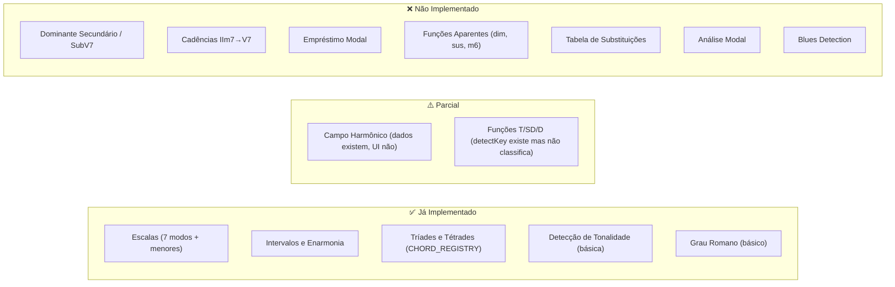

# 📚 Análise dos eBooks — Harmonia Popular Descomplicada (Érica Masson)

## Visão Geral da Obra

A obra é composta por **3 volumes** progressivos, escritos por **Érica Masson**, professora de harmonia do Conservatório de Tatuí há mais de 25 anos. O material é focado em **música popular** (MPB, Bossa Nova, Samba, Choro e Jazz) e aborda a harmonia funcional de forma prática e aplicável.

---

## 📖 Volume 1 — Fundamentos da Harmonia Tonal Maior

### Conteúdo Detalhado

| Capítulo | Assunto | Conceitos-Chave |
|----------|---------|-----------------|
| Cap. 1 | Fundamentos | Escalas maiores, enarmonia, intervalos (simples e compostos), consonâncias vs dissonâncias |
| Cap. 1.4 | Tríades | 4 tipos (maior, menor, diminuta, aumentada), inversões, cifragem |
| Cap. 1.5 | Tétrades | 5 categorias (maj7, m7, 7, m7b5, dim7), extensões e cifragem |
| Cap. 2 | Campo Harmônico Maior | Harmonização em tétrades de todas as 12 tonalidades |
| Cap. 3 | Funções Harmônicas | Tônica (I, IIIm, VIm), Subdominante (IVmaj7, IIm7), Dominante (V7, VIIm7b5) |
| Cap. 4 | Dominante Secundário e SubV7 | V7 de cada grau, SubV7 (substituto tritonal), tabela completa em 12 tons |
| Cap. 5 | Cadência IIm7 → V7 | IIm7 cadencial do V7 e do V7 secundário, IIm7(b5) no tom menor |
| Cap. 6 | Cadência IIm7 → subV7 | Relação de meio-tom, tabela em 12 tons |
| Cap. 7 | Substituto da Subdominante (subIIm7) | O bVIm7 como substituto do IIm7, 4 variações de cadência II-V |
| Cap. 8 | Blues | Estrutura de 12 compassos, I7-IV7-V7, variações com II-V e SubV |

### Mapeamento com o Find Chord Atual

| Conceito | Status no Find Chord | Observação |
|----------|---------------------|------------|
| Escalas maiores | ✅ Implementado | `SCALE_DATA` em musicTheory.ts |
| Intervalos | ✅ Implementado | `getFriendlyInterval` |
| Tríades e Tétrades | ✅ Implementado | `CHORD_REGISTRY` |
| Campo Harmônico | ✅ Parcial | Escalas compatíveis mostradas, mas sem exibir o campo harmônico completo |
| Funções Harmônicas (T/SD/D) | ✅ Implementado | Mapeado no classificador e rotulado como `HarmonicFunction` no DTO final |
| Dominante Secundário (V7/) | ✅ Implementado | Identificado como `SECONDARY_DOMINANT` no pipeline analítico |
| SubV7 (substituto tritonal) | ✅ Implementado | Identificado como `TRITONE_SUBSTITUTION` no pipeline analítico |
| Cadência IIm7→V7 | ✅ Implementado | Agrupamento e detecção estrutural de cadências perfeita, plagal, backdoor, etc. |
| subIIm7 (bVIm7) | ❌ Não implementado | — |
| Blues (12-bar) | ❌ Não detectado | Planejado para sprints futuras |

---

## 📖 Volume 2 — Tonalidade Menor e Análise Modal

### Conteúdo Detalhado

| Capítulo | Assunto | Conceitos-Chave |
|----------|---------|-----------------|
| Cap. 1.1 | Escalas Menores | Menor melódica (1 2 b3 4 5 6 7), menor harmônica (1 2 b3 4 5 b6 7), menor natural (1 2 b3 4 5 b6 b7) |
| Cap. 1.2-1.4 | Tabelas completas | Todas as escalas menores nas 12 tonalidades |
| Cap. 1.5-1.8 | Campos Harmônicos Menores | Harmonização completa dos 3 campos (melódico, harmônico, natural) em todas as tonalidades |
| Cap. 1.9 | Funções no Tom Menor | T: Im7, bIIImaj7 · SD: IVm7, IIm7(b5) · D: V7, VIIdim |
| Cap. 1.10 | Análise em Tom Menor | Exemplos práticos de análise funcional |
| Cap. 2.1 | Harmonia Modal | 7 modos gregos, nota característica de cada modo, acordes característicos por modo |
| Cap. 2.2 | Análise Modal | Tipos: modulação modal (mesmo modo, tons diferentes) vs intercâmbio modal (mesma tonalidade, modos diferentes) |

### Detalhes dos Modos e Acordes Característicos

| Modo | Nota Característica | Campo Harmônico | Acordes Característicos |
|------|---------------------|-----------------|------------------------|
| Jônico | 4J (evitar) | Imaj7, IIm7, IIIm7, IVmaj7, V7, VIm7, VIIm7(b5) | — (referência) |
| Lídio | #4 (4A) | Imaj7(#11), II7, IIIm7, #IVm7(b5), Vmaj7, VIm7, VIIm7 | II7, #IVm7(b5), Vmaj7, VIIm7 |
| Mixolídio | 7m | I7, IIm7, IIIm7(b5), IVmaj7, Vm7, VIm7, bVIImaj7 | I7, IIIm7(b5), Vm7, bVIImaj7 |
| Dórico | 6M | Im7, IIm7, bIIImaj7, IV7, Vm7, VIm7(b5), bVIImaj7 | IIm7, IV7, VIm7(b5), bVIImaj7 |
| Eólio | 6m | Im7, IIm7(b5), bIIImaj7, IVm7, Vm7, bVImaj7, bVII7 | IIm7(b5), IVm7, bVImaj7, bVII7 |
| Frígio | 2m | Im7, bIImaj7, bIII7, IVm7, Vm7(b5), bVImaj7, bVIIm7 | bIImaj7, bIII7, Vm7(b5), bVIIm7 |
| Lócrio | 5d | Im7(b5), bIImaj7, bIIIm7, IVm7, bVmaj7, bVI7, bVIIm7 | Im7(b5), bIIIm7, bVmaj7, bVI7 |

### Mapeamento com o Find Chord Atual

| Conceito | Status no Find Chord | Observação |
|----------|---------------------|------------|
| Escala menor natural | ✅ Implementado | Presente em `SCALE_DATA` como "Minor (Natural)" |
| Escala menor harmônica | ✅ Implementado | Presente como "Harmonic Minor" |
| Escala menor melódica | ✅ Implementado | Presente como "Melodic Minor" |
| 7 Modos gregos | ✅ Implementado | Todos presentes em `SCALE_DATA` |
| Campo harmônico menor | ❌ Não exibido | Dados existem nas escalas mas não são "harmonizados" na UI |
| Funções no tom menor | ✅ Implementado | Distinguido no resolvedor HMM de 24 tonalidades com cadências próprias |
| Análise modal | ❌ Não implementado | Contextos puramente modais planejados para sprints futuras |
| Intercâmbio modal | ✅ Implementado | Identificado como `MODAL_BORROWING` a nível de acorde e resumido no DTO |
| Nota característica do modo | ❌ Não destacada | — |

---

## 📖 Volume 3 — Acordes de Função Aparente

### Conteúdo Detalhado

| Capítulo | Assunto | Conceitos-Chave |
|----------|---------|-----------------|
| Cap. 1 | Empréstimo Modal | Acordes vindos do campo menor usados no contexto maior (IVm7, bVImaj7, bVII7, bIIImaj7) |
| Cap. 2 | Acorde Diminuto | **3 funções**: Dominante (subindo ½ tom = V7), Subdominante (Idim = IV7), Cromática (desce ½ tom, passagem) |
| Cap. 3 | Acorde Sus | **2 funções**: Dominante (Vsus = V7, bIIsus = subV7) e Subdominante (Vsus = IIm7/V, bIIsus = subIIm7/subV7) |
| Cap. 4 | Acorde m6 | Múltiplas funções aparentes: V7 (quando m6 = 3-5-b7-b9 do dominante), IIm7(b5), IVm7, bVImaj7 |
| Cap. 4.1 | Im(b6) | Gera IVm7 ou bVImaj7 como substituto |
| Cap. 5 | #IVm7(b5) | Substituto do IVmaj7 (3 notas em comum), intensificação cromática da subdominante |
| Cap. 6 | Tabela de Substituições | **A joia do livro**: Tabela completa de substituições por função (T/SD/D) em tonalidade maior e menor |

### A Tabela de Substituições Harmônicas (Cap. 6) — Detalhamento

#### Tonalidade Maior

| Função | Acordes Possíveis |
|--------|------------------|
| **Tônica** | Imaj7, IIIm7, VIm7 |
| **Subdominante** | IVmaj7, IIm7, subIIm7, Vsus(=IIm7), bIIsus(=subIIm7), #IVm7(b5)(=IVmaj7), bVIImaj7(=IVmaj7) |
| **Dominante** | V7, subV7, VIIm7(b5), VIIdim, IIdim, IVdim, bVIdim, IIm6(=V7), bVIm6(=subV7), Vsus4/Vsus4(b9), bIIsus4/bIIsus4(b9) |

#### Tonalidade Menor

| Função | Acordes Possíveis |
|--------|------------------|
| **Tônica** | Im(maj7), bIIImaj7(#5), VIm7(b5) · Im7, bIIImaj7 |
| **Subdominante** | IVm7, IIm7(b5), subIIm7(b5), bIImaj7, bVI6, bVImaj7, bVII7, IVm6(=IIm7b5), VIIm6(=subIIm7b5), Vsus(b9), bIIsus(b9), bVIIsus(=IVm7), Im(b6)(=IVm7) · IV7, Idim, Im6 |
| **Dominante** | *(Compartilhada)* V7, subV7, VIIm7(b5), VIIdim, IIdim, IVdim, bVIdim, IIm6(=V7), bVIm6(=subIIm7), Vsus4/Vsus4(b9), bIIsus4/bIIsus4(b9) |

### Mapeamento com o Find Chord Atual

| Conceito | Status no Find Chord | Observação |
|----------|---------------------|------------|
| Empréstimo Modal | ✅ Implementado | Sinalizado como `MODAL_BORROWING` a partir do modo paralelo homônimo |
| Diminuto com 3 funções | ✅ Implementado | Classificado como de passagem, vizinho ou de tom comum em `chromaticAnalysis.ts` |
| Acorde Sus com 2 funções | ❌ Não implementado | Planejado para sprints futuras |
| Acorde m6 como função aparente | ❌ Não implementado | Planejado para sprints futuras |
| #IVm7(b5) como substituto do IV | ❌ Não implementado | Planejado para sprints futuras |
| Tabela de Substituições | ❌ Não existe | Planejado para sprints futuras |

---

## 🎯 Propostas de Implementação no Find Chord

### Prioridade 1 — Análise Funcional Completa (Volumes 1+2)

> [!IMPORTANT]
> Esta é a base para tudo que vem depois. Sem análise funcional, não é possível implementar substituições.

**O que fazer:**
1. **Classificação por função harmônica (T/SD/D)** — Estender `getRomanNumeral` para retornar também a função do grau
2. **Detecção de tonalidade menor** — Melhorar `detectKey` para distinguir C maior de A menor
3. **Dominantes secundários** — Detectar V7/X na timeline (ex: A7 antes de Dm7 = V7/II)
4. **SubV7** — Detectar substituição tritonal (ex: Db7 → Cmaj7)
5. **Cadências IIm7→V7** — Identificar e agrupar cadências na timeline

**Onde implementar:** [musicTheory.ts](file:///Volumes/Documents/Development/Find Chord/src/utils/music/theory/musicTheory.ts) + novo módulo `functionalAnalysis.ts`

---

### Prioridade 2 — Campo Harmônico Visual (Volume 1+2)

**O que fazer:**
1. Novo painel/seção mostrando o campo harmônico completo da tonalidade detectada
2. Exibir tétrades de cada grau com função (T/SD/D) colorida
3. Incluir campos menores (melódico, harmônico, natural)
4. Destacar qual grau o acorde atual representa

---

### Prioridade 3 — Análise de Função Aparente (Volume 3)

> [!TIP]
> Esta é a feature mais sofisticada e diferenciadora. Poucos softwares fazem isso.

**O que fazer:**
1. **Diminuto inteligente** — Ao encontrar um dim na timeline, classificar automaticamente:
   - Sobe ½ tom para o próximo acorde? → **Função Dominante** (V7 com b9)
   - É Idim (mesmo root da tonalidade)? → **Função Subdominante** (=IV7)
   - Desce ½ tom para o próximo acorde? → **Função Cromática** (passagem)
2. **Acorde Sus inteligente** — Classificar como V7 ou IIm7/V conforme contexto
3. **Acorde m6 inteligente** — Identificar qual dominante está implícito
4. **#IVm7(b5)** — Sinalizar quando está substituindo IVmaj7

---

### Prioridade 4 — Tabela de Substituições (Volume 3, Cap. 6)

> [!IMPORTANT]
> Esta seria uma feature única e extremamente valiosa para músicos.

**O que fazer:**
1. Para cada acorde na timeline, mostrar painel lateral com **todos os substitutos possíveis** agrupados por função
2. Permitir "trocar" o acorde por qualquer substituto e ouvir a diferença
3. Sugerir rearmonizações completas (ex: trocar IIm7→V7 por IIm7→subV7)

---

### Prioridade 5 — Análise Modal (Volume 2, Cap. 2)

**O que fazer:**
1. Detectar quando uma progressão é **modal** (sem tensão-repouso V7→I)
2. Identificar o modo (Dórico, Lídio, Mixolídio, etc.) pela nota característica
3. Detectar intercâmbio modal vs modulação modal
4. Sugerir escala específica do modo para cada acorde

---

## 📊 Resumo: O que o Find Chord já tem vs o que falta

---

## 🔑 Conclusão

Os 3 volumes cobrem um espectro completo da harmonia funcional popular. O Find Chord já tem a **infraestrutura de dados** (escalas, intervalos, chord registry) mas falta a **camada de inteligência analítica** que transforma dados brutos em insights musicais.

A implementação em fases (funcional → campo harmônico → função aparente → substituições → modal) criaria uma experiência progressiva e extremamente diferenciada no mercado.
