# Architecture Report — F11-AUD
**Find Chord Harmonic Core Architecture Map & Component Inventory**

Este relatório apresenta o mapeamento completo do fluxo de dados e controle do núcleo científico do **Find Chord**, catalogando a arquitetura interna do resolvedor e identificando dependências, responsabilidades e riscos estruturais.

---

## 1. Grafo de Fluxo Conceitual de Processamento

A análise harmônica do Find Chord opera como um pipeline sequencial e acoplado, que transforma a entrada física de notas e cifras em uma leitura conceitual profunda fundamentada em paradigmas de teoria musical. O diagrama abaixo descreve esse ciclo:

```mermaid
graph TD
    %% Estilos de nós
    classDef input fill:#0d1117,stroke:#58a6ff,stroke-width:2px,color:#fff;
    classDef engine fill:#1f242c,stroke:#8f52ff,stroke-width:2px,color:#fff;
    classDef telemetry fill:#1b2024,stroke:#3fb950,stroke-width:2px,color:#fff;
    classDef output fill:#211822,stroke:#f25c54,stroke-width:2px,color:#fff;

    subgraph INGRESSO ["1. Entrada de Dados"]
        InNotes["Entrada Física: MIDI / Trastes / Tuning<br>(Ex: Builder ou Fretboard)"]:::input
        InSymbol["Cifra Original: Chord Symbol<br>(Ex: Dm7, G7, Cmaj7)"]:::input
    end

    subgraph PIPELINE_LOCAL ["2. Geração de Hipóteses Locais"]
        TC["resolveTonalCenter<br>(Estimador Inicial de Tom)"]:::engine
        Candidates["Construção de Estados Candidatos<br>(24 Tons Diatônicos + Top 3 Modal Axis)"]:::engine
        UnderKey["analyzeProgressionUnderKey<br>(Análise em Isolamento para Cada Tom)"]:::engine
        Classifiers["Classificadores Paralelos<br>(Diatônico, Secundário, Empréstimo, Cromático)"]:::engine
        CadencesDetect["detectCadences<br>(Detecção de Cadências Pré-Viterbi)"]:::engine
    end

    subgraph RESOLVER_GLOBAL ["3. Resolvedor Global Caminho Ótimo"]
        Viterbi["resolveGlobalPath (Motor Viterbi)<br>Beam Search (Width=10) sobre Trellis de Estados"]:::engine
        TransitionModels["transitionModels<br>(Matriz de Transição Teórica + Corpus Weight)"]:::engine
    end

    subgraph TELEMETRIA_CALIBRACAO ["4. Pós-Processamento e Calibragem"]
        Bayes["calibrateHypotheses<br>(Calibragem Bayesiana de Probabilidades)"]:::engine
        Priors["applyMusicologicalPriors<br>(Overrides de Priors de Casos Históricos)"]:::engine
        MIG["computeConsensus<br>(Criação do MIG: Grafo de Escolas Musicológicas)"]:::engine
        Stability["computeStabilityAndCausality<br>(Simulação Contrafactual: Perturbações O(N²))"]:::engine
        Frontier["computeTheoryAdequacyAndFrontier<br>(Cálculo de TAS e TFI)"]:::engine
        Segment["Segmentation Engines<br>(Regiões Harmônicas, Frases, Estrutura Formal)"]:::engine
    end

    subgraph NARRATIVA_FINGERPRINT ["5. Explanação e Identidade"]
        Facts["extractNarrativeFacts<br>(Extração de Fatos de Narrativa)"]:::engine
        Narrative["compileNarrativeExplanation<br>(Geração de Explicações em Texto Natural)"]:::engine
        Fingerprint["generateFingerprint<br>(Assinatura Digital da Análise)"]:::engine
    end

    subgraph CONSUMIDORES ["6. API Local & Consumidores"]
        API["Local API Bridge Server<br>(Porta 9000: CORS / X-FindChord-Client)"]:::output
        QML["Plugin QML MuseScore 4.x<br>(Transcritor de Cifras e Eventos)"]:::output
        UI["Compose Suite Frontend UI<br>(Visualizações e Telemetria)"]:::output
    end

    %% Relações de Fluxo
    InNotes --> InSymbol
    InSymbol --> TC
    TC --> Candidates
    Candidates --> UnderKey
    UnderKey --> Classifiers
    Classifiers --> CadencesDetect
    CadencesDetect --> Viterbi
    TransitionModels --> Viterbi
    Viterbi --> Bayes
    Bayes --> Priors
    Priors --> MIG
    MIG --> Stability
    Stability --> Frontier
    Frontier --> Segment
    Segment --> Facts
    Facts --> Narrative
    Narrative --> Fingerprint
    Fingerprint --> API
    API --> QML
    API --> UI
```



---

## 2. Inventário de Componentes e Responsabilidades

O núcleo científico está modularizado sob o diretório [src/utils/music/analysis/](file:///Volumes/Documents/Development/Find%20Chord/src/utils/music/analysis/). A tabela a seguir consolida as responsabilidades e interdependências de cada motor:

| Componente | Arquivo Relacionado | Responsabilidade Principal | Dependências Diretas |
| :--- | :--- | :--- | :--- |
| **Orchestrator** | [progressionAnalysis.ts](file:///Volumes/Documents/Development/Find%20Chord/src/utils/music/analysis/orchestrators/progressionAnalysis.ts) | Gerencia a execução sequencial do pipeline harmônico inteiro, do input bruto ao DTO final de análise. | `resolveGlobalPath`, `InterpretiveStabilityEngine`, `TheoryFrontierDetector` |
| **Viterbi Engine** | [resolveGlobalPath.ts](file:///Volumes/Documents/Development/Find%20Chord/src/utils/music/analysis/viterbi/resolveGlobalPath.ts) | Executa o Beam Search sobre a Trellis para definir o caminho de tom local ótimo e os índices de hipóteses de acordes mais prováveis. | `ConsensusModelingEngine`, `BayesianCalibrationEngine`, `MusicologicalPriorEngine` |
| **Consensus Engine** | [ConsensusModelingEngine.ts](file:///Volumes/Documents/Development/Find%20Chord/src/utils/music/analysis/calibration/ConsensusModelingEngine.ts) | Constrói o Grafo de Interpretação Musicológica (MIG) e calcula as métricas locais de desacordo acadêmico (`adi`) e fragilidade (`cfs`). | `AnalyticalDisagreementCorpus` |
| **Prior Engine** | [MusicologicalPriorEngine.ts](file:///Volumes/Documents/Development/Find%20Chord/src/utils/music/analysis/calibration/MusicologicalPriorEngine.ts) | Aplica correções estruturais de probabilidade baseadas em convenções consagradas para 12 cenários de referência históricos. | Nenhuma (Teoria pura) |
| **Bayesian Likelihood** | [BayesianCalibrationEngine.ts](file:///Volumes/Documents/Development/Find%20Chord/src/utils/music/analysis/calibration/BayesianCalibrationEngine.ts) | Atualiza as probabilidades locais utilizando atualizações de verossimilhança de acordo com perfis sintáticos da gramática harmônica. | Nenhuma |
| **Stability Engine** | [InterpretiveStabilityEngine.ts](file:///Volumes/Documents/Development/Find%20Chord/src/utils/music/analysis/calibration/InterpretiveStabilityEngine.ts) | Simula perturbações contrafactuais na progressão para extrair índices de estabilidade (`iss`, `sis`, `pis`) e o grafo de causalidade. | `CounterfactualAnalysisEngine`, `progressionAnalysis` (Callback recursivo) |
| **Frontier Detector** | [TheoryFrontierDetector.ts](file:///Volumes/Documents/Development/Find%20Chord/src/utils/music/analysis/calibration/TheoryFrontierDetector.ts) | Avalia a adequação das teorias existentes (`tas`) e mapeia as fronteiras explicativas (`tfi`) de cada acorde analisado. | Nenhuma |
| **Narrative Facts** | [narrativeFactEngine.ts](file:///Volumes/Documents/Development/Find%20Chord/src/utils/music/analysis/narrative/narrativeFactEngine.ts) | Extrai fatos e anomalias de alto nível (como modulações abruptas ou acordes de empréstimo não-triviais) da análise. | Nenhuma |

---

## 3. Avaliação de Coesão e Acoplamento

A auditoria arquitetural aponta os seguintes diagnósticos estruturais de acoplamento:

### ⚠️ Acoplamento Circular no Motor de Estabilidade (Criticidade: P2)
O arquivo [InterpretiveStabilityEngine.ts](file:///Volumes/Documents/Development/Find%20Chord/src/utils/music/analysis/calibration/InterpretiveStabilityEngine.ts) requer a execução completa da análise harmônica para avaliar as progressões mutadas (contrafactuais). 
* **Desenho atual**: Evita um `import` circular direto recebendo um callback do orquestrador: `analyzeCallback: (progression: string[]) => FunctionalAnalysis`.
* **Avaliação**: Embora o padrão de callback previna o erro de importação em tempo de compilação, o acoplamento lógico permanece extremamente forte. A estabilidade depende de re-executar todo o pipeline Viterbi para cada mutação de acorde, o que gera o maior gargalo de desempenho do sistema.

### 🔴 Caching de Objetos Complexos Pré-Viterbi (Criticidade: P1)
No orquestrador, antes de executar o Viterbi, o sistema pré-calcula e armazena em cache a análise completa para cada acorde sob cada tonalidade candidata:
```typescript
  for (const state of candidates) {
    const analyzedChords = analyzeProgressionUnderKey(progression, state);
    cache[stateStr] = analyzedChords;
    ...
  }
```
* **Avaliação**: Para uma progressão de comprimento $N$ e $K$ candidatos, o sistema cria $N \times K$ instâncias completas do objeto `FunctionalChord` (cada uma contendo sub-arrays de hipóteses, strings de explicações e estruturas de depuração pesadas). Esse caching inicial sem compressão é a causa direta do estouro de memória (Heap OOM) em progressões longas.
