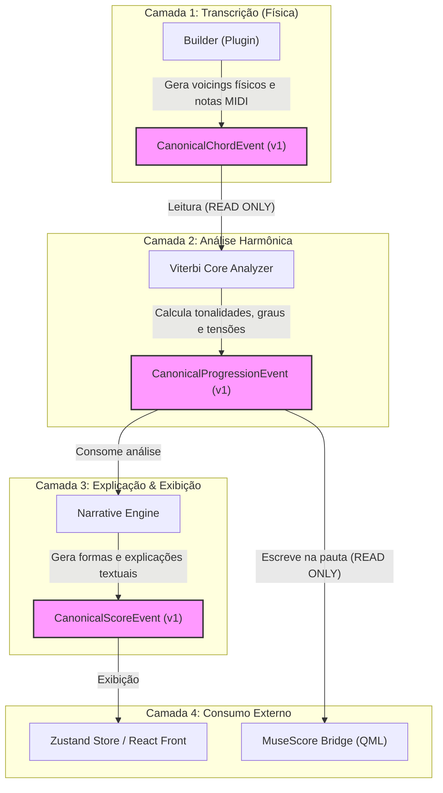

# Auditoria de Mutabilidade de Contratos — F11-AUD-REM

Este documento estabelece o fluxo de ciclo de vida e a matriz de permissões para os contratos canônicos congelados na versão 1 (`FROZEN v1`): `CanonicalChordEvent`, `CanonicalProgressionEvent` e `CanonicalScoreEvent`.

---

## 1. Matriz de Permissões de Acesso

Para manter a integridade dos contratos e evitar corrupções em runtime durante a comunicação inter-plugin (sprint F12), cada ator/componente do ecossistema possui limites estritos de acesso:

| Componente | CanonicalChordEvent | CanonicalProgressionEvent | CanonicalScoreEvent |
| :--- | :--- | :--- | :--- |
| **Builder** | `WRITE` (Criação) | `READ ONLY` | Sem Acesso |
| **Analyzer (Viterbi Core)** | `READ ONLY` | `WRITE / MUTATE` (Criação/Mutação) | Sem Acesso |
| **Narrative Engine** | `READ ONLY` | `READ ONLY` | `WRITE` (Criação) |
| **MuseScore Bridge** | `READ ONLY` | `READ ONLY` | `READ ONLY` |
| **Inspector / Reharmonizer** | `READ ONLY` | `READ ONLY` (Criação Temp para Preview) | `READ ONLY` |

### Definições de Permissão:
*   `WRITE`: Permissão para instanciar novos objetos do contrato.
*   `MUTATE`: Permissão para modificar campos internos de instâncias já existentes (ex: enriquecimento de atributos teóricos e calibrações).
*   `READ ONLY`: Acesso estrito de leitura; o componente não pode alterar nenhuma propriedade do objeto.

---

## 2. Diagrama de Ciclo de Vida e Fluxo de Dados

O fluxo a seguir ilustra a cadeia de transformações e transmissões de dados pelo pipeline do sistema:

---

## 3. Diretrizes de Governança para Alterações

1.  **Imutabilidade em Runtime**: Instâncias de `CanonicalChordEvent` enviadas pelo Builder não devem ser modificadas em suas propriedades físicas (`voicing`, `tuning`) por nenhuma engine de análise. Qualquer rearmonização deve gerar novos eventos em paralelo.
2.  **Políticas de Extensibilidade**:
    *   Nenhum campo novo pode ser inserido diretamente nas interfaces v1.
    *   Para o desenvolvimento de F12, se houver necessidade de novos dados em tempo de execução que não existam nas assinaturas congeladas, estes devem ser transitados nas interfaces de sandbox ou declarados em um novo contrato `v2/`.
    *   Tabelas de depuração temporária de motores experimentais só devem transitar na propriedade genérica `debug` (previamente tipada) sem poluir o contrato público estável.
