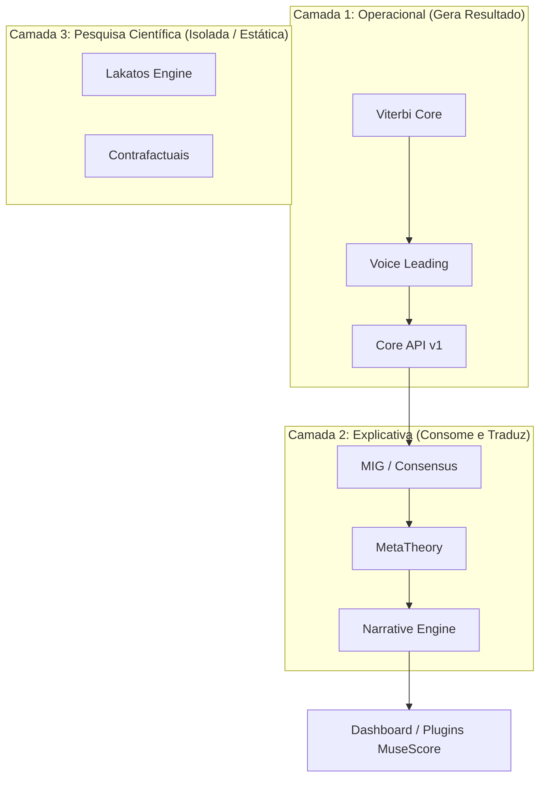

# Mapeamento de Valor — F11-AUD
**Scientific, Product & Strategic Differentiation Matrix**

Este relatório apresenta o mapeamento estratégico de valor para os componentes do **Find Chord**, cruzando a relevância científica acadêmica, o valor percebido de produto pelo usuário final (Compose Suite, Builder, Inspector e Narrative) e o valor de diferenciação de mercado que torna o sistema impossível de ser copiado por concorrentes.

---

## 📊 Matriz Tridimensional de Valor

| Componente | Científico | Produto | Diferenciação | Descrição / Papel Estratégico |
| :--- | :---: | :---: | :---: | :--- |
| **Viterbi (Core Engine)** | Alto | Alto | Médio | O coração do resolvedor harmônico global. Embora outros resolvedores de acordes existam, sua implementação com Viterbi é o alicerce operacional indispensável. |
| **Voice Leading** | Alto | Alto | Alto | Algoritmo de condução de vozes físicas. Altamente interativo para guiar digitações e rearmonizações parciais de forma fluida. |
| **MIG (Consensus)** | Alto | Médio | Muito Alto | O grafo de consenso musicológico multiescola. Transforma o Find Chord de um simples identificador em uma plataforma de debate epistemológico. |
| **MetaTheory** | Médio | Médio | Muito Alto | Síntese de leis que unifica a terminologia e as premissas analíticas, dando consistência e profundidade às explicações. |
| **Lakatos** | Muito Alto | Baixo | Extremamente Alto | O motor popperiano/lakatosiano de crise de paradigmas. Sem uso direto pelo músico comum, mas é o maior ativo proprietário de validação acadêmica. |
| **Contrafactuais** | Muito Alto | Baixo | Alto | Simulações causais em mundos harmônicos alternativos. Altíssimo valor de pesquisa e validação empírica de robustez. |
| **Universal Laws** | Alto | Médio | Alto | Regras e restrições fundamentais que alimentam as decisões e cálculos de transição do motor de Viterbi. |
| **Narrative** | Médio | Altíssimo | Alto | Tradução direta de grafos matemáticos complexos em análises explicativas legíveis de nível humano (pedagógicas, estéticas e estilísticas). |

---

## 🗂️ Classificação Arquitetural em Três Camadas

A auditoria e o mapeamento tridimensional de valor revelam que o Find Chord se divide naturalmente em três camadas conceituais, simplificando radicalmente o planejamento de integração de produtos:

### 1. Camada Operacional (Viterbi, Voice Leading, Core API v1)
* **Status**: Crítica para o funcionamento.
* **Comportamento**: Se esta camada falhar, o Find Chord deixa de funcionar como ferramenta musical. É responsável por produzir os caminhos de acordes, cifragens, modulações e conduções de vozes fisicamente tocáveis.
* **Estratégia**: Manter o foco total em desempenho e robustez. É onde a sprint de Performance Hardening deve atuar prioritariamente.

### 2. Camada Explicativa (MIG, MetaTheory, Narrative)
* **Status**: Crítica para a Experiência do Usuário (UX).
* **Comportamento**: **Desligar o MIG ou a MetaTheory não altera a resposta musical** calculada pela Camada 1. Eles apenas consomem a análise concluída e a traduzem em explicações lógicas e narrativas ricas.
* **Estratégia**: Tratá-los estritamente como consumidores de dados. Isso reduz o acoplamento do sistema e o risco da F12, pois falhas ou atrasos nesta camada não quebram o resolvedor central.

### 3. Camada de Pesquisa Científica (Lakatos, Contrafactuais)
* **Status**: Crítica para o Valor de Marca e Rigor Acadêmico.
* **Comportamento**: Invisível para o usuário final do MuseScore ou Compose Suite. Funciona em sandbox de testes e scripts de benchmark.
* **Estratégia**: **Congelar o desenvolvimento e isolar do runtime**. Estes motores devem ser mantidos inativos no fluxo normal de produção para eliminar sobrecarga de memória (Heap OOM) e CPU, servindo como validadores acadêmicos offline.

---

## 🎯 Impacto no Direcionamento da Fase F12

Com a introdução do eixo de **Valor de Diferenciação**, redefinimos quais ativos devem ser "protegidos" como vantagens competitivas proprietárias de longo prazo (MIG, MetaTheory, Lakatos) e quais devem ser "simplificados" no produto diário para não gerar débito técnico.

Isso justifica a nova divisão sequencial de 6 sprints do roadmap, onde o desenvolvimento do **Inspector** foi expandido em duas fases devido à sua importância direta na tomada de decisão do músico, e o **Narrative** e o **Performance Hardening** foram estruturados de forma puramente desacoplada ao final do fluxo.
