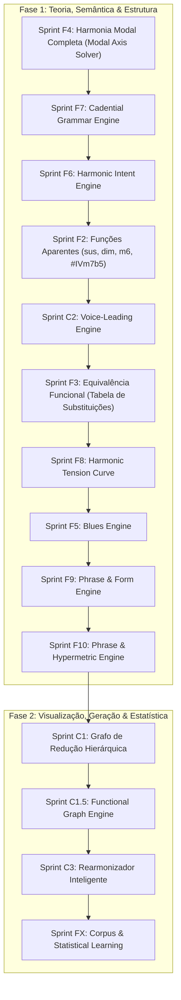

# 🚀 Catálogo de Sprints Futuras — Do Motor Analítico ao Engine de Produto

Após a conclusão da **Sprint 12A**, o Find Chord consolidou seu núcleo como um **Analisador Tonal Hierárquico**. A maior parte da Prioridade 1 (Harmonia Funcional Clássica) e várias fundações de análise regional avançada (Viterbi, Árvores de Regiões, Sumário e Narrativas) foram concluídas.

---

## 📊 Estado de Cobertura Atual (vs Obra de Érica Masson)

| Área | Cobertura Atual | Detalhamento |
|---|---|---|
| **Harmonia funcional tonal maior** | ~95% | Cobertura completa de tétrades, graus e funções diatônicas. |
| **Tonalidade menor** | ~85% | Relações de menor natural, harmônica e melódica integradas na busca global. |
| **Dominantes secundários** | ~100% | Detecção e rotulação contextual de V7/X na timeline. |
| **SubV7** | ~100% | Identificação de dominantes substitutos tritone. |
| **Tonicizações e modulações** | ~100% | Delimitação de janelas temporárias vs modulações estruturais via cadência. |
| **Narrativa tonal** | ~100% | Redução de trajetória e categorização da narrativa da peça. |
| **Empréstimo modal** | ~60% | Identificação de acordes emprestados sem modulação formal. |
| **Harmonia modal** | ~35% | Rastreamento estatístico de escalas/modos na timeline, mas sem resolvedor de eixo modal verdadeiro. |
| **Funções aparentes (Volume 3)** | ~15% | Heurísticas básicas de diminutos inteligentes, mas sem reinterpretação via resolução. |
| **Equivalência funcional / substituições** | ~10% | Agrupamento funcional básico, sem motor de substituição ou geração equivalente. |
| **Blues** | ~5% | Parcialmente detectado como acordes dominantes avulsos, sem suporte estrutural formal. |
| **Voice-leading** | ~0% | Foco atual em acordes inteiros, sem condução de vozes internas. |

---

## 🗺️ Visão Geral do Roadmap



---

## 📖 Parte 1: Cobertura da Obra & Consolidação Teórica

### Sprint F4: Harmonia Modal Completa (Modal Axis Solver)
**Objetivo**: Resolver contextos de harmonia modal verdadeira (Volume 2), onde as progressões não se baseiam em relações de tensão e resolução do tipo dominante-tônica.
*   **Conceito**: Criar um resolvedor HMM paralelo ou alternativo baseado em "Eixos e Acordes Característicos" dos modos (Dórico, Mixolídio, Lídio, Frígio, Lócrio).
*   **Exemplos Práticos**:
    *   Identificar e rotular eixos oscilatórios (vamps) como `||: Dm7 | G :||` como Mixolídio ou Dórico (pela nota característica).
*   **Implementação**:
    *   Detecção de eixos estáveis baseados na nota característica do modo.
    *   Desativação de cadências tonais artificiais em prol de cadências de aproximação modal.

---

### Sprint F7: Cadential Grammar Engine (Gramática de Cadências Avançada)
**Objetivo**: Enriquecer a taxonomia de detecção de cadências e acoplar a análise sintática de resolução cadencial.
*   **Conceito**: Identificar relações como `AUTHENTIC`, `PLAGAL`, `DECEPTIVE`, `HALF`, `BACKDOOR`, `BLUES` e `PHRYGIAN`, além do estado e direcionamento da resolução:
    *   `resolved` (resolvida estruturalmente)
    *   `interrupted` (interrompida no meio do caminho)
    *   `evaded` (evitada/deceptiva, desviando a atração)
    *   `delayed` (atrasada por suspensão)
*   **Implementação**:
    *   Estender as definições estruturais do `cadenceDetector.ts` para capturar com mais nuance a conclusão melódico-harmônica.

---

### Sprint F6: Harmonic Intent Engine (Motor de Intenção Harmônica)
**Objetivo**: Responder ao *"porquê"* um acorde está presente em determinada posição, definindo o papel dele no fraseado sob a perspectiva do compositor/analista.
*   **Conceito**: Rotular a intenção semântica em categorias abstratas como `PROLONGATION` (prolongamento de tônica), `PREPARATION` (tensão preparatória), `INTENSIFICATION` (cromatismo intensificador), `DECEPTION` (cadência deceptiva) ou `COLORATION` (empréstimo modal estético).
*   **Implementação**:
    *   Mapear interfaces e contratos:
        ```typescript
        interface HarmonicIntent {
          intent: 'PROLONGATION' | 'PREPARATION' | 'INTENSIFICATION' | 'DECEPTION' | 'COLORATION';
          confidence: number;
        }
        ```
    *   Gerar o mapeamento lógico e contextual combinando funções vizinhas imediatas e lookahead.

---

### Sprint F2: Funções Aparentes (Functional Substitution Engine)
**Objetivo**: Implementar o núcleo do **Volume 3**, permitindo que o motor classifique acordes cuja função harmônica real difira de sua estrutura de superfície.
*   **Conceito**: Mapear equivalências onde a condução de vozes e a resolução transformam a função percebida do acorde.
*   **Exemplos Práticos**:
    *   `Idim` atuando como `IV7` (Subdominante).
    *   Acordes menor com sexta (`m6`) funcionando como dominantes implícitos (ex: `Dm6` como `G7(b9)` sem fundamental).
    *   `#IVm7(b5)` funcionando como substituto com tensão intensificada de `IVmaj7`.
*   **Implementação**: Estender o classificador funcional para reinterpretar os graus baseando-se no lookahead de resolução (lookahead estendido).

---

### Sprint F3: Motor de Equivalência & Tabela de Substituições Harmônicas
**Objetivo**: Desenvolver uma API de consulta que forneça alternativas de rearmonização com equivalência funcional para qualquer acorde da timeline.
*   **Conceito**: Implementar as regras do Cap. 6 (Volume 3), agrupando substitutos por função harmônica (T/SD/D). Esta sprint depende de F2 e F4 para diferenciar substituições tonais de substituições modais.
*   **Implementação**:
    *   Criar um mapeamento dinâmico que receba `{ chord: FunctionalChord, key: TonalCenter }` e retorne uma lista de substitutos com scores de estabilidade.
    *   Permitir substituições por proximidade física de terça (ex: `Imaj7` ➔ `IIIm7` ou `VIm7`) e substituições por tensão (ex: `IIm7` ➔ `bIImaj7`).

---

### Sprint F8: Harmonic Tension Curve (Curva de Tensão Dinâmica)
**Objetivo**: Computar e exportar a curva de tensão harmônica instantânea da progressão, gerando dados cruciais para visualizações e motores de IA generativa.
*   **Conceito**: Mapear a flutuação de dissonância e instabilidade tonal acorde a acorde.
*   **Implementação**:
    *   Calcular um score numérico contínuo para cada acorde da timeline (ex: `tensionCurve = [0.10, 0.65, 0.40, 0.85, 0.05]`), ponderando a dissonância intervalar inerente, a distância do centro tonal ativo e o direcionamento cadencial.

---

### Sprint F5: Detector de Formas e Variações de Blues
**Objetivo**: Classificar e analisar progressões estruturadas em formas de Blues clássicas e suas variações modernas.
*   **Conceito**: Isolar a estrutura de Blues do resolvedor funcional clássico, permitindo que acordes de dominante com sétima (`I7`, `IV7`, `V7`) funcionem como tônica ou subdominante sem gerar falsos positivos de dominante secundário.
*   **Implementação**:
    *   Mapear Blues de 12 compassos (básico, jazz blues, choro blues).
    *   Identificar substituições específicas de blues (ex: aproximações cromáticas e turnarounds de blues).

---

### Sprint F9: Phrase & Form Engine (Estruturas de Frase e Forma)
**Objetivo**: Conectar a análise harmônica com a forma macro da peça musical, detectando limites de frases e tipos de estruturas formais de fraseado.
*   **Conceito**: Identificar relações formais entre frases (antecedente, consequente, período, sentença, semifrase, turnarounds e extensões cadenciais).
*   **Implementação**:
    *   Fornecer saídas descritivas como: *"Estrutura periódica de 8 compassos com antecedente e consequente"*.
    *   Apoiar visualizadores na delimitação formal e agrupamento rítmico-harmônico das frases.

---

### Sprint F10: Phrase & Hypermetric Engine (Métrica e Posição Formal)
**Objetivo**: Acoplar a métrica e a posição temporal da timeline para refinar o papel formal de cada acorde baseado em sua alocação no fraseado.
*   **Conceito**: O significado de um grau romano (ex: I, V) varia drasticamente se ele ocorre no início da frase, no meio de um trecho de passagem ou em uma fronteira cadencial de resolução.
*   **Implementação**:
    *   Rastrear propriedades contextuais como:
        ```typescript
        interface FormalAccent {
          isPhraseBoundary: boolean;
          hypermetricAccent: 'STRONG' | 'WEAK';
          formalFunction: 'INITIATION' | 'TRANSITION' | 'CADENCE';
        }
        ```

---

## 💻 Parte 2: Inovações (Musicologia Computacional & IA)

### Sprint C1: Grafo de Redução Hierárquica (Schenker-Lite Visualizer)
**Objetivo**: Gerar uma representação gráfica aninhada ilustrando as camadas de redução da narrativa tonal.
*   **Conceito**: Visualizar como desvios e tonicizações locais se aninham sob modulações estruturais maiores.

---

### Sprint C1.5: Functional Graph Engine (Grafo de Fluxo Funcional)
**Objetivo**: Converter a análise sequencial de acordes e hierarquia regional em um grafo direcionado de dependência e transição funcional.
*   **Conceito**: Mapear caminhos funcionais explícitos (ex: `Tônica ➔ Subdominante ➔ Dominante ➔ Tônica` ou `Tônica ➔ Dominante Secundária ➔ Subdominante`).
*   **Implementação**:
    *   Habilitar buscas por padrões complexos e criar a fundação para algoritmos de correspondência harmônica e Machine Learning.

---

### Sprint C2: Voice-Leading Engine (Condução de Vozes)
**Objetivo**: Analisar o movimento linear de vozes internas (condução melódica por graus conjuntos/afastamento de notas) entre acordes adjacentes.
*   **Conceito**: Mapear a transição intervalar física das vozes (soprano, contralto, tenor, baixo) e detectar resoluções de trítonos ou sensíveis soltas.

---

### Sprint C3: Rearmonizador Inteligente Guiado por Metas
**Objetivo**: Permitir rearmonização automática guiada por parâmetros de complexidade, tensão e tipo de narrativa selecionados pelo usuário.
*   **Conceito**: Gerar caminhos de rearmonização inversa respeitando metas de tensão e curva de tensão harmônica.

---

### Sprint FX: Corpus & Statistical Learning Layer (Camada Empírica/Estatística)
**Objetivo**: Enriquecer as heurísticas teóricas com frequências observadas e probabilidades estatísticas extraídas de corpora musicais reais, adicionando uma camada empírica ao resolvedor teórico.

#### Sub-fases de Implementação:
1.  **FX1 — Camada Observacional (Segura)**: O motor realiza a medição empírica e enriquece os DTOs com dados estatísticos (frequências de cadências, progressões e modulações), mas sem interferir na decisão do resolvedor Viterbi.
2.  **FX2 — Camada Probabilística (Delicada)**: As estatísticas passam a atuar como fatores de desempate e pesos adicionais no solver HMM (ex: escolher uma análise de menor score teórico caso ela seja 20x mais frequente empiricamente).
3.  **FX3 — Camada Adaptativa (Pesquisa/Extensão Futura)**: Análise adaptativa baseada nas preferências harmônicas do próprio usuário (`UserCorpusProfile`). O sistema aprende tendências estéticas individuais (ex: se o usuário prefere intercâmbio modal ou evita cromatismos) para filtrar e classificar as recomendações de rearmonização e substituição, preservando a explicabilidade matemática da inferência de base.

*   **Evitando Dependência de Gêneros Musicais**: Seguindo a filosofia arquitetural do projeto, o resolvedor não trabalhará com eixos rígidos de gêneros (`JAZZ`, `POP`, `CLASSICAL`), mas sim com eixos gramaticais abstratos e pesos contínuos:
    ```typescript
    interface CorpusProfile {
      tonalFunctionalWeight: number; // Força de atração de cadências clássicas
      modalWeight: number;           // Incidência de eixos e vamps modais
      chromaticWeight: number;       // Tolerância a cromatismos e substituições
      substitutionWeight: number;    // Frequência de caminhos de rearmonização
    }

    interface CorpusEvidence {
      support: number;               // Ocorrências absolutas no corpus
      confidence: number;            // Frequência normalizada (0.0 a 1.0)
      corpusSources: string[];       // Origem das fontes analíticas
    }
    ```

---

## ⚠️ Risco Arquitetural: DTO Inflation & Modularização

> [!WARNING]
> Conforme novas camadas analíticas são agregadas, a interface do DTO principal `FunctionalAnalysis` tende a inflar excessivamente. Para evitar um modelo monolítico difícil de gerenciar e serializar, é recomendado modularizar o DTO antes de iniciar a **Sprint C2**.

**Mapeamento de Módulos Sugerido**:
```typescript
interface FunctionalAnalysis {
  harmonicAnalysis: HarmonicAnalysisModule;     // Chords, Roman Numerals, Functions
  structuralAnalysis: StructuralAnalysisModule; // Regions, Tree, Phrases
  modalAnalysis?: ModalAnalysisModule;          // Modal Axis, Borrowing context
  pedagogicalAnalysis: PedagogicalModule;       // Summary, Narrative, Intent, Explanations, Tension
}
```

---

## 🔑 Cronograma de Priorização Recomendado

1.  **Fase 1 (Teoria & Semântica Tonal/Modal)**:
    1.  [F4] Harmonia Modal Completa (Modal Axis Solver)
    2.  [F7] Cadential Grammar Engine
    3.  [F6] Harmonic Intent Engine
    4.  [F2] Funções Aparentes (sus, dim, m6, #IVm7b5)
    5.  [C2] Voice-Leading Engine
    6.  [F3] Equivalência Funcional (Tabela de Substituições)
    7.  [F8] Harmonic Tension Curve
    8.  [F5] Blues Engine
    9.  [F9] Phrase & Form Engine
    10. [F10] Phrase & Hypermetric Engine (Métrica e Posição Formal)
2.  **Fase 2 (Visualização, Geração & Estatística)**:
    11. [C1 / C1.5] Visualização de Grafos e Árvore Schenker-Lite
    12. [C3] Rearmonizador Inteligente
    13. [FX] Corpus & Statistical Learning Layer (FX1/FX2/FX3)
