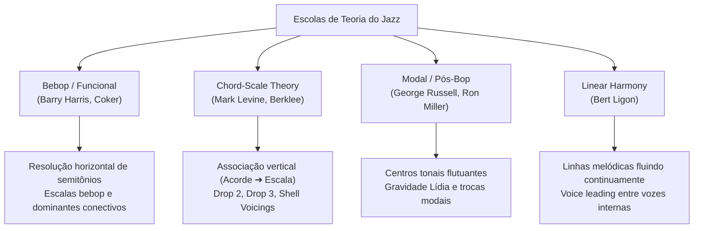

# 🎼 Jazz Theory, Pedagogy & Improvisation Foundations
## Mapeamento de Conceitos e Escolas para o Harmony Engine

Este documento documenta os pilares teóricos, as escolas de pensamento e a linhagem pedagógica que fundamentam o desenvolvimento do **Harmony Engine**. A transição da representação física (trastes e cordas) para a inteligência de condução e análise baseia-se diretamente na sistematização acadêmica do jazz moderno.

---

## 1. As Quatro Escolas de Pensamento no Jazz

---

## 2. Sistematizadores & Pilares Bibliográficos

### 1. George Russell — *Lydian Chromatic Concept of Tonal Organization* (1953)
* **Conceito Chave**: A gravidade harmônica baseia-se no **Modo Lídio** (com sua #11 estável) e não na escala maior Jônica (onde a 4ª justa cria atrito acústico).
* **Aplicação no Engine**: Mapeamento inteligente de notas de assinatura modal (como o `#11` em acordes maiores) e priorização de resoluções de tensão com base no distanciamento da gravidade tonal.

### 2. Barry Harris — *Bebop Funcional e Diminutos Conectivos*
* **Conceito Chave**: Uso de escalas Bebop (adicionando notas de passagem cromáticas) e a escala "Sixth-Diminished" (Maior 6 ou Menor 6 alternadas com acordes diminutos de passagem) para gerar movimento interno de vozes (*inner voice movement*).
* **Aplicação no Engine**: Algoritmo de geração de linhas internas que adiciona notas de passagem cromáticas no Viterbi para suavizar a condução.

### 3. Mark Levine — *The Jazz Theory Book* & *Chord-Scale Theory*
* **Conceito Chave**: Mapeamento vertical estrito de qualidades de acordes para escalas parentais (ex: `Cmaj7` ➔ `C Lydian`, `G7alt` ➔ `G Altered`). Popularizou as aberturas em quartas, estruturas superiores (*upper structures*) e voicings modernos de piano/guitarra.
* **Aplicação no Engine**: Base do nosso **Laboratório de Improviso & Escalas Compatíveis** e a geração de voicings sem tônica (*Rootless Voicings*) na Sprint 3.

### 4. Bert Ligon — *Connecting Chords with Linear Harmony*
* **Conceito Chave**: Crítica à dependência cega da Chord-Scale. Ligon propõe que a boa improvisação decorre de linhas melódicas horizontais coerentes baseadas em 3 outlines melódicos clássicos que resolvem notas estruturais (terças e sétimas) nos tempos fortes.
* **Aplicação no Engine**: Refinamento do resolvedor Viterbi DP na Sprint 4 para pontuar preferencialmente trajetórias que conectam terças e sétimas passo a passo de forma linear.

---

## 3. Mapeamento Arquitetural de Sprints (Linhagem Pedagógica)

Nossa linha de desenvolvimento modular traduz essas escolas em algoritmos exatos de programação:

| Sprint | Escopo Funcional | Escola de Pensamento | Referência Teórica |
| :--- | :--- | :--- | :--- |
| **Sprint 3** | **Rootless & Jazz Engine** (Drop 2, Drop 3, Shells) | *Chord-Scale Theory* / *Berklee* | Mark Levine, Dan Haerle, Berklee Faculty |
| **Sprint 4** | **Advanced Voice Leading** (Contraponto e Outlines) | *Bebop Funcional* / *Linear* | Bert Ligon, Barry Harris, Jerry Coker |
| **Sprint 5** | **Arranger Engine** (Densidade e Registro) | *Modal / Pós-Bop* | George Russell, Ron Miller, Dariusz Terefenko |

---

## 4. Biblioteca Essencial do Desenvolvedor de Áudio (Ordem de Estudo)

1. **The Jazz Theory Book** (Mark Levine) — *A introdução definitiva para mapeamento vertical.*
2. **The Berklee Book of Jazz Harmony** (Barrie Nettles / Richard Graf) — *Sistematização acadêmica rígida.*
3. **Connecting Chords with Linear Harmony** (Bert Ligon) — *A arte do fluxo horizontal real.*
4. **Modal Jazz Composition and Harmony** (Ron Miller) — *Para arranjos e composições pós-bop.*
5. **Lydian Chromatic Concept of Tonal Organization** (George Russell) — *A filosofia da física acústica.*
6. **Jazz Theory: From Basic to Advanced Study** (Dariusz Terefenko) — *A enciclopédia definitiva de síntese acadêmica.*
