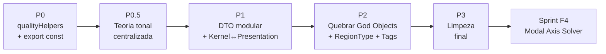

# 🔍 Auditoria Arquitetural Consolidada — Find Chord Analysis Engine

> Levantamento completo de fragilidades, duplicações, dívidas técnicas e riscos estruturais
> do motor analítico antes de iniciar a Sprint F4.
> 
> **v2 — Inclui 4 pontos adicionais de revisão externa (ChatGPT).**

---

## 📊 Resumo Executivo

| # | Categoria | Severidade | Itens |
|---|---|---|---|
| 1 | **Código Duplicado (DRY)** | 🔴 Alta | 18 cópias de 5 funções helper |
| 2 | **Kernel × Presentation Layer** | 🔴 Alta | Texto pt-BR e UI helpers misturados no motor |
| 3 | **DTO Inflation** | 🟡 Média | `FunctionalChord` com 17 campos crescentes |
| 4 | **Teoria Tonal Dispersa** | 🟡 Média | `ROOT_CHROMAS`, `getKeyRelation`, `degreeMap` espalhados |
| 5 | **God Object / God Function** | 🟡 Média | `functionalAnalysis.ts` (905L), `pathResolver.ts` (742L) |
| 6 | **RegionTree acoplada ao tonal** | 🟡 Média | Sem suporte para regiões modais (F4) |
| 7 | **Type Safety (`any`)** | 🟡 Média | 14 usos em 6 arquivos |
| 8 | **Crescimento de Tags** | 🟠 Baixa-Média | `AnalysisTag` sem categorização |
| 9 | **Estado Mutável Exportado** | 🟠 Baixa-Média | 1 `export let` mutável |
| 10 | **Código Morto / Órfão** | 🟠 Baixa | `transitionTrainer.ts` sem consumidores |
| 11 | **Fragilidades Menores** | 🟢 Baixa | `pitchClasses` hardcoded na UI, imports fora de lugar |

---

## 🔴 1. Código Duplicado — Violação Massiva de DRY

**O problema mais grave do codebase.** 5 funções helper copiadas integralmente em múltiplos arquivos, totalizando **18 instâncias duplicadas**:

### `isDominantType(quality: string): boolean` — 5 cópias
- [functionalClassifier.ts:92](file:///Volumes/Documents/Development/Find%20Chord/src/utils/music/analysis/functionalClassifier.ts#L92)
- [tonalCenter.ts:64](file:///Volumes/Documents/Development/Find%20Chord/src/utils/music/analysis/tonalCenter.ts#L64)
- [secondaryAnalysis.ts:8](file:///Volumes/Documents/Development/Find%20Chord/src/utils/music/analysis/secondaryAnalysis.ts#L8)
- [cadenceDetector.ts:6](file:///Volumes/Documents/Development/Find%20Chord/src/utils/music/analysis/cadenceDetector.ts#L6)
- [modalInterchange.ts:6](file:///Volumes/Documents/Development/Find%20Chord/src/utils/music/analysis/modalInterchange.ts#L6)

### `isMinorType(quality: string): boolean` — 6 cópias
- [functionalClassifier.ts:83](file:///Volumes/Documents/Development/Find%20Chord/src/utils/music/analysis/functionalClassifier.ts#L83)
- [tonalCenter.ts:52](file:///Volumes/Documents/Development/Find%20Chord/src/utils/music/analysis/tonalCenter.ts#L52)
- [cadenceDetector.ts:21](file:///Volumes/Documents/Development/Find%20Chord/src/utils/music/analysis/cadenceDetector.ts#L21)
- [modalInterchange.ts:33](file:///Volumes/Documents/Development/Find%20Chord/src/utils/music/analysis/modalInterchange.ts#L33)
- [harmonicField.ts:14](file:///Volumes/Documents/Development/Find%20Chord/src/utils/music/analysis/harmonicField.ts#L14)
- [pathResolver.ts:325](file:///Volumes/Documents/Development/Find%20Chord/src/utils/music/analysis/pathResolver.ts#L325)

### `isMajorType` — 2 cópias, `isDiminishedType` — 3 cópias, `getQualitySuffix` — 2 cópias

### Risco Concreto

Após a **F2** (Funções Aparentes), qualidades como `sus`, `sus4`, `7sus4`, `m6`, `mMaj7` passarão a ter interpretações contextuais. Se existirem 5 cópias de `isDominantType`, elas **inevitavelmente divergem** — não é questão de _se_, mas de _quando_.

### Remediação

```typescript
// src/utils/music/analysis/qualityHelpers.ts
export function isDominantType(quality: string): boolean { ... }
export function isMinorType(quality: string): boolean { ... }
export function isMajorType(quality: string): boolean { ... }
export function isDiminishedType(quality: string): boolean { ... }
export function getQualitySuffix(quality: string): string { ... }
```

Todos os 8 arquivos consumidores passam a importar deste módulo único.

---

## 🔴 2. Kernel × Presentation Layer — Mistura Camada Analítica com Camada Pedagógica

> [!WARNING]
> Este ponto **não constava na auditoria original** e é **crítico para F6/F7/F8/F9**.

### Evidências no código atual

**Texto pedagógico em português gerado dentro do motor analítico:**

[generateTonalNarrative()](file:///Volumes/Documents/Development/Find%20Chord/src/utils/music/analysis/functionalAnalysis.ts#L765-L904) simultaneamente:
1. Calcula a trajetória tonal (kernel)
2. Classifica o tipo de narrativa (kernel)
3. Gera **strings em pt-BR** como `"A progressão permanece totalmente estável..."` (presentation)
4. Anexa análise complementar em texto (presentation)

```typescript
// Linha 863 — texto pt-BR hardcoded no kernel analítico
summaryText = `A progressão permanece totalmente estável no campo harmônico da tonalidade principal de ${homeKeyStr}.`;
```

**UI helpers vivendo no facade analítico:**

| Função | Linha | Responsabilidade |
|---|---|---|
| [getFunctionLabel()](file:///Volumes/Documents/Development/Find%20Chord/src/utils/music/analysis/functionalAnalysis.ts#L461) | 461 | Abreviação de display |
| [getFunctionColorClass()](file:///Volumes/Documents/Development/Find%20Chord/src/utils/music/analysis/functionalAnalysis.ts#L477) | 477 | **Classe CSS** no motor |
| [getRelationLabel()](file:///Volumes/Documents/Development/Find%20Chord/src/utils/music/analysis/functionalAnalysis.ts#L749) | 749 | Tradução pt-BR de relações |

**Campo `summaryText` no DTO analítico:**

[TonalNarrative.summaryText](file:///Volumes/Documents/Development/Find%20Chord/src/utils/music/analysis/models/FunctionalAnalysis.ts#L326) — uma string de apresentação textual embutida num DTO de análise.

### Projeção de Risco

F6 (Intent Engine) → textos como `"Prolongamento de tônica"`, `"Preparação cadencial"`  
F7 (Cadential Grammar) → textos como `"Cadência autêntica perfeita resolvida"`  
F8 (Tension Curve) → textos como `"Pico de tensão no acorde 5"`  
F9 (Phrase & Form) → textos como `"Estrutura periódica de 8 compassos"`  

Se cada sprint adicionar geração textual diretamente nos módulos analíticos, o motor fica **impossível de internacionalizar** e **difícil de testar** (testes passam a depender de strings literais).

### Remediação

```
Kernel (puro, testável, sem idioma):

  TonalNarrative {
    departureKey, arrivalKey, primaryTrajectory,
    structuralEvents, narrativeType
    // SEM summaryText
  }

            ↓

Presentation Layer (separada):

  NarrativeFormatter {
    format(narrative: TonalNarrative, locale: 'pt-BR' | 'en'): string
  }
```

---

## 🟡 3. DTO Inflation — `FunctionalChord`

[FunctionalChord](file:///Volumes/Documents/Development/Find%20Chord/src/utils/music/analysis/models/FunctionalAnalysis.ts#L77-L139) já possui **17 campos** (7 obrigatórios + 10 opcionais), misturando:

| Camada | Campos |
|---|---|
| **Análise funcional** | `romanNumeral`, `scaleDegree`, `harmonicFunction`, `degree`, `isDiatonic`, `confidence` |
| **Contexto secundário** | `secondaryTarget`, `contextualAnalysis`, `contextualFunction` |
| **Modal/cromática** | `modalBorrowing`, `chromaticAnalysis` |
| **Evidência** | `resolutionEvidence`, `candidateResolutions` |
| **Debugging/pedagogia** | `functionalHypotheses`, `explanation` |

### Projeção de Crescimento (F4→F10)

```
+ modalAxisContext?      (F4)
+ harmonicIntent?        (F6)
+ cadentialContext?       (F7)
+ tensionScore?          (F8)
+ phraseContext?         (F9)
+ hypermetricPosition?   (F10)
+ voiceLeadingEvidence?  (C2)
```

→ **24+ campos**, DTO impossível de navegar.

### Remediação

```typescript
interface FunctionalChord {
  // Núcleo imutável (~8 campos)
  index: number;
  chordSymbol: string;
  romanNumeral: string;
  scaleDegree: string;
  harmonicFunction: HarmonicFunction;
  degree: number;
  isDiatonic: boolean;
  confidence: number;

  // Módulos opcionais de contexto
  tonal?: TonalContext;
  secondary?: SecondaryContext;
  modal?: ModalContext;
  resolution?: ResolutionContext;
  debug?: DebugContext;
}
```

---

## 🟡 4. Teoria Tonal Dispersa — Falta de Fonte Única da Verdade

> [!WARNING]
> A Sprint F4 depende **pesadamente** de relações entre pitch classes, graus e distâncias modais. Hoje essas funções estão espalhadas.

### Mapeamento atual

| Conceito | Localização atual | Deveria estar em |
|---|---|---|
| `ROOT_CHROMAS` (mapa nota→chroma) | [pathResolver.ts:162](file:///Volumes/Documents/Development/Find%20Chord/src/utils/music/analysis/pathResolver.ts#L162) | `theory/pitchClass.ts` |
| `getChroma()` | [pathResolver.ts:177](file:///Volumes/Documents/Development/Find%20Chord/src/utils/music/analysis/pathResolver.ts#L177) | `theory/pitchClass.ts` |
| `getPitchClass()` | [core/pitch.ts](file:///Volumes/Documents/Development/Find%20Chord/src/utils/music/core/pitch.ts) | ✅ OK (mas duplicado via `ROOT_CHROMAS`) |
| `getScaleDegreeOffset()` | [pathResolver.ts:291](file:///Volumes/Documents/Development/Find%20Chord/src/utils/music/analysis/pathResolver.ts#L291) | `theory/scaleDegree.ts` |
| `getKeyRelation()` | [pathResolver.ts:223](file:///Volumes/Documents/Development/Find%20Chord/src/utils/music/analysis/pathResolver.ts#L223) | `theory/keyRelations.ts` |
| `isCloselyRelated()` | [pathResolver.ts:185](file:///Volumes/Documents/Development/Find%20Chord/src/utils/music/analysis/pathResolver.ts#L185) | `theory/keyRelations.ts` |
| `getKeyTransitionMultiplier()` | [pathResolver.ts:278](file:///Volumes/Documents/Development/Find%20Chord/src/utils/music/analysis/pathResolver.ts#L278) | `theory/keyRelations.ts` |
| `ALL_24_KEYS` | [pathResolver.ts:151](file:///Volumes/Documents/Development/Find%20Chord/src/utils/music/analysis/pathResolver.ts#L151) | `theory/pitchClass.ts` |
| `pitchClasses` (hardcoded) | [ChordList.tsx:368](file:///Volumes/Documents/Development/Find%20Chord/src/components/ChordList.tsx#L368) | Usar `getPitchClass` |
| `degreeMap` (2 cópias) | [functionalClassifier.ts:337,357](file:///Volumes/Documents/Development/Find%20Chord/src/utils/music/analysis/functionalClassifier.ts#L337) | `theory/scaleDegree.ts` |

### Remediação

```
src/utils/music/theory/
├── pitchClass.ts       ← getPitchClass, getChroma, ROOT_CHROMAS, ALL_24_KEYS
├── scaleDegree.ts      ← getScaleDegreeOffset, degreeMap, getDiatonicTargetDegree
├── keyRelations.ts     ← getKeyRelation, isCloselyRelated, getKeyTransitionMultiplier
└── chordParser.ts      ← (já existe)
```

---

## 🟡 5. God Object / God Function

### [functionalAnalysis.ts](file:///Volumes/Documents/Development/Find%20Chord/src/utils/music/analysis/functionalAnalysis.ts) — 905 linhas

Acumula **8 funções exportadas** de responsabilidades distintas:

| Função | Responsabilidade | Linhas |
|---|---|---|
| `analyzeProgressionUnderKey()` | Classificação sob chave fixa | ~60 |
| `analyzeProgression()` | Façade principal | ~170 |
| `segmentTonalRegions()` | Segmentação regional | ~80 |
| `segmentPhrases()` | Segmentação fraseológica | ~70 |
| `buildTonalRegionTree()` | Construção de árvore | ~50 |
| `calculateTonalSummary()` | Métricas quantitativas | ~160 |
| `generateTonalNarrative()` | Narrativa tonal + texto pt-BR | ~140 |
| UI helpers | Display (CSS classes, labels) | ~40 |

### [pathResolver.ts](file:///Volumes/Documents/Development/Find%20Chord/src/utils/music/analysis/pathResolver.ts) — 742 linhas

Mistura modelos de transição, relações tonais, o Viterbi completo e helpers de grau.

### Remediação (ver estrutura de diretórios no item 4)

---

## 🟡 6. RegionTree Acoplada à Teoria Tonal

[TonalRegionType](file:///Volumes/Documents/Development/Find%20Chord/src/utils/music/analysis/models/FunctionalAnalysis.ts#L239-L242) possui apenas 3 valores, todos tonais:

```typescript
export type TonalRegionType = 
  | 'TONICIZATION'
  | 'REGIONAL_SHIFT'
  | 'ESTABLISHED_MODULATION';
```

A Sprint F4 vai introduzir eixos modais (`DORIAN_AXIS`, `LYDIAN_AXIS`, `MIXOLYDIAN_AXIS`). Se tentarmos encaixar regiões modais nos tipos atuais, o motor vai "forçar" modos dentro de uma árvore desenhada exclusivamente para modulações tonais.

### Remediação

Generalizar para um tipo hierárquico:

```typescript
export type RegionType =
  // Tonal
  | 'TONICIZATION'
  | 'REGIONAL_SHIFT'
  | 'ESTABLISHED_MODULATION'
  // Modal (F4)
  | 'MODAL_AXIS'
  | 'MODAL_INTERCHANGE_ZONE';
```

E ajustar [getRegionRank()](file:///Volumes/Documents/Development/Find%20Chord/src/utils/music/analysis/functionalAnalysis.ts#L494) para atribuir ranks adequados a regiões modais:

```typescript
case 'MODAL_AXIS':
  return 2; // Equivalente a modulação estabelecida
case 'MODAL_INTERCHANGE_ZONE':
  return 1; // Equivalente a regional shift
```

---

## 🟡 7. Type Safety — Usos de `any`

| Arquivo | Linha | Código | Severidade |
|---|---|---|---|
| [ChordList.tsx:166](file:///Volumes/Documents/Development/Find%20Chord/src/components/ChordList.tsx#L166) | 166 | `(interp: any) =>` | 🟡 Deveria ser `HarmonicInterpretation` |
| [transitionTrainer.ts:20,22,62,66](file:///Volumes/Documents/Development/Find%20Chord/src/utils/music/analysis/transitionTrainer.ts#L20) | 20–66 | `{} as any` (4×) | 🟡 Inicialização tipada |
| [VoicingSelector.tsx:375](file:///Volumes/Documents/Development/Find%20Chord/src/components/VoicingSelector.tsx#L375) | 375 | `e.target.value as any` | 🟡 Union type tipado |
| [voicingScorer.ts:249](file:///Volumes/Documents/Development/Find%20Chord/src/utils/music/scoring/voicingScorer.ts#L249) | 249 | `"E" as any` | 🟡 Tipo `CageShape` |
| [SatbRealizer.ts:70](file:///Volumes/Documents/Development/Find%20Chord/src/utils/music/realization/realizers/SatbRealizer.ts#L70) | 70 | `roles[idx] as any` | 🟡 Cast inseguro |
| [VoiceLeadingPanel.tsx:228](file:///Volumes/Documents/Development/Find%20Chord/src/components/VoiceLeadingPanel.tsx#L228) | 228 | `midiResult.bytes as any` | 🟢 Aceitável (interop Blob) |
| [audioSynth.ts:10](file:///Volumes/Documents/Development/Find%20Chord/src/utils/audioSynth.ts#L10) | 10 | `(window as any).webkitAudioContext` | 🟢 Aceitável (legacy) |

---

## 🟠 8. Crescimento do Enum de Tags

[AnalysisTag](file:///Volumes/Documents/Development/Find%20Chord/src/utils/music/analysis/models/FunctionalAnalysis.ts#L21-L32) já possui **11 valores** e vai crescer com cada sprint:

```
Sprint atual:  SECONDARY_DOMINANT, TRITONE_SUBSTITUTION, SECONDARY_LEADING_TONE,
               MODAL_BORROWING, II_V_CADENCE, BLUES_DOMINANT, CHROMATIC_APPROACH,
               PICARDY_THIRD, PASSING_DIMINISHED, COMMON_TONE_DIMINISHED, NEIGHBOR_DIMINISHED

F4 adicionaria: MODAL_AXIS, CHARACTERISTIC_NOTE
F6 adicionaria: PROLONGATION, PREPARATION, INTENSIFICATION, DECEPTION, COLORATION
F7 adicionaria: EVADED_CADENCE, DELAYED_CADENCE
F9 adicionaria: PHRASE_BOUNDARY
F10 adicionaria: HYPERMETRIC_ACCENT
```

→ **20+ tags** numa única union type flat.

### Remediação

Categorizar as tags:

```typescript
interface AnalysisAnnotation {
  category: 'HARMONIC' | 'CADENTIAL' | 'MODAL' | 'CHROMATIC' | 'STRUCTURAL';
  tag: string;       // valor específico dentro da categoria
  confidence?: number;
}
```

Ou, no mínimo, criar sub-unions tipadas:

```typescript
type HarmonicTag = 'SECONDARY_DOMINANT' | 'TRITONE_SUBSTITUTION' | ...;
type CadentialTag = 'II_V_CADENCE' | 'EVADED_CADENCE' | ...;
type ModalTag = 'MODAL_BORROWING' | 'MODAL_AXIS' | ...;
type AnalysisTag = HarmonicTag | CadentialTag | ModalTag | ...;
```

---

## 🟠 9. Estado Mutável Exportado

```typescript
// secondaryAnalysis.ts:5
export let MAX_SECONDARY_RESOLUTION_DISTANCE = 2;
```

[secondaryAnalysis.ts:5](file:///Volumes/Documents/Development/Find%20Chord/src/utils/music/analysis/secondaryAnalysis.ts#L5)

Permite que qualquer módulo mude o comportamento global em runtime sem rastreabilidade.

**Remediação:** `export const` ou parâmetro de função.

---

## 🟠 10. Código Morto / Órfão

### [transitionTrainer.ts](file:///Volumes/Documents/Development/Find%20Chord/src/utils/music/analysis/transitionTrainer.ts)

93 linhas, 4 usos de `as any`, **nenhum consumidor**, pertence conceptualmente à Sprint FX.

**Remediação:** Mover para `_experimental/` ou remover.

---

## 🟢 11. Fragilidades Menores

- `pitchClasses` hardcoded em [ChordList.tsx:368](file:///Volumes/Documents/Development/Find%20Chord/src/components/ChordList.tsx#L368) (deveria usar `getPitchClass`)
- `degreeMap` duplicado em [functionalClassifier.ts:337,357](file:///Volumes/Documents/Development/Find%20Chord/src/utils/music/analysis/functionalClassifier.ts#L337)
- Import no meio do arquivo em [voicingAnalyzer.ts:261](file:///Volumes/Documents/Development/Find%20Chord/src/utils/music/analysis/voicingAnalyzer.ts#L261)
- Array de suffixes com comprimento inconsistente em [harmonicField.ts:98-100](file:///Volumes/Documents/Development/Find%20Chord/src/utils/music/analysis/harmonicField.ts#L98-L100)

---

## 📋 Plano de Remediação Priorizado (Revisado)

| Prioridade | Ação | Esforço | Impacto |
|---|---|---|---|
| **P0** | Criar `qualityHelpers.ts` — eliminar 18 duplicatas | ~30 min | 🔴 Elimina divergência semântica |
| **P0** | `export let` → `const` em `secondaryAnalysis.ts` | ~2 min | 🟠 Elimina mutação global |
| **P0.5** | Centralizar teoria tonal: `pitchClass.ts`, `scaleDegree.ts`, `keyRelations.ts` | ~45 min | 🟡 Fonte única da verdade para F4 |
| **P1** | Modularizar `FunctionalChord` em sub-contextos tipados | ~1h | 🟡 Prepara para F4-F10 |
| **P1** | Separar Kernel ↔ Presentation (`NarrativeFormatter`, mover UI helpers) | ~45 min | 🔴 Testabilidade + i18n |
| **P2** | Quebrar `functionalAnalysis.ts` (905L → módulos focados) | ~45 min | 🟡 Manutenibilidade |
| **P2** | Quebrar `pathResolver.ts` (742L → Viterbi + modelos + relações) | ~30 min | 🟡 Manutenibilidade |
| **P2** | Expandir `TonalRegionType` para suporte modal | ~15 min | 🟡 Readiness F4 |
| **P2** | Categorizar `AnalysisTag` em sub-unions | ~20 min | 🟠 Controle de crescimento |
| **P2** | Tipar `any` em `ChordList.tsx`, `transitionTrainer.ts` e outros | ~15 min | 🟡 Type safety |
| **P3** | Mover `transitionTrainer.ts` para experimental | ~5 min | 🟠 Higiene |
| **P3** | Corrigir `pitchClasses` hardcoded, imports, suffix array | ~15 min | 🟢 Consistência |

---

## 🎯 Recomendação Final

> [!IMPORTANT]
> **Executar P0 + P0.5 + P1 antes de iniciar a Sprint F4.**
> 
> Estimativa total: **~3 horas de refatoração.**
> 
> Após essa consolidação, o motor estará arquiteturalmente preparado para atravessar F4 → F10 sem necessidade de grandes refatorações estruturais no meio do caminho.

### Sequência de Execução Recomendada


