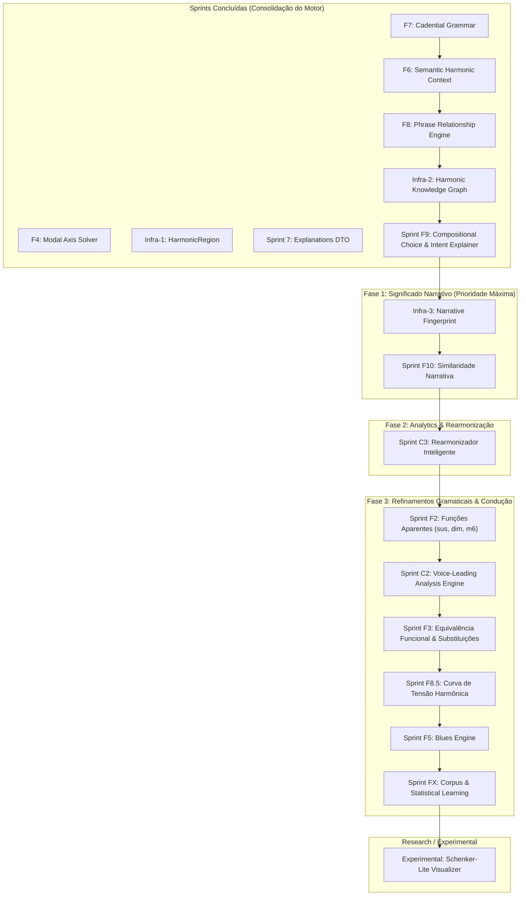

# 🚀 Catálogo de Sprints Futuras — Do Motor Analítico ao Engine de Significado

Após a conclusão das sprints **F4**, **Infra-1**, **Sprint 7**, **F7** e **F6**, o Find Chord consolidou seu núcleo como um **Analisador Tonal, Modal e Semântico Hierárquico**. A maior parte da Prioridade 1 (Harmonia Funcional Clássica) e várias fundações de análise regional, cadencial e semântica avançadas foram concluídas.

Com a consolidação dessas camadas, o gargalo do motor mudou:
> **O próximo gargalo não é mais "detectar coisas", mas sim "explicar o significado musical".**

Este documento redefine e prioriza o roadmap futuro do Find Chord sob essa ótica semântica.

---

## 📊 Estado de Cobertura Atual

| Área | Cobertura Atual | Detalhamento |
|---|---|---|
| **Harmonia funcional tonal maior** | ~95% | Cobertura completa de tétrades, graus e funções diatônicas. |
| **Tonalidade menor** | ~85% | Relações de menor natural, harmônica e melódica integradas na busca global. |
| **Dominantes secundários** | ~100% | Detecção e rotulação contextual de V7/X na timeline. |
| **SubV7** | ~100% | Identificação de dominantes substitutos tritone. |
| **Tonicizações e modulações** | ~100% | Delimitação de janelas temporárias vs modulações estruturais via cadência. |
| **Regiões harmônicas unificadas** | ~100% | Unificação de tonalidades e eixos modais em `HarmonicRegion`. |
| **Gramática cadencial** | ~100% | Quatro tipos objetivos (`AUTHENTIC`, `PLAGAL`, `HALF`, `PHRYGIAN`) com pesos e status de resolução. |
| **DTO Explicável** | ~100% | Evidências físicas, notas comuns e caminhos Viterbi expostos diretamente no DTO público. |
| **Contexto Semântico (F6)** | ~100% | AST semântica contendo intenção harmônica, papéis de frase, causas e suportes tipados. |
| **Empréstimo modal** | ~60% | Identificação de acordes emprestados sem modulação formal. |
| **Harmonia modal** | ~75% | resolvedor de eixos modais verdadeiro integrado ao Viterbi. |
| **Funções aparentes (Volume 3)** | ~15% | Heurísticas básicas de diminutos inteligentes, mas sem reinterpretação via resolução. |
| **Equivalência funcional / substituições** | ~10% | Agrupamento funcional básico, sem motor de substituição ou geração equivalente. |
| **Blues** | ~5% | Parcialmente detectado como acordes dominantes avulsos, sem suporte estrutural formal. |
| **Voice-leading** | ~15% | Condução linear na geração coralizada, mas sem análise de movimentos paralelos no input do usuário. |

---

## 🗺️ Visão Geral do Novo Roadmap



---

## 🔑 Cronograma de Priorização Recomendado

---

### Sprint F6: Semantic Harmonic Context Engine
**Status: ✅ CONCLUÍDA**
*   **Objetivo**: Mapear fatos e relações dinâmicas de significado e discurso musical diretamente nos acordes.
*   **Conceito**: Implementou a tipagem semântica ortogonal (`HarmonicIntent`, `PhraseRole`, `SemanticCause`, `SemanticSupport`) e o motor de explicabilidade estrutural objetiva, fornecendo a AST semântica básica.
*   **Valor**: Evita a geração prematura de textos, servindo como uma AST semântica pura a ser consumida pela futura F9.

---

### Sprint F7: Cadential Grammar
**Status: ✅ CONCLUÍDA**
*   **Objetivo**: Identificar e rotular padrões de encadeamento cadencial na progressão.
*   **Conceito**: Implementou a gramática sintática de cadências (Autêntica, Plagal, Semicadência, Frígia) com cálculo de peso de convicção (`cadentialWeight`) e status de resolução (Resolvida, Deceptiva, Evadida, Interrompida, Atrasada).
*   **Valor**: Permite ao motor de explicabilidade destacar momentos formais de resolução e tensão sintática.

---

### Narrativa Harmônica UI (Dashboard de 2 Abas & Auditoria Inline)
**Status: ✅ CONCLUÍDA**
*   **Objetivo**: Substituir o modal estático de Campo Harmônico por uma central de inteligência explicativa moderna e fluida.
*   **Conceito**: Estruturou o modal em duas áreas de abstração (Visão Geral/Cadências macro e timeline vertical com acordeão/inspeção de auditoria F6 inline). Adicionou suporte a multi-notação respeitando a DSL de cifragem ativa.
*   **Valor**: Traz valor imediato ao usuário final, permitindo "ler" e estudar a narrativa pedagógica do motor.

---

### Sprint F8: Phrase Relationship Engine (Relações de Período)
**Status: ✅ CONCLUÍDA**
*   **Objetivo**: Conectar a análise harmônica com a estrutura formal de frases, identificando relações de período baseadas em comportamento cadencial.
*   **Conceito**: Mapeia o pareamento formal entre frases adjacentes, classificando papéis estruturais (`ANTECEDENT`, `CONSEQUENT`) e construindo agrupamentos de períodos com cálculo de confiança de análise harmônica objetiva e suporte a `STANDALONE` fallback conservador.
*   **Implementação**:
    ```typescript
    export type PhraseFormalRole = 'ANTECEDENT' | 'CONSEQUENT' | 'STANDALONE';
    export type PhraseGroupType = 'PERIOD' | 'STANDALONE';
    export interface PhraseGroup {
      index: number;
      type: PhraseGroupType;
      phraseIndices: number[];
      confidence: number;
      name: string;
    }
    ```
*   **Observação**: Elementos complexos de macro-forma (Sentenças, Verso, Refrão, Ponte) foram explicitamente adiados para a sprint **F11**, uma vez que requerem informações de similaridade melódica, temática e rítmica não presentes no motor atual.

---

### Infra-2: Harmonic Knowledge Graph Engine
**Status: ✅ CONCLUÍDA**
*   **Objetivo**: Representar dependências funcionais, regiões, cadências, intenções e relações semânticas em um grafo de conhecimento interno estruturado e indexado, sem acoplamento visual ou de UI.
*   **Conceito**: Mapeia todas as entidades em nós estáveis (formato `tipo:index`) e arestas direcionadas (hierárquicas, temporal-sequenciais `FOLLOWS`, e conexões harmônicas diretas `PREPARES` / `RESOLVES`). Serve como a espinha dorsal de travessia e consulta para a geração explicativa em linguagem natural (F9) e análises estatísticas comparativas (F10).
*   **Valor**: Base essencial e motor de consulta para o explicador linguístico (F9) percorrer a rede de relações harmônicas da progressão.

---

### Sprint F9: Compositional Choice & Intent Explainer
**Status: ✅ CONCLUÍDA**

*   **Objetivo**: Traduzir a análise estrutural e o grafo de conhecimento (Infra-2) em explicações musicais em linguagem natural fluida e pedagógica.
*   **Conceito**: Consumir os dados do grafo semântico para gerar narrativas explicativas sobre escolhas composicionais (ex: *"O compositor utiliza A7 para intensificar a aproximação ao acorde de Ré menor antes da resolução da frase."*).
*   **Valor**: Diferencial central para o usuário final que estuda teoria musical.

---

---

### Infra-3: Narrative Fingerprint
**Prioridade: ALTA**
*   **Objetivo**: Criar uma assinatura estrutural abstrata e independente de tom (Narrative Fingerprint DTO) a partir de fatos harmônicos e perfis de cadência/região.
*   **Conceito**: Consolidar a sequência de fatos, perfis rítmico-cadenciais e transições regionais em uma representação serializável ou vetorial simplificada (ex: assinaturas do tipo `[OPENING_PROLONGATION, SECONDARY_DOMINANT_PREPARATION, PRIMARY_DOMINANT_RESOLUTION]`).
*   **Valor**: Desacopla completamente a lógica de comparação (F10) do idioma do compilador de texto (F9) e dos acordes literais de superfície, tornando a busca por similaridade 100% matemática e performática.

---

### Sprint F10: Similaridade Narrativa (Harmonic Narrative Similarity)

**Prioridade: MÉDIA**
*   **Objetivo**: Mapear similaridades e pareamentos estruturais entre progressões com base em intenção harmônica e fatos narrativos em vez de apenas cifras de superfície.
*   **Conceito**: Utilizar a sequência de fatos extraída da F9 (`NarrativeFacts`) para comparar músicas que compartilham a mesma narrativa funcional subjacente, mesmo que em tons ou graus secundários diferentes (ex: comparar um ciclo `I - V7/ii - ii - V - I` com `I - V7/vi - vi - V - I` como narrativas similares).
*   **Valor**: Permite ao sistema sugerir peças harmonicamente similares e criar conexões pedagógicas profundas, dizendo: *"Esta progressão possui uma narrativa funcional semelhante àquela encontrada em..."*.


---

### Sprints Secundárias & Refinamentos Gramaticais

*   **[F2] Funções Aparentes (Functional Substitution)**: Classificar acordes cuja estrutura física difere da função de superfície (ex: `Idim` atuando como `IV7`, `m6` como dominante implícito).
*   **[C2] Voice-Leading Analysis Engine**: Analisar o movimento de vozes internas do input do usuário (soprano, contralto, tenor, baixo) e detectar conduções proibidas (oitavas/quintas paralelas, sensíveis não resolvidas).
*   **[F3] Equivalência Funcional & Substituições**: API que sugere rearmonizações equivalentes para cada ponto da timeline.
*   **[F8.5] Curva de Tensão Harmônica (Tension Curve)**: Computar curva contínua de flutuação de dissonância e instabilidade tonal.
*   **[F5] Blues Engine**: Identificar formas de Blues de 12 compassos e tratar dominantes como acordes estáticos sem falsa tensão dominante.
*   **[FX] Corpus & Statistical Learning**: Adicionar probabilidade empírica baseada em corpora para desempate do resolvedor Viterbi.

---

### Sprints Experimentais / Pesquisa

*   **[Experimental] Schenker-Lite Visualizer (antiga C1)**: Grafo de redução hierárquica gráfica aninhada ilustrando as camadas de redução da narrativa tonal. Removido do roadmap principal devido ao menor valor de produto comparado com a descrição textual de significado musical.
