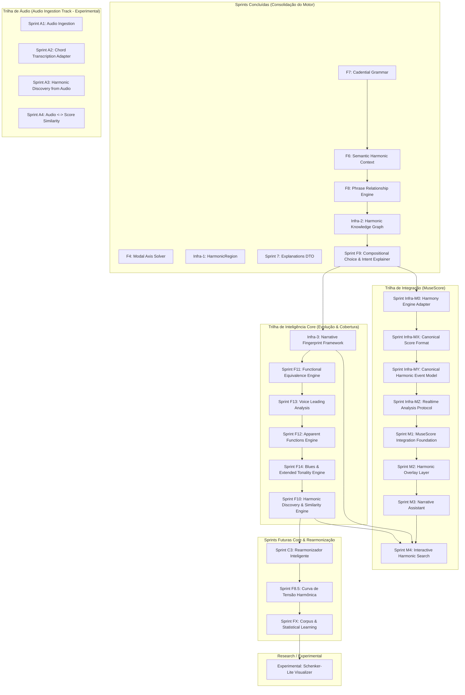

# 🚀 Catálogo de Sprints Futuras — Do Motor Analítico ao Engine de Significado

Após a conclusão das sprints **F4**, **Infra-1**, **Sprint 7**, **F7** e **F6**, o Find Chord consolidou seu núcleo como um **Analisador Tonal, Modal e Semântico Hierárquico**. A maior parte da Prioridade 1 (Harmonia Funcional Clássica) e várias fundações de análise regional, cadencial e semântica avançadas foram concluídas.

Com a consolidação dessas camadas, o gargalo do motor mudou:
> **O próximo gargalo não é mais "detectar coisas", mas sim "explicar o significado musical".**

Este documento redefine e prioriza o roadmap futuro do Find Chord sob essa ótica semântica.

---

## 📊 Estado de Cobertura Atual

| Área | Cobertura Atual | Detalhamento |
|---|---|---|
| **Harmonia funcional tonal maior** | ~95% | Cobertura completa de tétrades, graus e funções diatônicas. |
| **Tonalidade menor** | ~85% | Relações de menor natural, harmônica e melódica integradas na busca global. |
| **Dominantes secundários** | ~100% | Detecção e rotulação contextual de V7/X na timeline. |
| **SubV7** | ~100% | Identificação de dominantes substitutos tritone. |
| **Tonicizações e modulações** | ~100% | Delimitação de janelas temporárias vs modulações estruturais via cadência. |
| **Regiões harmônicas unificadas** | ~100% | Unificação de tonalidades e eixos modais em `HarmonicRegion`. |
| **Gramática cadencial** | ~100% | Quatro tipos objetivos (`AUTHENTIC`, `PLAGAL`, `HALF`, `PHRYGIAN`) com pesos e status de resolução. |
| **DTO Explicável** | ~100% | Evidências físicas, notas comuns e caminhos Viterbi expostos diretamente no DTO público. |
| **Contexto Semântico (F6)** | ~100% | AST semântica contendo intenção harmônica, papéis de frase, causas e suportes tipados. |
| **Empréstimo modal** | ~60% | Identificação de acordes emprestados sem modulação formal. |
| **Harmonia modal** | ~75% | resolvedor de eixos modais verdadeiro integrado ao Viterbi. |
| **Funções aparentes (Volume 3)** | ~15% | Heurísticas básicas de diminutos inteligentes, mas sem reinterpretação via resolução. |
| **Equivalência funcional / substituições** | ~10% | Agrupamento funcional básico, sem motor de substituição ou geração equivalente. |
| **Blues** | ~5% | Parcialmente detectado como acordes dominantes avulsos, sem suporte estrutural formal. |
| **Voice-leading** | ~15% | Condução linear na geração coralizada, mas sem análise de movimentos paralelos no input do usuário. |

---

## 🗺️ Visão Geral do Novo Roadmap




```

---

## 🔑 Cronograma de Priorização Recomendado

---

### Sprint F6: Semantic Harmonic Context Engine
**Status: ✅ CONCLUÍDA**
*   **Objetivo**: Mapear fatos e relações dinâmicas de significado e discurso musical diretamente nos acordes.
*   **Conceito**: Implementou a tipagem semântica ortogonal (`HarmonicIntent`, `PhraseRole`, `SemanticCause`, `SemanticSupport`) e o motor de explicabilidade estrutural objetiva, fornecendo a AST semântica básica.
*   **Valor**: Evita a geração prematura de textos, servindo como uma AST semântica pura a ser consumida pela futura F9.

---

### Sprint F7: Cadential Grammar
**Status: ✅ CONCLUÍDA**
*   **Objetivo**: Identificar e rotular padrões de encadeamento cadencial na progressão.
*   **Conceito**: Implementou a gramática sintática de cadências (Autêntica, Plagal, Semicadência, Frígia) com cálculo de peso de convicção (`cadentialWeight`) e status de resolução (Resolvida, Deceptiva, Evadida, Interrompida, Atrasada).
*   **Valor**: Permite ao motor de explicabilidade destacar momentos formais de resolução e tensão sintática.

---

### Narrativa Harmônica UI (Dashboard de 2 Abas & Auditoria Inline)
**Status: ✅ CONCLUÍDA**
*   **Objetivo**: Substituir o modal estático de Campo Harmônico por uma central de inteligência explicativa moderna e fluida.
*   **Conceito**: Estruturou o modal em duas áreas de abstração (Visão Geral/Cadências macro e timeline vertical com acordeão/inspeção de auditoria F6 inline). Adicionou suporte a multi-notação respeitando a DSL de cifragem ativa.
*   **Valor**: Traz valor imediato ao usuário final, permitindo "ler" e estudar a narrativa pedagógica do motor.

---

### Sprint F8: Phrase Relationship Engine (Relações de Período)
**Status: ✅ CONCLUÍDA**
*   **Objetivo**: Conectar a análise harmônica com a estrutura formal de frases, identificando relações de período baseadas em comportamento cadencial.
*   **Conceito**: Mapeia o pareamento formal entre frases adjacentes, classificando papéis estruturais (`ANTECEDENT`, `CONSEQUENT`) e construindo agrupamentos de períodos com cálculo de confiança de análise harmônica objetiva e suporte a `STANDALONE` fallback conservador.
*   **Implementação**:
    ```typescript
    export type PhraseFormalRole = 'ANTECEDENT' | 'CONSEQUENT' | 'STANDALONE';
    export type PhraseGroupType = 'PERIOD' | 'STANDALONE';
    export interface PhraseGroup {
      index: number;
      type: PhraseGroupType;
      phraseIndices: number[];
      confidence: number;
      name: string;
    }
    ```
*   **Observação**: Elementos complexos de macro-forma (Sentenças, Verso, Refrão, Ponte) foram explicitamente adiados para a sprint **F11**, uma vez que requerem informações de similaridade melódica, temática e rítmica não presentes no motor atual.

---

### Infra-2: Harmonic Knowledge Graph Engine
**Status: ✅ CONCLUÍDA**
*   **Objetivo**: Representar dependências funcionais, regiões, cadências, intenções e relações semânticas em um grafo de conhecimento interno estruturado e indexado, sem acoplamento visual ou de UI.
*   **Conceito**: Mapeia todas as entidades em nós estáveis (formato `tipo:index`) e arestas direcionadas (hierárquicas, temporal-sequenciais `FOLLOWS`, e conexões harmônicas diretas `PREPARES` / `RESOLVES`). Serve como a espinha dorsal de travessia e consulta para a geração explicativa em linguagem natural (F9) e análises estatísticas comparativas (F10).
*   **Valor**: Base essencial e motor de consulta para o explicador linguístico (F9) percorrer a rede de relações harmônicas da progressão.

---

### Sprint F9: Compositional Choice & Intent Explainer
**Status: ✅ CONCLUÍDA**
*   **Objetivo**: Traduzir a análise estrutural e o grafo de conhecimento (Infra-2) em explicações musicais em linguagem natural fluida e pedagógica.
*   **Conceito**: Consumir os dados do grafo semântico para gerar narrativas explicativas sobre escolhas composicionais (ex: *"O compositor utiliza A7 para intensificar a aproximação ao acorde de Ré menor antes da resolução da frase."*).
*   **Valor**: Diferencial central para o usuário final que estuda teoria musical.

---

### Infra-3: Narrative Fingerprint Framework
**Prioridade: CRÍTICA (Direcionador Estratégico)**
*   **Objetivo**: Criar uma assinatura estrutural em camadas (Narrative Fingerprint DTO), abstrata e independente de tom, a partir de fatos harmônicos, frases, regiões e cadências, guiada pelo conceito de **Densidade Semântica**.
*   **Visão Estratégica: Fingerprint Information Density Roadmap**
    A evolução do fingerprint é estruturada de forma que cada camada adiciona uma dimensão específica de densidade semântica sobre a base:
    ```text
    Fingerprint Information Density Roadmap

    Layer 1 — Structural
    Layer 2 — Harmonic
    Layer 3 — Formal
    Layer 4 — Regional

    (F9 baseline)

    Layer 5 — Functional Equivalence (F11)
    Layer 6 — Voice-Leading (F13)
    Layer 7 — Apparent Functions (F12)
    Layer 8 — Extended Tonality / Blues (F14)
    ```
    Onde cada camada atua em uma dimensão diferente de enriquecimento:
    ```text
    F11
    ↑
    aumenta a abstração (mapeamento de acordes substitutos e classes equivalentes)

    F13
    ↑
    aumenta a resolução física (notas comuns e direção das vozes)

    F12
    ↑
    aumenta a interpretação semântica (leitura retrospectiva baseada em voice-leading)

    F14
    ↑
    aumenta a cobertura estilística (jazz, blues e tonalidade estendida)
    ```
*   **Conceito**: Dividir o fingerprint em camadas analíticas dinâmicas, com estrutura flexível para expansões futuras que aumentem progressivamente a densidade semântica da representação.
*   **Valor**: Permite comparar progressões sob diferentes prismas analíticos, garantindo que o motor de similaridade possa encontrar peças com correspondências estruturais, sintáticas ou formais sem acoplar com as cifras literais de superfície.

---

### Sprint F11: Functional Equivalence Engine
**Prioridade: CRÍTICA**
*   **Objetivo**: Criar um resolvedor de equivalência funcional para unificar representações estruturais de progressões com cifragens de superfície distintas.
*   **Conceito**: Mapear acordes e encadeamentos semanticamente equivalentes (ex: `G7 ≈ Db7` por substituição de trítono; `B°7 ≈ G7(b9)` por equivalência de diminuto; `ii - V ≈ IV - V` por equivalência subdominante; `V7/V ≈ subV7/V`).
*   **Valor**: Enriquece os fingerprints (F9/Infra-3) com agrupamento de classes funcionais, permitindo que a busca da F10 reconheça que duas progressões contam a mesma história estrutural mesmo usando acordes substitutos diferentes.

---

### Sprint F13: Voice Leading Analysis
**Prioridade: CRÍTICA (Pré-requisito de F12)**
*   **Objetivo**: Analisar melódica e fisicamente o movimento das vozes internas entre acordes adjacentes da timeline.
*   **Relação de Dependência**: O voice-leading é um pré-requisito técnico direto para a identificação de **Funções Aparentes (F12)**. Por exemplo, para descobrir se um acorde diminuto `B°7` atua como `vii°7/I`, `vii°7/V`, `SubV°`, ou apenas um acorde de passagem, é necessário analisar a condução física (resolução, notas comuns e direção das vozes). Portanto, F13 deve necessariamente preceder F12 no roadmap.
*   **Conceito**: Mapear notas comuns mantidas, aproximações cromáticas e tipos de movimento linear (paralelo, contrário, oblíquo). Emitir fatos estruturados (`VoiceLeadingFact`) que explicam o nível de suavidade e condução.
*   **Valor**: Fornece um novo nível de explicabilidade estética no compilador de narrativa (F9) e adiciona a camada de voice-leading ao fingerprint da Infra-3.

---

### Sprint F12: Apparent Functions Engine
**Prioridade: CRÍTICA**
*   **Objetivo**: Interpretar acordes não-diatônicos e ambíguos a partir de seu comportamento de resolução (análise retrospectiva), baseando-se nas teorias de Schoenberg e na análise linear de condução obtida na F13.
*   **Conceito**: Tratar acordes com cifragens exóticas (ex: acorde de sexta aumentada alemã/italiana/francesa ou acordes alterados) avaliando sua condução linear de resolução em vez de apenas sua origem no campo diatônico, rotulando-os como funções aparentes dominantes.
*   **Valor**: Eleva drasticamente a precisão da narrativa harmônica (F9) e a detecção de tensões em peças do classicismo tardio, romantismo e música erudita do início do século XX.

---

### Sprint F14: Blues & Extended Tonality Engine
**Prioridade: ALTA**
*   **Objetivo**: Expandir o resolvedor Viterbi e o grafo de conhecimento com regras específicas para Blues e tonalidade estendida do Jazz.
*   **Conceito**: Adicionar suporte nativo à estrutura clássica de Blues de 12 compassos, tratamento de dominantes estáticas não funcionais (que não buscam resolução), acordes de *Backdoor Dominant* (bVII7) e turnarounds de jazz típicos.
*   **Valor**: Aumenta a cobertura do motor de 5% para 90% em repertórios de jazz, blues e música popular moderna, permitindo a extração de fatos analíticos precisos nessas linguagens.

---

### Sprint F10: Harmonic Discovery & Similarity Engine
**Prioridade: MÉDIA**
*   **Objetivo**: Construir o resolvedor de similaridade musical em camadas e integrá-lo a um motor de recomendação pedagógica de repertório.
*   **Conceito**: Utilizar os fingerprints estruturados da `Infra-3` para oferecer diferentes modalidades de comparação. O Discovery Engine é responsável por aplicar filtros de repertório, estilo, período histórico e corpus (ex: `repertoire: 'JAZZ'`, `corpus: 'CLASSICAL'`) de forma independente do modelo abstrato do fingerprint, permitindo cruzar correspondências funcionais de peças de estéticas distintas.
    *   **Similaridade Funcional** (foco no *Structural Fingerprint*): Compara o encadeamento puro de tensão e repouso.
    *   **Similaridade Harmônica** (foco no *Harmonic Fingerprint*): Compara o uso de recursos de cor (empréstimos, dominantes secundárias).
    *   **Similaridade Formal** (foco no *Formal Fingerprint*): Compara a estrutura fraseológica (períodos, sementes sintáticas).
    *   **Similaridade Narrativa Completa**: Combinação ponderada de todas as camadas.
    *   **Similaridade de Voice Leading**: Compara padrões de movimentação de vozes (Layer 6).
*   **Valor**: Transforma a similaridade em um professor de repertório ativo, sugerindo peças famosas com discursos harmônicos similares (ex: *"Esta progressão apresenta um comportamento de período antecedente-consequente semelhante ao de Autumn Leaves ou a corais de Bach"*).

---

## 🔌 Trilha de Integração (MuseScore Integration Track)

---

### Sprint Infra-M0: Harmony Engine Adapter (API/SDK)
**Prioridade: ALTA**
*   **Objetivo**: Criar uma API pública de fachada estável e desacoplada (SDK/Adapter API) para expor as capacidades do motor a clientes externos.
*   **Conceito**: Estruturar a interface de integração (SDK) em três níveis específicos:
    1.  **Nível 1 — APIs de Alto Nível**: Para a maioria dos clientes (`analyzeScore`, `generateNarrative`, `generateFingerprint(score, options)`, `findSimilarWorks`). A chamada `generateFingerprint` suportará opções para selecionar camadas específicas (ex: `layers: ['STRUCTURAL', 'HARMONIC']`) ou níveis de densidade de informação (ex: `density: 'CORE' | 'STANDARD' | 'FULL'`).
    2.  **Nível 2 — APIs de Explicabilidade**: Para tutores, overlays e assistentes pedagógicos (`explainChord`, `explainPhrase`, `explainCadence`).
    3.  **Nível 3 — APIs de Pesquisa**: Para descoberta e recomendação profunda de repertório (`compareFingerprints`, `searchByFingerprint`, `searchByNarrativeFacts`).
*   **Valor**: Garante a reusabilidade do Find Chord como um "Harmony Intelligence Engine" plugável de forma universal, permitindo a evolução independente do motor.


---

### Sprint Infra-MX: Canonical Score Format
**Prioridade: ALTA**
*   **Objetivo**: Definir uma estrutura de representação de partitura canônica, neutra e universal (`HarmonyEngineScore` JSON) para unificar diferentes formatos de entrada.
*   **Conceito**: Criar um esquema de dados padrão que encapsule metadados, compassos (`Measure[]`), eventos harmônicos de cifra (`HarmonyEvent[]`) e notas melódicas (`NoteEvent[]`). Qualquer adaptador (MuseScore, Guitar Pro, importador de MIDI/MusicXML/ChordPro) será responsável apenas por traduzir seu formato proprietário para esta representação canônica antes de enviá-lo ao SDK da `Infra-M0`.
*   **Valor**: Evita a explosão de acoplamento no motor analítico, permitindo adicionar novos clientes ou leitores de formatos de partitura no ecossistema sem tocar em uma única linha do Harmony Engine.

---

### Sprint Infra-MY: Canonical Harmonic Event Model
**Prioridade: ALTA**
*   **Objetivo**: Definir um modelo canônico de eventos harmônicos baseado em tempo/offset (`HarmonicEvent[]`) para alimentar o motor a partir de dados de áudio ou cifras temporizadas (sem necessidade de partitura).
*   **Conceito**: Criar uma estrutura de dados de eventos sequenciais temporizados (timestamp, duration, chord, notes, region, cadence). Permite que clientes de análise de áudio (ex: APIs do Spotify, Chordify, bases do MusicBrainz) possam mapear suas saídas de transcrição direta para o formato canônico do Harmony Engine, contornando a necessidade de representações de compassos ou notações de partitura rígidas.
*   **Valor**: Abre a inteligência harmônica para o ecossistema de áudio digital e processamento de sinal (DSP), expandindo o mercado do Find Chord além do escopo de editores de partitura.

---

### Sprint Infra-MZ: Realtime Analysis Protocol
**Prioridade: ALTA**
*   **Objetivo**: Desenvolver um protocolo de reanálise incremental em tempo real para partituras longas durante a edição.
*   **Conceito**: Implementar mecanismos de reanálise localizada baseada em diffs temporais ou marcações de compassos modificados. O editor de partitura envia eventos incrementais de alteração e o Harmony Engine recalcula apenas os nós e caminhos Viterbi afetados, atualizando dinamicamente a narrativa sem necessitar reprocessar a partitura inteira.
*   **Valor**: Elimina gargalos de processamento, garantindo latência extremamente baixa e experiência em tempo real mesmo em partituras extensas.


---

### Sprint M1: MuseScore Integration Foundation


**Prioridade: MÉDIA**
*   **Objetivo**: Estabelecer a conectividade básica entre a partitura do MuseScore e o Harmony Engine do Find Chord de forma simplificada.
*   **Conceito**: Desenvolver um adaptador/plugin leve no MuseScore que lê a partitura atual, extrai os acordes brutos e durações, e os envia via API da `Infra-M0` para o motor do Find Chord. O resultado da análise harmônica e a visão geral são exibidos de forma puramente textual (texto/JSON) em um painel lateral integrado, sem qualquer overlay visual ou gráfico sofisticado.
*   **Valor**: Valida com o menor custo possível a viabilidade e a conectividade de ponta a ponta de toda a pipeline de dados.

---

### Sprint M2: Harmonic Overlay Layer
**Prioridade: MÉDIA**
*   **Objetivo**: Desenhar anotações analíticas diretamente sobre a partitura do MuseScore de forma dinâmica.
*   **Conceito**: Sobreescrever graficamente elementos visuais na partitura para plotar automaticamente áreas de frases, limites de períodos (antecedente/consequente), modulações e marcações de cadências de forma nativa.
*   **Valor**: Substitui a análise harmônica de papel por uma camada visual analítica interativa no próprio editor.

---

### Sprint M3: Narrative Assistant
**Prioridade: MÉDIA**
*   **Objetivo**: Habilitar a auditoria semântica e pedagógica da F9 integrada ao fluxo de escrita no MuseScore.
*   **Conceito**: Ao selecionar uma frase ou compasso, exibir balões de ajuda ou explicações detalhadas em linguagem natural sobre o *porquê* daquele acorde ter sido escolhido (ex: *"O acorde A7 é uma dominante secundária preparando Dm"*).
*   **Valor**: Proporciona feedback imediato ao compositor ou estudante de harmonia enquanto ele está ativamente compondo.

---

### Sprint M4: Interactive Harmonic Search
**Prioridade: MÉDIA**
*   **Objetivo**: Integrar os recursos de busca de similaridade e recomendação de repertório no MuseScore.
*   **Conceito**: Conectar a camada de fingerprints (`Infra-3`) e busca (`F10`) para que o usuário possa selecionar um trecho da sua própria partitura e pedir ao plugin para encontrar peças clássicas ou populares na literatura com a mesma assinatura narrativa.
*   **Valor**: Transforma a partitura em uma central de descoberta e estudo musical interativo.

---

## 🎧 Trilha de Áudio (Audio Ingestion Track - Experimental)

---

### Sprint A1: Audio Ingestion
**Prioridade: BAIXA (Pesquisa/Experimental)**
*   **Objetivo**: Estabelecer conectividade básica para processamento de sinais de áudio brutos e extração de características acústicas (chromagrams).
*   **Conceito**: Desenvolver pipelines de entrada para ler arquivos de áudio (MP3, WAV) e computar a flutuação contínua de chroma pitch classes sobre janelas temporais.
*   **Valor**: Base de dados essencial para transcrição automática.

---

### Sprint A2: Chord Transcription Adapter
**Prioridade: BAIXA (Pesquisa/Experimental)**
*   **Objetivo**: Mapear as características de áudio processadas em eventos harmônicos estruturados no formato canônico da `Infra-MY`.
*   **Conceito**: Utilizar heurísticas analíticas e modelos acústicos de desambiguação para transcrever chromagrams em acordes temporizados (`HarmonicEvent[]`), validando as previsões através de coerência tonal.
*   **Valor**: Habilita a ingestão direta de arquivos de áudio reais no motor do Find Chord.

---

### Sprint A3: Harmonic Discovery from Audio
**Prioridade: BAIXA (Pesquisa/Experimental)**
*   **Objetivo**: Permitir a extração de fingerprints narrativos diretamente a partir de áudios brutos gravados ou importados.
*   **Conceito**: Integrar os resultados do transcritor (`A2`) com o framework de fingerprints da `Infra-3`.
*   **Valor**: Permite a indexação automática de bases de dados de áudio (ex: Spotify, arquivos de MP3) em discursos harmônicos pesquisáveis.

---

### Sprint A4: Audio ↔ Score Similarity
**Prioridade: BAIXA (Pesquisa/Experimental)**
*   **Objetivo**: Mapear e parear correspondências cruzadas de similaridade entre arquivos de áudio e partituras escritas.
*   **Conceito**: Confrontar fingerprints extraídos do áudio com fingerprints de partituras canônicas para busca semântica híbrida (ex: *"Esta gravação em áudio possui 85% de similaridade estrutural com esta partitura de Chopin"*).
*   **Valor**: Consolida a busca universal e cruzada de conceitos harmônicos em bases de dados mistas de mídia.


---

### Sprints Secundárias & Refinamentos Gramaticais

*   **[F8.5] Curva de Tensão Harmônica (Tension Curve)**: Computar curva contínua de flutuação de dissonância e instabilidade tonal.
*   **[FX] Corpus & Statistical Learning**: Adicionar probabilidade empírica baseada em corpora para desempate do resolvedor Viterbi.


---

### Sprints Experimentais / Pesquisa

*   **[Experimental] Schenker-Lite Visualizer (antiga C1)**: Grafo de redução hierárquica gráfica aninhada ilustrando as camadas de redução da narrativa tonal. Removido do roadmap principal devido ao menor valor de produto comparado com a descrição textual de significado musical.
