# 🚀 Catálogo de Sprints Futuras — Do Motor Analítico ao Engine de Significado

Após a conclusão da consolidação semântica e analítica, o Find Chord atingiu a maturidade em sua plataforma de explicabilidade. A trilogia de explicabilidade, causalidade e o espaço formal de transformações estão operando de forma integrada.

Este documento formaliza a reestruturação do roadmap sob a ótica de espaço de busca e planejamento pedagógico de rearmonizações.

---

## 📊 Estado de Cobertura Atual

| Área | Cobertura Atual | Detalhamento |
|---|---|---|
| **Harmonia funcional tonal maior** | ~95% | Cobertura completa de tétrades, graus e funções diatônicas. |
| **Tonalidade menor** | ~85% | Relações de menor natural, harmônica e melódica integradas na busca global. |
| **Dominantes secundários** | ~100% | Detecção e rotulação contextual de V7/X na timeline. |
| **SubV7** | ~100% | Identificação de dominantes substitutos tritone. |
| **Tonicizações e modulações** | ~100% | Delimitação de janelas temporárias vs modulações estruturais via cadência. |
| **Regiões harmônicas unificadas** | ~100% | Unificação de tonalidades e eixos modais em `HarmonicRegion`. |
| **Gramática cadencial** | ~100% | Quatro tipos objetivos (`AUTHENTIC`, `PLAGAL`, `HALF`, `PHRYGIAN`) com pesos e status de resolução. |
| **DTO Explicável** | ~100% | Evidências físicas, notas comuns e caminhos Viterbi expostos diretamente no DTO público. |
| **Contexto Semântico (F6)** | ~100% | AST semântica contendo intenção harmônica, papéis de frase, causas e suportes tipados. |
| **Empréstimo modal** | ~100% | Identificação de acordes emprestados e suporte para desvios harmônicos. |
| **Harmonia modal** | ~75% | resolvedor de eixos modais verdadeiro integrado ao Viterbi. |
| **Funções aparentes (Volume 3)** | ~100% | Resoluções retrospectivas, diminutos inteligentes e sextas aumentadas integrados à Layer 7. |
| **Equivalência funcional / substituições** | ~100% | Mapeamento de classes funcionais equivalentes e substituições na Layer 5. |
| **Voice-leading** | ~100% | Análise de notas comuns, condução suave e movimentos lineares concluída na Layer 6. |
| **Espaço de Transformação (F10-C.4/C.5)** | ~100% | Catálogo estático de templates de rearmonização, grafo de decisões e caminhos pedagógicos. |
| **Blues** | ~5% | Parcialmente detectado como acordes dominantes avulsos, sem suporte estrutural formal. |

---

## 🗺️ Visão Geral do Novo Roadmap

```mermaid
graph TD
    subgraph "PHASE 1 — Analysis Engine (✅ Concluída)"
        F4["F4: Modal Axis Solver"]
        Infra1["Infra-1: HarmonicRegion"]
        Sprint7["Sprint 7: Explanations DTO"]
        F7["F7: Cadential Grammar"]
        F6["F6: Semantic Harmonic Context"]
        F8["F8: Phrase Relationship Engine"]
        Infra2["Infra-2: Harmonic Knowledge Graph"]
        F9["Sprint F9: Compositional Choice & Intent Explainer"]
        Infra3["Infra-3: Narrative Fingerprint Framework"]
        F11["Sprint F11: Functional Equivalence Engine"]
        F13["Sprint F13: Voice Leading Analysis"]
        F12["Sprint F12: Apparent Functions Engine"]
        F10["Sprint F10: Harmonic Discovery & Similarity Engine"]
      
        F4 --> Infra1 --> Sprint7 --> F7 --> F6 --> F8 --> Infra2 --> F9 --> Infra3
        Infra3 --> F11 --> F13 --> F12 --> F10
    end

    subgraph "PHASE 2 — Explainability Platform (✅ Concluída)"
        F10C1["F10-C.1: Evidence Graph & Traceability"]
        F10C2["F10-C.2: Evidence Attribution & Causal Ranking"]
        F10C3["F10-C.3: Counterfactual Explainability"]
        F10C4["F10-C.4: Recommendation Readiness"]
      
        F10 --> F10C1 --> F10C2 --> F10C3 --> F10C4
    end

    subgraph "PHASE 3 — Recommendation Engine (✅ Concluída)"
        F10C5["F10-C.5: Transformation Dependency Graph"]
        C31["C3.1: Transformation Execution Engine"]
        C32A["C3.2-A: Goal-Oriented Recommendation Engine"]
        C32B["C3.2-B: Harmonic State Evaluation Engine"]
        C32C["C3.2-C: Constraint Satisfaction Engine"]
        C33["C3.3: Explainable Recommendations 2.0"]
        C34["C3.4: Multi-Objective Optimization"]
        C34A["C3.4-A: Real Scenario Benchmark"]
        C34B["C3.4-B: Recommendation Analytics"]
        F12_1B["F12.1-B: Percentile Normalization Layer"]
        F12_3["F12.3: Dynamic Pareto Diagnostics"]
        F12_4["F12.4: Empirical Confidence Recalibration"]
        F12_5["F12.5: Confidence Decomposition Analytics"]
      
        F10C4 --> F10C5 --> C31 --> C32A --> C32B --> C32C --> C33 --> C34 --> C34A --> C34B --> F12_1B --> F12_3 --> F12_4 --> F12_5
    end

    subgraph "PHASE 4 — Confidence Weight Learning (✅ Concluída)"
        F12_6["F12.6: Learned Confidence Weight Optimization"]
        F12_5 --> F12_6
    end

    subgraph "PHASE 5 — Context-Aware Optimization (🔄 Em andamento)"
        F12_7["F12.7: Context-Aware Confidence Weights"]
        F12_6 --> F12_7
        F10E["F10-E: Corpus Expansion & Benchmark Suite"]
        F12_7 --> F10E
    end

    subgraph "PHASE 6 — Extended Harmony"
        F14["F14: Blues & Extended Tonality Engine"]
        F10E --> F14
    end

    subgraph "PHASE 7 — Integrations (MuseScore & Audio)"
        IM0["Infra-M0: Harmony Engine Adapter"]
        IMX["Infra-MX: Canonical Score Format"]
        IMY["Infra-MY: Canonical Harmonic Event Model"]
        IMZ["Infra-MZ: Realtime Analysis Protocol"]
        M1["M1: MuseScore Integration Foundation"]
        M2["M2: Harmonic Overlay Layer"]
        M3["M3: Narrative Assistant"]
        M4["M4: Interactive Harmonic Search"]
      
        A1["A1: Audio Ingestion"]
        A2["A2: Chord Transcription Adapter"]
        A3["A3: Harmonic Discovery from Audio"]
        A4["A4: Audio <-> Score Similarity"]
      
        F9 --> IM0 --> IMX --> IMY --> IMZ --> M1 --> M2 --> M3 --> M4
        IMY --> A1 --> A2 --> A3 --> A4
    end
```

---

## 🔑 Cronograma de Priorização Recomendado

As sprints concluídas compõem o motor fundamental de análise, a plataforma de explicabilidade e a fundação do recomendador. As próximas focarão em restrições, otimização e calibração de probabilidade.

---

### Sprint C3.2-B: Harmonic State Evaluation Engine
**Status: ✅ CONCLUÍDA**
*   **Objetivo**: Introduzir inteligência de circuito fechado para avaliar as consequências harmônicas reais de rearmonizações executadas.
*   **Conceito**: Implementação de perfis dinâmicos de transição de estado harmônico (`HarmonicStateProfile` e `HarmonicStateTransition`) e aferição de alinhamento com a meta harmônica (`GoalAchievement`) com score e confiança da análise.

---

### Sprint C3.2-C: Constraint Satisfaction Engine
**Status: ✅ CONCLUÍDA**
*   **Objetivo**: Permitir que o usuário imponha restrições reais de contorno físico e musical sobre o motor de rearmonização.
*   **Conceito**: Implementação do sistema de restrições harmônicas e físicas (`HarmonicConstraint`):
    *   Métricas: `TENSION` | `CHROMATICISM` | `BASS_SMOOTHNESS` | `FUNCTIONAL_STABILITY` | `VOICE_LEADING` | `PHYSICAL_COMPLEXITY`.
    *   Operadores: `GREATER_THAN` | `LESS_THAN` | `PRESERVE`.
    *   Fórmula do Ranking: `finalScore = (goalAlignment * 0.5) + (pedagogicalScore * 0.3) + (goalAchievement * 0.2) - constraintPenalty`.
    *   Traceability com `constraintId` e `reason` de violação.
    *   Filtragem automática de Hard Constraints e caching do `executionResult`.

---

### Sprint C3.3: Explainable Recommendations 2.0
**Status: ✅ CONCLUÍDA**
*   **Objetivo**: Conectar as explicações estruturadas e restrições diretamente às metas harmônicas e de contorno fornecidas pelo recomendador.
*   **Conceito**: Implementação do Decision Explanation Engine (`explainRecommendationDecision`), que calcula o fator de decisão dominante (`dominantFactor`), razões de seleção (`selectionReasons`), descartes por restrições hard (`HARD_CONSTRAINT_FAILURE`) e alinhamentos alternativos, trade-offs de ganho/perda de métricas harmônicas e física, além de confiança ponderada contínua. As novas seções analíticas em português foram acopladas ao renderizador de narrativa (`narrativeRenderer.ts`).

---

### Sprint C3.4: Multi-Objective Optimization
**Status: ✅ CONCLUÍDA**
*   **Objetivo**: Buscar o conjunto de caminhos ótimos na fronteira de Pareto de múltiplos objetivos.
*   **Conceito**: Implementação do Multi-Objective Optimization Engine (`multiObjectiveOptimizationEngine.ts`) que mapeia os vetores de objetivos reais (`ObjectiveVector`), realiza checagens de dominância de Pareto e aplica a distância de aglomeração do NSGA-II (`computeCrowdingDistance`) para garantir diversidade de soluções. Adicionamos a estratégia de perfis lineares (`BALANCED`, `MAX_TENSION`, `MAX_STABILITY`, `MAX_PLAYABILITY`, `MAX_VOICE_LEADING`, `MAX_PEDAGOGY`) e a integração no pipeline de busca, permitindo reordenação pública de caminhos e narratives detalhadas em português (`narrativeRenderer.ts`).

---

### Sprint C3.4-A: Real Musical Scenario Benchmark
**Status: ✅ CONCLUÍDA**
*   **Objetivo**: Validar qualitativamente o recomendador de acordes através de 30 cenários em 10 categorias estruturais, intenções do usuário e consistência narrativa.
*   **Conceito**: Implementação de uma suíte de testes de benchmark (`musicalScenarioBenchmark.test.ts`) que valida o alinhamento musical, casos regressivos históricos, empate de Pareto (NSGA-II) e consistência narrativa (com validação em português no renderizador).
    *   Métricas: Aferição de média aritmética > 4.2 e restrição de nenhum cenário crítico (cadência autêntica, tritone substitution, teste do professor e MAX_PLAYABILITY) abaixo de 3.
    *   Resultados salvos no artefato `musical_benchmark_report.md` com métricas globais e distribuição de mecanismos para detecção de vieses.

---

### Sprint C3.4-B: Recommendation Analytics
**Status: ✅ CONCLUÍDA**
*   **Objetivo**: Implementar o motor de analytics do recomendador para medir comportamentos qualitativos do recomendador e tendências do motor.
*   **Conceito**: Desenvolvimento do calculador de analytics (`recommendationAnalyticsEngine.ts`) operando sobre execuções e correspondências de descoberta (adapter).
    *   Métricas: Tamanho médio de Pareto, taxas de falhas de restrições estritas e confiança média do recomendador.
    *   Validação: Aferição de asserções de robustez no benchmark (`averageParetoSize > 1.0`, `averageDecisionConfidence > 0.4`, `hardConstraintFailureRate < 0.5`) e geração automática do relatório `musical_benchmark_report.md` contendo a seção "Tendências do Motor" com dados quantitativos e mecanismos normalizados de rearmonização.

---

### Sprint F12.1-B: Percentile Normalization Layer
**Status: ✅ CONCLUÍDA**
*   **Objetivo**: Corrigir assimetrias de escala nos objetivos de Pareto que distorciam a tomada de decisão.
*   **Conceito**: Normalização baseada em percentis reais obtidos via simulação de quotas com 500 progressões únicas e 3.672 caminhos válidos.

---

### Sprint F12.3: Dynamic Pareto Diagnostics
**Status: ✅ CONCLUÍDA**
*   **Objetivo**: Implementar instrumentação geométrica na fronteira de Pareto.
*   **Conceito**: Métricas contínuas de Hypervolume (Monte Carlo), Spread, Spacing (L2) e FCR (compactação) para diagnosticar a estrutura de soluções não-dominadas.

---

### Sprint F12.4: Empirical Confidence Recalibration
**Status: ✅ CONCLUÍDA**
*   **Objetivo**: Mapear a incerteza espacial da fronteira na certeza do recomendador.
*   **Conceito**: Inclusão de `geometryFactor` e `paretoAmbiguity` na confiança bruta, seguido de recalibração logística de Platt ($A = 19.60, B = -10.15$) otimizada sob restrições de discriminação.

---

### Sprint F12.5: Confidence Decomposition Analytics
**Status: ✅ CONCLUÍDA**
*   **Objetivo**: Analisar detalhadamente as contribuições individuais e a força preditiva de cada fator de confiança.
*   **Conceito**: Telemetria para registrar a contribuição bruta, ponderada e *Relative Contribution Share* de cada fator. Cálculo de correlações de Pearson com a confiança e com o sucesso real de benchmark qualitativo, além de gravação histórica local de drift.

---

### Sprint F12.6: Learned Confidence Weight Optimization
**Status: ✅ CONCLUÍDA**
*   **Objetivo**: Otimizar empiricamente os pesos de confiança e simplificar a formulação de elegibilidade.
*   **Conceito**:
    *   **F12.6-A (Filtro Rígido de Restrições)**: Remover `Constraint Margin` como componente ponderado da confiança (visto que atua puramente como gate binário de elegibilidade com variância zero) e mantê-lo estritamente como *Hard Eligibility Gate*.
    *   **Etapa 1 (Grid Search Grosso + Fino)**: Aprender pesos ótimos $w_{\text{scoreGap}}$, $w_{\text{goalAlignment}}$, $w_{\text{geometry}}$ usando busca de grade em duas etapas (0.05 coarse e 0.01 fine local) para maximizar o score híbrido ($0.7 \cdot \text{Pearson} + 0.3 \cdot \text{Spearman}$ com tratamento de empates) sobre os cenários qualitativos de sucesso do benchmark.
    *   **Etapa 2 (Recalibração Platt)**: Executar Platt Scaling sobre a nova confiança de pesos empíricos ($w = [0.68, 0.12, 0.20]$), atingindo $A = 24.20, B = -4.70$ com ECE de $11.97\%$ e MCE de $17.68\%$.
    *   **Barreira de Regressão**: Proteção de escrita em `confidence_weight_model.json` para atualizações regressivas inferiores a $\epsilon = 0.005$.

---

### Sprint F12.7: Context-Aware Confidence Weights
**Status: 🔄 PRÓXIMO PASSO (Prioridade 1)**
*   **Objetivo**: Aprender e aplicar vetores de pesos de confiança condicionados ao contexto harmônico, incorporando o Brier Score como métrica de validação probabilística integral.
*   **Conceito**:
    *   **Brier Score como KPI Principal**: Promover o **Brier Score** ($BS = \frac{1}{N} \sum_{i=1}^N (p_i - o_i)^2$) a indicador primário de qualidade do recomendador (avaliando simultaneamente linearidade, calibração e discriminação).
    *   **Percentis Dinâmicos de Ambiguidade**: Segmentar os cenários em clusters baseados nos percentis observados de Pareto ($P_{33}$ e $P_{66}$ para tamanho de fronteira e volume) e obter vetores de pesos específicos ($w_{\text{context}}$) via otimização regional.
    *   **Persistência Seletiva**: Gravar em `confidence_context_model.json` apenas os contextos com população validada ($N \ge 3$), usando a chave `"global"` como fallback padrão em runtime.

---

### Sprint F12.8: Probabilistic Confidence Modeling
**Status: 🔄 PLANEJADA**
*   **Objetivo**: Modelar continuamente a confiança a partir de um estimador de probabilidade contínua baseado nas características geométricas da fronteira.
*   **Conceito**:
    *   **Entropia de Pareto**: Integrar a métrica de **Entropia da Fronteira** ($H = -\sum p_i \log p_i$, onde $p_i$ é a relevância relativa ou crowding distance de cada solução ótima) para diferenciar entre fronteiras com soluções redundantes (baixa entropia) e soluções altamente diversas/competitivas (alta entropia).
    *   **Estimador de Densidade Contínuo**: Substituir as decisões discretas por contexto da F12.7 por uma função de inferência contínua (regressão probabilística), interpolando os pesos de confiança diretamente a partir da entropia e volume da fronteira de Pareto.

---

### Sprint F10-E: Corpus Expansion & Benchmark Suite
**Status: 🔄 ADIADA (Pós-Otimização)**
*   **Objetivo**: Expandir o corpus com mais de 100 progressões clássicas, de jazz e populares.
*   **Conceito**: Indexar fingerprints de alta densidade no banco estático para validação em larga escala.
*   **Valor**: Mudado para posterior ao gerador C3 para evitar retrabalho de calibração de modelos sobre uma base inflada de dados.

---

## 🔌 Trilha de Integração (MuseScore Integration Track)

### Sprint Infra-M0: Harmony Engine Adapter (API/SDK)
*   **Objetivo**: Criar uma API pública de fachada estável e desacoplada para expor as capacidades do motor a clientes externos.

### Sprint Infra-MX: Canonical Score Format
*   **Objetivo**: Definir uma estrutura de representação de partitura canônica, neutra e universal (`HarmonyEngineScore` JSON).

### Sprint Infra-MY: Canonical Harmonic Event Model
*   **Objetivo**: Definir um modelo canônico de eventos harmônicos baseado em tempo/offset (`HarmonicEvent[]`) para alimentar o motor a partir de dados de áudio ou cifras temporizadas.

### Sprint Infra-MZ: Realtime Analysis Protocol
*   **Objetivo**: Desenvolver um protocolo de reanálise incremental em tempo real para partituras longas durante a edição.

### Sprint M1: MuseScore Integration Foundation
*   **Objetivo**: Estabelecer a conectividade básica entre a partitura do MuseScore e o Harmony Engine do Find Chord de forma simplificada.

### Sprint M2: Harmonic Overlay Layer
*   **Objetivo**: Desenhar anotações analíticas diretamente sobre a partitura do MuseScore de forma dinâmica.

### Sprint M3: Narrative Assistant
*   **Objetivo**: Habilitar a auditoria semântica e pedagógica da F9 integrada ao fluxo de escrita no MuseScore.

### Sprint M4: Interactive Harmonic Search
*   **Objetivo**: Integrar os recursos de busca de similaridade e recomendação de repertório no MuseScore.

---

## 🎧 Trilha de Áudio (Audio Ingestion Track - Experimental)

### Sprint A1: Audio Ingestion
*   **Objetivo**: Estabelecer conectividade básica para processamento de sinais de áudio brutos e extração de características acústicas (chromagrams).

### Sprint A2: Chord Transcription Adapter
*   **Objetivo**: Mapear as características de áudio processadas em eventos harmônicos estruturados no formato canônico da `Infra-MY`.

### Sprint A3: Harmonic Discovery from Audio
*   **Objetivo**: Permitir a extração de fingerprints narrativos diretamente a partir de áudios brutos gravados ou importados.

### Sprint A4: Audio ↔ Score Similarity
*   **Objetivo**: Mapear e parear correspondências cruzadas de similaridade entre arquivos de áudio e partituras escritas.

---

## Sprints Secundárias & Refinamentos Gramaticais

*   **[F8.5] Curva de Tensão Harmônica (Tension Curve)**: Computar curva contínua de flutuação de dissonância e instabilidade tonal.
*   **[FX] Corpus & Statistical Learning**: Adicionar probabilidade empírica baseada em corpora para desempate do resolvedor Viterbi.

---

## Sprints Experimentais / Pesquisa

*   **[Experimental] Schenker-Lite Visualizer**: Grafo de redução hierárquica gráfica aninhada ilustrando as camadas de redução da narrativa tonal.
