# 🚀 Catálogo de Sprints Futuras — Do Motor Analítico ao Engine de Significado

Após a conclusão da consolidação semântica e analítica, o Find Chord atingiu a maturidade em sua plataforma de explicabilidade. A trilogia de explicabilidade, causalidade e o espaço formal de transformações estão operando de forma integrada.

Este documento formaliza a reestruturação do roadmap sob a ótica de espaço de busca e planejamento pedagógico de rearmonizações.

---

## 📊 Estado de Cobertura Atual

| Área | Cobertura Atual | Detalhamento |
|---|---|---|
| **Harmonia funcional tonal maior** | ~95% | Cobertura completa de tétrades, graus e funções diatônicas. |
| **Tonalidade menor** | ~95% | Relações de menor natural, harmônica e melódica integradas; funções diatônicas menores validadas a 100% de acurácia. |
| **Dominantes secundários** | ~100% | Detecção e rotulação contextual de V7/X na timeline. |
| **SubV7** | ~100% | Identificação de dominantes substitutos tritone. |
| **Tonicizações e modulações** | ~100% | Delimitação de janelas temporárias vs modulações estruturais via cadência. |
| **Regiões harmônicas unificadas** | ~100% | Unificação de tonalidades e eixos modais em `HarmonicRegion`. |
| **Gramática cadencial** | ~100% | Quatro tipos objetivos (`AUTHENTIC`, `PLAGAL`, `HALF`, `PHRYGIAN`) com pesos e status de resolução. |
| **DTO Explicável** | ~100% | Evidências físicas, notas comuns e caminhos Viterbi expostos diretamente no DTO público. |
| **Contexto Semântico (F6)** | ~100% | AST semântica contendo intenção harmônica, papéis de frase, causas e suportes tipados. |
| **Empréstimo modal** | ~100% | Identificação de acordes emprestados e suporte para desvios harmônicos. |
| **Harmonia modal** | ~75% | resolvedor de eixos modais verdadeiro integrado ao Viterbi. |
| **Funções aparentes (Volume 3)** | ~100% | Resoluções retrospectivas, diminutos inteligentes e sextas aumentadas integrados à Layer 7. |
| **Equivalência funcional / substituições** | ~100% | Mapeamento de classes funcionais equivalentes e substituições na Layer 5. |
| **Voice-leading** | ~100% | Análise de notas comuns, condução suave e movimentos lineares concluída na Layer 6. |
| **Espaço de Transformação (F10-C.4/C.5)** | ~100% | Catálogo estático de templates de rearmonização, grafo de decisões e caminhos pedagógicos. |
| **Calibração de Confiança** | ~100% | Otimização Platt e peso das 4 features validados em repertório real (Brier < 0.003, ECE < 5.0%), robustos a OOD. |
| **Explicabilidade Causal (F11-B)** | ~100% | Justificativas estruturadas em português auditadas via ablação virtual com 100% de consistência e acurácia. |
| **Blues** | ~5% | Parcialmente detectado como acordes dominantes avulsos, sem suporte estrutural formal. |

---

## 🗺️ Visão Geral do Novo Roadmap

```mermaid
graph TD
    subgraph "PHASE 1 — Analysis Engine (✅ Concluída)"
        F4["F4: Modal Axis Solver"]
        Infra1["Infra-1: HarmonicRegion"]
        Sprint7["Sprint 7: Explanations DTO"]
        F7["F7: Cadential Grammar"]
        F6["F6: Semantic Harmonic Context"]
        F8["F8: Phrase Relationship Engine"]
        Infra2["Infra-2: Harmonic Knowledge Graph"]
        F9["Sprint F9: Compositional Choice & Intent Explainer"]
        Infra3["Infra-3: Narrative Fingerprint Framework"]
        F11["Sprint F11: Functional Equivalence Engine"]
        F13["Sprint F13: Voice Leading Analysis"]
        F12["Sprint F12: Apparent Functions Engine"]
        F10["Sprint F10: Harmonic Discovery & Similarity Engine"]
      
        F4 --> Infra1 --> Sprint7 --> F7 --> F6 --> F8 --> Infra2 --> F9 --> Infra3
        Infra3 --> F11 --> F13 --> F12 --> F10
    end

    subgraph "PHASE 2 — Explainability Platform (✅ Concluída)"
        F10C1["F10-C.1: Evidence Graph & Traceability"]
        F10C2["F10-C.2: Evidence Attribution & Causal Ranking"]
        F10C3["F10-C.3: Counterfactual Explainability"]
        F10C4["F10-C.4: Recommendation Readiness"]
      
        F10 --> F10C1 --> F10C2 --> F10C3 --> F10C4
    end

    subgraph "PHASE 3 — Recommendation Engine (✅ Concluída)"
        F10C5["F10-C.5: Transformation Dependency Graph"]
        C31["C3.1: Transformation Execution Engine"]
        C32A["C3.2-A: Goal-Oriented Recommendation Engine"]
        C32B["C3.2-B: Harmonic State Evaluation Engine"]
        C32C["C3.2-C: Constraint Satisfaction Engine"]
        C33["C3.3: Explainable Recommendations 2.0"]
        C34["C3.4: Multi-Objective Optimization"]
        C34A["C3.4-A: Real Scenario Benchmark"]
        C34B["C3.4-B: Recommendation Analytics"]
        F12_1B["F12.1-B: Percentile Normalization Layer"]
        F12_3["F12.3: Dynamic Pareto Diagnostics"]
        F12_4["F12.4: Empirical Confidence Recalibration"]
        F12_5["F12.5: Confidence Decomposition Analytics"]
      
        F10C4 --> F10C5 --> C31 --> C32A --> C32B --> C32C --> C33 --> C34 --> C34A --> C34B --> F12_1B --> F12_3 --> F12_4 --> F12_5
    end

    subgraph "PHASE 4 — Confidence Weight Learning (✅ Concluída)"
        F12_6["F12.6: Learned Confidence Weight Optimization"]
        F12_5 --> F12_6
    end

    subgraph "PHASE 5 — Context-Aware Optimization (✅ Concluída)"
        F12_7["F12.7: Context-Aware Confidence Weights"]
        F12_6 --> F12_7
    end

    subgraph "PHASE 5.5 — Probabilistic Modeling (✅ Concluída)"
        F12_8["F12.8: Probabilistic Confidence Modeling"]
        F12_7 --> F12_8
    end

    subgraph "PHASE 6 — Extended Harmony, Validation & Audit (🔄 Em andamento)"
        F10E["F10-E: Corpus Expansion & Benchmark Suite"]
        F10F["F10-F: Corpus Expansion & Generalization Stress Testing"]
        F10F5["F10-F.5: Parameter Identifiability & Redundancy Audit"]
        F10F6["F10-F.6: Confidence Feature Simplification Audit"]
        F10F7["F10-F.7: Regularization vs Stabilization Audit"]
        F10G["F10-G: Real Repertoire Validation Benchmark"]
        F11A["F11-A: Harmonic Function Intelligence Layer"]
        F11B["F11-B: Explainable Harmonic Reasoning Audit"]
        F11C["F11-C: Adversarial Harmonies & Outlier Stress Test"]
        F11D["F11-D: Adaptive Harmonic Reasoning"]
        F11E["F11-E: Convergence Bias & Polytonal Inference Audit"]
        F11F["F11-F: Bayesian Polytonal Calibration"]
        F11G["F11-G: Musicological Consensus & Disagreement"]
        F11H["F11-H: Interpretive Stability Engine"]
        F11I["F11-I: Theory Discovery"]
        F11J["F11-J: Theory Formation"]
        F11K["F11-K: Theory Selection"]
        F14["F14: Blues & Extended Tonality Engine"]
        F12_8 --> F10E
        F10E --> F10F --> F10F5 --> F10F6 --> F10F7 --> F10G --> F11A --> F11B --> F11C --> F11D --> F11E --> F11F --> F11G --> F11H --> F11I --> F11J --> F11K --> F14
    end

    subgraph "PHASE 7 — Integrations (MuseScore & Audio)"
        IM0["Infra-M0: Harmony Engine Adapter"]
        IMX["Infra-MX: Canonical Score Format"]
        IMY["Infra-MY: Canonical Harmonic Event Model"]
        IMZ["Infra-MZ: Realtime Analysis Protocol"]
        M1["M1: MuseScore Integration Foundation"]
        M2["M2: Harmonic Overlay Layer"]
        M3["M3: Narrative Assistant"]
        M4["M4: Interactive Harmonic Search"]
      
        A1["A1: Audio Ingestion"]
        A2["A2: Chord Transcription Adapter"]
        A3["A3: Harmonic Discovery from Audio"]
        A4["A4: Audio <-> Score Similarity"]
      
        F9 --> IM0 --> IMX --> IMY --> IMZ --> M1 --> M2 --> M3 --> M4
        IMY --> A1 --> A2 --> A3 --> A4
    end
```

---

## 🔑 Cronograma de Priorização Recomendado

As sprints concluídas compõem o motor fundamental de análise, a plataforma de explicabilidade e a fundação do recomendador. As próximas focarão em restrições, otimização e calibração de probabilidade.

---

### Sprint C3.2-B: Harmonic State Evaluation Engine
**Status: ✅ CONCLUÍDA**
*   **Objetivo**: Introduzir inteligência de circuito fechado para avaliar as consequências harmônicas reais de rearmonizações executadas.
*   **Conceito**: Implementação de perfis dinâmicos de transição de estado harmônico (`HarmonicStateProfile` e `HarmonicStateTransition`) e aferição de alinhamento com a meta harmônica (`GoalAchievement`) com score e confiança da análise.

---

### Sprint C3.2-C: Constraint Satisfaction Engine
**Status: ✅ CONCLUÍDA**
*   **Objetivo**: Permitir que o usuário imponha restrições reais de contorno físico e musical sobre o motor de rearmonização.
*   **Conceito**: Implementação do sistema de restrições harmônicas e físicas (`HarmonicConstraint`):
    *   Métricas: `TENSION` | `CHROMATICISM` | `BASS_SMOOTHNESS` | `FUNCTIONAL_STABILITY` | `VOICE_LEADING` | `PHYSICAL_COMPLEXITY`.
    *   Operadores: `GREATER_THAN` | `LESS_THAN` | `PRESERVE`.
    *   Fórmula do Ranking: `finalScore = (goalAlignment * 0.5) + (pedagogicalScore * 0.3) + (goalAchievement * 0.2) - constraintPenalty`.
    *   Traceability com `constraintId` e `reason` de violação.
    *   Filtragem automática de Hard Constraints e caching do `executionResult`.

---

### Sprint C3.3: Explainable Recommendations 2.0
**Status: ✅ CONCLUÍDA**
*   **Objetivo**: Conectar as explicações estruturadas e restrições diretamente às metas harmônicas e de contorno fornecidas pelo recomendador.
*   **Conceito**: Implementação do Decision Explanation Engine (`explainRecommendationDecision`), que calcula o fator de decisão dominante (`dominantFactor`), razões de seleção (`selectionReasons`), descartes por restrições hard (`HARD_CONSTRAINT_FAILURE`) e alinhamentos alternativos, trade-offs de ganho/perda de métricas harmônicas e física, além de confiança ponderada contínua. As novas seções analíticas em português foram acopladas ao renderizador de narrativa (`narrativeRenderer.ts`).

---

### Sprint C3.4: Multi-Objective Optimization
**Status: ✅ CONCLUÍDA**
*   **Objetivo**: Buscar o conjunto de caminhos ótimos na fronteira de Pareto de múltiplos objetivos.
*   **Conceito**: Implementação do Multi-Objective Optimization Engine (`multiObjectiveOptimizationEngine.ts`) que mapeia os vetores de objetivos reais (`ObjectiveVector`), realiza checagens de dominância de Pareto e aplica a distância de aglomeração do NSGA-II (`computeCrowdingDistance`) para garantir diversidade de soluções. Adicionamos a estratégia de perfis lineares (`BALANCED`, `MAX_TENSION`, `MAX_STABILITY`, `MAX_PLAYABILITY`, `MAX_VOICE_LEADING`, `MAX_PEDAGOGY`) e a integração no pipeline de busca, permitindo reordenação pública de caminhos e narratives detalhadas em português (`narrativeRenderer.ts`).

---

### Sprint C3.4-A: Real Musical Scenario Benchmark
**Status: ✅ CONCLUÍDA**
*   **Objetivo**: Validar qualitativamente o recomendador de acordes através de 30 cenários em 10 categorias estruturais, intenções do usuário e consistência narrativa.
*   **Conceito**: Implementação de uma suíte de testes de benchmark (`musicalScenarioBenchmark.test.ts`) que valida o alinhamento musical, casos regressivos históricos, empate de Pareto (NSGA-II) e consistência narrativa (com validação em português no renderizador).
    *   Métricas: Aferição de média aritmética > 4.2 e restrição de nenhum cenário crítico (cadência autêntica, tritone substitution, teste do professor e MAX_PLAYABILITY) abaixo de 3.
    *   Resultados salvos no artefato `musical_benchmark_report.md` com métricas globais e distribuição de mecanismos para detecção de vieses.

---

### Sprint C3.4-B: Recommendation Analytics
**Status: ✅ CONCLUÍDA**
*   **Objetivo**: Implementar o motor de analytics do recomendador para medir comportamentos qualitativos do recomendador e tendências do motor.
*   **Conceito**: Desenvolvimento do calculador de analytics (`recommendationAnalyticsEngine.ts`) operando sobre execuções e correspondências de descoberta (adapter).
    *   Métricas: Tamanho médio de Pareto, taxas de falhas de restrições estritas e confiança média do recomendador.
    *   Validação: Aferição de asserções de robustez no benchmark (`averageParetoSize > 1.0`, `averageDecisionConfidence > 0.4`, `hardConstraintFailureRate < 0.5`) e geração automática do relatório `musical_benchmark_report.md` contendo a seção "Tendências do Motor" com dados quantitativos e mecanismos normalizados de rearmonização.

---

### Sprint F12.1-B: Percentile Normalization Layer
**Status: ✅ CONCLUÍDA**
*   **Objetivo**: Corrigir assimetrias de escala nos objetivos de Pareto que distorciam a tomada de decisão.
*   **Conceito**: Normalização baseada em percentis reais obtidos via simulação de quotas com 500 progressões únicas e 3.672 caminhos válidos.

---

### Sprint F12.3: Dynamic Pareto Diagnostics
**Status: ✅ CONCLUÍDA**
*   **Objetivo**: Implementar instrumentação geométrica na fronteira de Pareto.
*   **Conceito**: Métricas contínuas de Hypervolume (Monte Carlo), Spread, Spacing (L2) e FCR (compactação) para diagnosticar a estrutura de soluções não-dominadas.

---

### Sprint F12.4: Empirical Confidence Recalibration
**Status: ✅ CONCLUÍDA**
*   **Objetivo**: Mapear a incerteza espacial da fronteira na certeza do recomendador.
*   **Conceito**: Inclusão de `geometryFactor` e `paretoAmbiguity` na confiança bruta, seguido de recalibração logística de Platt ($A = 19.60, B = -10.15$) otimizada sob restrições de discriminação.

---

### Sprint F12.5: Confidence Decomposition Analytics
**Status: ✅ CONCLUÍDA**
*   **Objetivo**: Analisar detalhadamente as contribuições individuais e a força preditiva de cada fator de confiança.
*   **Conceito**: Telemetria para registrar a contribuição bruta, ponderada e *Relative Contribution Share* de cada fator. Cálculo de correlações de Pearson com a confiança e com o sucesso real de benchmark qualitativo, além de gravação histórica local de drift.

---

### Sprint F12.6: Learned Confidence Weight Optimization
**Status: ✅ CONCLUÍDA**
*   **Objetivo**: Otimizar empiricamente os pesos de confiança e simplificar a formulação de elegibilidade.
*   **Conceito**:
    *   **F12.6-A (Filtro Rígido de Restrições)**: Remover `Constraint Margin` como componente ponderado da confiança (visto que atua puramente como gate binário de elegibilidade com variância zero) e mantê-lo estritamente como *Hard Eligibility Gate*.
    *   **Etapa 1 (Grid Search Grosso + Fino)**: Aprender pesos ótimos $w_{\text{scoreGap}}$, $w_{\text{goalAlignment}}$, $w_{\text{geometry}}$ usando busca de grade em duas etapas (0.05 coarse e 0.01 fine local) para maximizar o score híbrido ($0.7 \cdot \text{Pearson} + 0.3 \cdot \text{Spearman}$ com tratamento de empates) sobre os cenários qualitativos de sucesso do benchmark.
    *   **Etapa 2 (Recalibração Platt)**: Executar Platt Scaling sobre a nova confiança de pesos empíricos ($w = [0.68, 0.12, 0.20]$), atingindo $A = 24.20, B = -4.70$ com ECE de $11.97\%$ e MCE de $17.68\%$.
    *   **Barreira de Regressão**: Proteção de escrita em `confidence_weight_model.json` para atualizações regressivas inferiores a $\epsilon = 0.005$.

---

### Sprint F12.7: Context-Aware Confidence Weights
**Status: ✅ CONCLUÍDA**
*   **Objetivo**: Aprender e aplicar vetores de pesos de confiança condicionados ao contexto harmônico, incorporando o Brier Score como métrica de validação probabilística integral.
*   **Conceito**:
    *   **Brier Score como KPI Principal**: Promover o **Brier Score** ($BS = \frac{1}{N} \sum_{i=1}^N (p_i - o_i)^2$) a indicador primário de qualidade do recomendador (avaliando simultaneamente linearidade, calibração e discriminação).
    *   **Percentis Dinâmicos de Ambiguidade**: Segmentar os cenários em clusters baseados nos percentis observados de Pareto ($P_{33}$ e $P_{66}$ para tamanho de fronteira e volume) e obter vetores de pesos específicos ($w_{\text{context}}$) via otimização regional.
    *   **Persistência Seletiva**: Gravar em `confidence_context_model.json` apenas os contextos com população validada ($N \ge 3$), usando a chave `"global"` como fallback padrão em runtime.

---

### Sprint F12.8: Probabilistic Confidence Modeling
**Status: ✅ CONCLUÍDA**
*   **Objetivo**: Modelar continuamente a confiança a partir de um estimador de probabilidade contínua baseado nas características geométricas da fronteira.
*   **Conceito**:
    *   **Entropia de Pareto**: Integrar a métrica de **Entropia da Fronteira** ($H = -\sum p_i \log p_i$, onde $p_i$ é a relevância relative ou crowding distance de cada solução ótima) para diferenciar entre fronteiras com soluções redundantes (baixa entropia) e soluções altamente diversas/competitivas (alta entropia).
    *   **Estimador de Densidade Contínuo**: Substituir as decisões discretas por contexto da F12.7 por uma função de inferência contínua (regressão probabilística), interpolando os pesos de confiança diretamente a partir da entropia e volume da fronteira de Pareto.

---

### Sprint F10-E: Corpus Expansion & Benchmark Suite
**Status: ✅ CONCLUÍDA**
*   **Objetivo**: Expandir o corpus com mais de 100 progressões clássicas, de jazz e populares e validar a cobertura de contextos.
*   **Conceito**:
    *   **Indexação e Densidade**: Indexar fingerprints de alta densidade no banco estático para validação em larga escala.
    *   **Métricas de Cobertura de Contexto (Coverage Metrics)**: Implementar métricas formais no benchmark de expansão para diagnosticar a cobertura real e mitigar a concentração de baixa ambiguidade:
        *   `clusterPopulation`: contagem de cenários classificados em cada cluster de ambiguidade harmônica.
        *   `ambiguityDistribution`: dispersão e percentis de Pareto de ambiguidade estrutural.
        *   `frontierSizeDistribution`: histograma de tamanhos de fronteiras obtidos.
        *   `hypervolumeDistribution`: distribuição de volume coberto por Pareto.
        *   `contextCoverageScore`: score sintético indicando a proporção de contextos cobertos com significância estatística ($N \ge 10$).

---

### Sprint F10-F: Corpus Expansion & Generalization Stress Testing
**Status: ✅ CONCLUÍDA**
*   **Objetivo**: Verificar se o modelo de calibração e confiança generaliza de forma robusta e calibrada sobre partições Holdout, Validação e Estresse.
*   **Conceito**:
    *   **Harness de Generalização**: Segmentar cenários em Treino, Holdout (estabilidade intra-distribuição), Validação (150 cenários sintéticos complexos) e Estresse (12 cenários de modulações extremas).
    *   **Métricas de Drift e Estabilidade**: Aferição de desvios populacionais usando Population Stability Index (PSI), Double Bootstrap para avaliar o Coeficiente de Variação (CV) dos pesos e parâmetros de Platt, e teste de consistência monotônica da entropia contínua da fronteira.

---

### Sprint F10-F.5: Parameter Identifiability & Redundancy Audit
**Status: ✅ CONCLUÍDA**
*   **Objetivo**: Realizar auditoria científica detalhada para analisar redundância entre `Goal Alignment`, `Geometry` e `Information Gain` na formulação da confiança.
*   **Conceito**:
    *   **Matriz de Correlação e VIF**: Computar multicolinearidade direta via diagonal da matriz inversa.
    *   **Correlação Parcial**: Estimar associação linear residual direta de `Goal Alignment` com o sucesso real de benchmark, removendo o efeito compartilhado de outras variáveis.
    *   **Estudo de Ablação**: Otimizar pesos e Platt scaling fixando $w_{\text{goal}} = 0$ e comparar o Brier Score e Spearman nas partições de validação e estresse.
    *   **Análise SHAP e Importance Ranking**: Decomposição de contribuição marginal média das features na confiança calibrada.

---

### Sprint F10-F.6: Confidence Feature Simplification Audit
**Status: ✅ CONCLUÍDA**
*   **Objetivo**: Realizar auditoria científica detalhada especificamente no fator `Score Gap` para verificar a possibilidade de simplificar o modelo removendo-o.
*   **Conceito**:
    *   **Ablação Completa**: Treinar pesos e Platt scaling calibrados com $w_{\text{gap}} = 0$.
    *   **Análise de Desempenho**: Comparar Brier Score, ECE, MCE e Spearman combinados nas partições de validação e estresse contra o modelo completo.
    *   **Critérios de Simplificação**: Definir limites para redundância (Brier Delta e Spearman Delta) e analisar a viabilidade de simplificação do modelo para os 3 pilares principais (`Geometry` + `Information Gain` + `Goal Alignment`).
*   **Aprendizado & Conclusão**:
    A auditoria demonstrou que o `Score Gap` não contribui materialmente para a capacidade preditiva do modelo calibrado (SHAP = 1.12%, $\Delta BS \approx 0$, $\Delta Spearman \approx 0.02$), porém atua como um mecanismo crucial de estabilização dos parâmetros durante a otimização. Sua remoção preserva o desempenho observável, mas aumenta significativamente a variabilidade dos pesos aprendidos (CV médio sobe de 0.1993 para 0.3263), especialmente em `Goal Alignment` (CV sobe de 0.2814 para 0.5650). Portanto, sua retenção é justificada por razões de robustez estatística e regularização estrutural, e não por ganho direto de discriminação ou calibração.
*   **Estrutura Hierárquica da Confiança**:
    O motor analítico opera sob a seguinte divisão:
    $$\text{Confidence} = \underbrace{\text{Geometry} + \text{InformationGain} + \text{GoalAlignment}}_{\text{sinal}} + \underbrace{\text{ScoreGap}}_{\text{estabilização}}$$

    | Feature | Papel Dominante | Justificativa de Retenção |
    | :--- | :--- | :--- |
    | **Geometry** | Sinal Principal (Incerteza Espacial) | Fonte primária de sinal estrutural (NSGA-II) |
    | **Information Gain** | Sinal Principal (Ganho de Informação) | Fonte primária de sinal informacional |
    | **Goal Alignment** | Sinal Semântico Independente | Direcionamento de intenção do usuário |
    | **Score Gap** | Estabilizador Paramétrico | Regularização estrutural e robustez estatística |

---

### Sprint F10-F.7: Regularização Explícita vs. Estabilização Empírica
**Status: ✅ CONCLUÍDA**
*   **Objetivo**: Investigar se o fator `Score Gap` pode ser substituído por um mecanismo de regularização explícito (como penalização L2/Ridge ou priors bayesianos) no otimizador do calibrador de confiança, simplificando o modelo para 3 features de sinal sem perder a estabilidade dos parâmetros.
*   **Conceito**:
    *   **Formulação de Regularizadores**: Incorporar penalização Ridge (L2) e Prior Bayesiano MAP sobre os pesos de otimização.
    *   **Análise Comparativa de Estabilidade**: Execução de bootstrap de 100+ iterações e mensuração do Stability Recovery Index (SRI).
    *   **Desempenho Preditivo**: Avaliação de erro de calibração (Brier, ECE) e poder de ranqueamento (Spearman).
    *   **Resultado Científico e Arquitetural**: A auditoria comprovou que a regularização explícita em um modelo de 3 features (L2 e Prior Bayesiano MAP) consegue estabilizar os pesos de bootstrap (SRI > 1.0), mas causa degradação inaceitável no ranqueamento do conjunto de Estresse (onde a correlação Spearman decai fortemente, com delta Spearman > 0.03). O `Score Gap` atua como um regularizador implícito fundamental para manter o melhor compromisso de Pareto entre calibração, estabilidade e capacidade preditiva Out-of-Distribution. A arquitetura de 4 features foi permanentemente mantida e a suíte de testes foi estendida com `regularizationAudit.test.ts` e o relatório `regularization_audit_report.md`.

---

### Sprint F10-G: Real Repertoire Validation Benchmark
**Status: ✅ CONCLUÍDA**
*   **Objetivo**: Validar a arquitetura congelada de confiança de 4 features do recomendador do Find Chord em um corpus diversificado de repertório musical real (popular, jazz, clássico, worship, trilhas sonoras), em vez de cenários harmônicos sintéticos ou controlados.
*   **Conceito**:
    *   **Corpus de Repertório Real**: Indexação de 50 músicas reais estruturadas por artista/compositor, gênero, tom e progressão completa de acordes.
    *   **Isolamento de Dados**: Utilização do método *Leave-One-Out* por música (exclusão da própria faixa avaliada da busca de similaridade) e congelamento absoluto dos pesos e coeficientes Platt do motor para evitar data leakage.
    *   **Métricas Literais e Funcionais**: Medição separada de acurácia de acorde exato (Top-1, Top-3, MRR) e de família harmônica funcional correspondente (Functional Hit@1, Functional Top-3, $MRR_{\text{functional}}$).
    *   **Calibração e Confiabilidade**: Avaliação quantitativa de calibração probabilística (Brier Score, ECE, MCE) e ranqueamento da confiança Platt contra o sucesso de recomendação (correlação de Spearman).
    *   **Auditoria de Degradação (OOD)**: Aferição da resiliência do motor fora da distribuição através dos índices *OOD Degradation Index* (ODI) e *Functional Degradation Index* (FDI) comparando partições In-Distribution (Pop/Worship) com partições Out-of-Distribution (Jazz/Classical/Film).
    *   **Análise de Cobertura e Robustez**: Validação da robustez inter-gêneros (limites de variação $\Delta$ de Brier, ECE e Spearman) e checagem do balanceamento de cobertura funcional (*CoverageRatio*).

---

### Sprint F11-A: Harmonic Function Intelligence Layer
**Status: ✅ CONCLUÍDA**
*   **Objetivo**: Mensurar formalmente a precisão e a qualidade do raciocínio e da compreensão harmônica do motor do Find Chord, avaliando a conformidade de suas predições contra gabaritos anotados por especialistas.
*   **Conceito**:
    *   **Corpus de Inteligência Harmônica**: Construção de corpus de 18 músicas desafiadoras anotadas com gabaritos detalhados de acordes, tonalidades locais, funções harmônicas e relações secundárias.
    *   **Comparação em Duas Camadas**: Validação de tonalidades de Viterbi considerando equivalência enarmônica musical (camada 1) e nomenclatura tonal estrita (camada 2).
    *   **Métricas de Cognição Musical**:
        *   `Function Prediction Accuracy`: assertividade na predição de Tonic, Subdominant e Dominant.
        *   `Functional Confusion Matrix`: matriz de dispersão de classificações funcionais.
        *   `Modulation Detection Latency`: latência média de acordes para Viterbi chavear a tonalidade local correta.
        *   `Key Stability Score (KSS)`: consistência de caminhos Viterbi contra flutuações e ruído de chaveamento.
        *   `Borrowed Chord Precision by Type`: precisão e F1-score segmentados de acordes emprestados (iv, bVI, bVII, Neapolitan/bII).
        *   `Contextual F1-Score`: precisão e recall de relações secundárias (dominantes secundárias, substituições tritônicas, acordes diminutos auxiliares).
*   **Resultados da Auditoria**:
    O teste comprovou 100% de acurácia de função e modulação local sob o perfil `GENERAL` do resolvedor de Viterbi (e mais de 97% sob o perfil diagnóstico `EXTENDED_FUNCTIONAL`), sem desvios na matriz de confusão. A latência de modulação estabilizou-se em 0.00 acordes devido ao alinhamento exato de caminhos, e o F1-score das relações secundárias e dominantes em cadeia atingiu 100% sob o perfil padrão, confirmando que as recomendações do motor decorrem de uma modelagem funcional coerente e robusta da harmonia musical.

---

### Sprint F11-B: Explainable Harmonic Reasoning Audit
**Status: ✅ CONCLUÍDA**
*   **Objetivo**: Auditar cientificamente a explicabilidade causal da incerteza e da confiança gerada pelo recomendador do Find Chord, provando que o motor consegue justificar de forma logicamente consistente suas decisões estruturais de confiança sob conceitos harmônicos e musicológicos em português.
*   **Conceito**:
    *   **Corpus de Explicabilidade**: Criação de corpus contendo 130 cenários anotados, englobando progressões diatônicas, dominantes secundárias e modulações, além de um *Modal Borrowing Stress Set* completo com $\ge 10$ exemplos para os acordes `iv`, `bVI`, `bVII`, `bII` em tons maiores e menores.
    *   **Motor de Explicação Harmônica**: Implementação do módulo [harmonicExplanationEngine.ts](file:///Volumes/Documents/Development/Find%20Chord/src/utils/music/analysis/similarity/harmonicExplanationEngine.ts) gerando relatórios textuais estruturados e narrativas coerentes sem placeholders.
    *   **Atribuição Causal e Ablação Virtual**: Implementação de teste de ablação virtual de features por Δ Confiança para calcular e auditar a importância local e global das features (`Score Gap`, `Goal Alignment`, `Geometry` e `Information Gain`).
    *   **Métricas e Taxonomia Cognitiva**: Definição e aferição de acurácia de função harmônica, acurácia de contexto especial, acurácia de centro tonal local, acurácia de atribuição de confiança e concordância de ranqueamento (Feature Ranking Agreement), além de checar consistência estrutural e narrativa e catalogar falhas sob taxonomia expandida (incluindo falhas do Tipo H — explicação musical correta mas atribuição causal incorreta).
*   **Resultados da Auditoria**:
    A suíte de testes [explainabilityBenchmark.test.ts](file:///Volumes/Documents/Development/Find%20Chord/src/utils/music/tests/explainabilityBenchmark.test.ts) atingiu **100.00% de sucesso** em todas as métricas de exatidão harmônica e consistência narrativa. A auditoria de ablação em [featureAttributionAudit.test.ts](file:///Volumes/Documents/Development/Find%20Chord/src/utils/music/tests/featureAttributionAudit.test.ts) corroborou quantitativamente a hipótese de estabilização paramétrica da confiança, onde o **Score Gap** figura como a feature causal dominante absoluta (Δ Confiança médio de 0.9919), e a ordem completa das contribuições preserva a ordenação `Score Gap > Goal Alignment > Geometry > Information Gain`. O relatório final foi persistido em [explainability_audit_report.md](file:///Users/gustavoesteves/.gemini/antigravity-ide/brain/177b17d2-71af-4648-a0b6-2e77cf48a251/explainability_audit_report.md).

---

### Sprint F11-C: Adversarial Harmonies & Outlier Stress Test
**Status: ✅ CONCLUÍDA**
*   **Objetivo**: Caracterizar os limites absolutos de quebra (break points) cognitivos do resolvedor e do recomendador sob cenários de cromatismo extremo, ambiguidade tonal insolúvel e harmonia pós-tonal, mapeando a transição de um motor de acurácia determinista para um motor de qualidade hermenêutica/interpretativa.
*   **Conceito & Camadas Adversárias**:
    *   **Nível 1 — Tonalidade Extrema (Bach / Modulação Encadeada)**: Forçar o motor Viterbi a transitar continuamente por modulações encadeadas rápidas, avaliando a degradação de KSS e latência de chaveamento.
    *   **Nível 2 — Ambiguidade Funcional (Aumentados / Diminutos Simétricos)**: Introduzir acordes simétricos sem resolução diatônica explícita. Avaliar o comportamento do Viterbi sob interpretações concorrentes válidas utilizando métricas de *Entropy of Interpretation* e *Explanation Stability*.
    *   **Nível 3 — Modalidade Híbrida (Debussy / Tons Inteiros)**: Progressões impressionistas que tensionam o significado funcional clássico (T/SD/D). Mapear a transição semântica da classificação.
    *   **Nível 4 — Harmonia Simétrica (Scriabin / Acorde Místico)**: Romper pressupostos acústicos diatônicos do motor com coleções octatônicas e de tons inteiros.
    *   **Nível 5 — Coltrane Changes (Giant Steps)**: Mudança tonal super-rápida (terças simétricas) para medir o colapso e degradação de KSS, Modulation Tracking e Transition Consistency.
    *   **Nível 6 — Politonalidade e Policordes**: Cenários de dois centros tonais simultâneos, avaliando a qualidade e a pluralidade da interpretação em vez da acurácia literal de gabarito único.
*   **Métricas de Robustez**:
    *   **Harmonic Ambiguity Robustness (HAR)**: Aferição da capacidade do motor de manter explicações logicamente coerentes e consistentes quando existem múltiplas análises teóricas concorrentes e igualmente válidas.
    *   **Entropy of Interpretation (EoI)**: Mensuração da entropia de probabilidade das hipóteses Viterbi em cenários ambíguos.
    *   **Interpretive Diversity Score (IDS)**: Mede o número efetivo de hipóteses consideradas relevantes pelo resolvedor ($IDS = 2^{EoI}$).
    *   **Explanation Stability Score (ESS)**: Mede a estabilidade explicativa textual sob perturbações harmônicas locais (Jaccard).
    *   **Tonal Collapse Index (TCI)**: Ponto de quebra observacional onde a suposição de centro tonal único colapsa.
*   **Resultados do Estresse Adversário**:
    A suíte de estresse adversário [adversarialHarmonyBenchmark.test.ts](file:///Volumes/Documents/Development/Find%20Chord/src/utils/music/tests/adversarialHarmonyBenchmark.test.ts) caracterizou os limites cognitivos da arquitetura atual, obtendo **100.00% de sucesso** em HAR, **96.36%** em ESS, **100.00%** em Explanation Consistency e **100.00%** em Narrative Consistency. Os resultados empiricamente comprovam a ocorrência de **excesso de confiança estrutural** nas transições rápidas (Níveis 3, 4, 5, onde a entropia EoI é zero e IDS = 1.00), e picos de incerteza harmônica controlada em regiões de ambiguidade e politonalidade (Nível 2 e Nível 6, com EoI ~0.50 e IDS ~1.50). O colapso do centro tonal (TCI) atinge seu ápice a partir do Nível 4, estabelecendo a fronteira operacional das suposições de Viterbi tonal. O relatório completo de caracterização científica está salvo em [adversarial_harmony_report.md](file:///Users/gustavoesteves/.gemini/antigravity-ide/brain/177b17d2-71af-4648-a0b6-2e77cf48a251/adversarial_harmony_report.md).

---

### Sprint F11-D: Adaptive Harmonic Reasoning
**Status: ✅ CONCLUÍDA**
*   **Objetivo**: Substituir o modelo de "uma tonalidade ativa por acorde" por um mecanismo de múltiplas hipóteses tonais ponderadas, capaz de representar ambiguidade funcional, politonalidade parcial e transições rápidas sem colapso interpretativo.
*   **Conceito & Raciocínio Multi-Hipótese**:
    *   **Estruturas AdaptiveTonalState e TonalHypothesis**: Representação de dados de entrada/saída contendo hipótese primária e concorrentes com probabilidades calibradas.
    *   **Adaptive Viterbi Resolver**: Resolvedor que mantém os top-K caminhos tonais (K=3, Beam Width = 10, Pruning = 1%).
    *   **Harmonic Ambiguity Layer**: Reconhecimento explícito de simetrias (diminutos, aumentados, coleções octatônicas, tons inteiros, policordes) para preservar múltiplas interpretações.
    *   **Hierarquia Narrativa (Níveis de Certeza)**: Mapear HDS e o **HDR (Hypothesis Dominance Ratio)** para determinar e retornar um nível de certeza do DTO (`certaintyLevel: 'HIGH' | 'MEDIUM' | 'LOW'`). O HDR ($HDR = \frac{P_1}{P_2}$) ajuda a separar as decisões de certeza: HIGH ($HDR > 4.0$, favorece claramente), MEDIUM ($HDR \in [1.5, 4.0]$, interpretações competitivas) e LOW ($HDR < 1.5$, sem evidência suficiente).
*   **Resultados & Métricas Obtidas**:
    O teste comprovou a eliminação completa do colapso tonal observado na F11-C, alcançando os seguintes resultados:
    *   `ICUA` (Interpretive Consistency Under Ambiguity): 100.00% (meta $\ge 95\%$)
    *   `HCE` (Hypothesis Calibration Error): 6.49% (meta $< 10\%$)
    *   `HDC` (Hypothesis Diversity Collapse) nos Níveis 4-6: 0.63 (meta $> 0.60$)
    *   `PAHR` (Persistent Alternative Hypothesis Rate): 100.00% (com persistência temporal de $N \ge 3$ acordes)
    A suíte de testes `adaptiveReasoningBenchmark.test.ts` validou com sucesso todos os critérios e o relatório completo foi arquivado em `adaptive_reasoning_report.md`.

---

### Sprint F11-E: Convergence Bias & Polytonal Inference Audit
**Status: ✅ CONCLUÍDA**
*   **Objetivo**: Investigar se as probabilidades das hipóteses concorrentes refletem a realidade musical ou se existe um viés estrutural no algoritmo (Beam Search/Viterbi) favorecendo a convergência precoce e o colapso probabilístico em torno de uma hipótese dominante.
*   **Conceito & Auditorias**:
    *   **Auditoria de Convergência**: Determinar se o Beam Search favorece excessivamente hipóteses tonais diatônicas dominantes em detrimento de alternativas legítimas.
    *   **Auditoria de Politonalidade**: Avaliar se centros tonais concorrentes permanecem vivos no feixe por tempo suficiente para competir legitimamente.
    *   **Auditoria de Calibração de Hipóteses**: Verificar se a distribuição probabilística do feixe corresponde às frequências observadas de sobrevivência e resolução.
    *   **Caracterização do Viés Estrutural**: Separar a convergência musical legítima da convergência induzida puramente por decisões algorítmicas de transição e poda.
*   **Componentes**:
    *   **[NEW] [polytonalInferenceCorpus.ts](file:///Volumes/Documents/Development/Find%20Chord/src/utils/music/analysis/similarity/polytonalInferenceCorpus.ts)**: Corpus especializado contendo:
        *   *Grupo A — Politonalidade Controlada*: Exemplos de Stravinsky, Milhaud e Bartók contendo centros tonais concorrentes formalmente anotados.
        *   *Grupo B — Embiguidade Simétrica*: Casos reais com acordes diminutos, aumentados e octatônicos onde múltiplas interpretações possuem suporte equivalente.
        *   *Grupo C — Ambiguidade Artificial*: Progressões sintéticas calibradas para manter $P(H_1) \approx P(H_2)$ durante longos trechos harmônicos.
        *   *Grupo D — Casos Musicológicos Controversos*: Peças literárias complexas (Tristan Chord, Scriabin Op. 74, trechos de Giant Steps, Debussy Voiles, Petrushka) com múltiplas análises teóricas aceitas na literatura.
    *   **[NEW] [convergenceBiasBenchmark.test.ts](file:///Volumes/Documents/Development/Find%20Chord/src/utils/music/tests/convergenceBiasBenchmark.test.ts)**: Runner dedicado à auditoria.
    *   **[NEW] [convergence_bias_report.md](file:///Users/gustavoesteves/.gemini/antigravity-ide/brain/177b17d2-71af-4648-a0b6-2e77cf48a251/convergence_bias_report.md)**: Relatório de auditoria focado em responder se existe viés.
    *   **[NEW] [beam_dynamics_report.md](file:///Users/gustavoesteves/.gemini/antigravity-ide/brain/177b17d2-71af-4648-a0b6-2e77cf48a251/beam_dynamics_report.md)**: Relatório detalhado focado em analisar a dinâmica temporal do feixe de busca e como o viés emerge.
*   **Novas Métricas**:
    *   **Convergence Bias Index (CBI)**: Mede a taxa de concentração probabilística ao longo do tempo:
        $$CBI = \frac{P_{\text{top}}(t_n) - P_{\text{top}}(t_0)}{n}$$
        Valores altos indicam convergência rápida.
    *   **Beam Diversity Preservation (BDP)**: Quantifica quanta diversidade sobrevive entre o estado inicial e final:
        $$BDP = \frac{H_t}{H_0}$$
        onde $H_t$ é a entropia final e $H_0$ a entropia inicial. Meta: $BDP > 0.50$ em trechos politonais.
    *   **Alternative Survival Probability (ASP)**: Taxa média de sobrevivência de hipóteses alternativas geradas:
        $$ASP = \frac{\text{Hipóteses Alternativas Sobreviventes}}{\text{Hipóteses Alternativas Geradas}}$$
        Meta: $ASP > 0.30$.
    *   **Hypothesis Dominance Velocity (HDV)**: Velocidade de crescimento do Hypothesis Dominance Ratio (HDR) para rastrear convergência prematura.
    *   **Polytonal Representation Score (PRS)**: Mede se múltiplos centros tonais concorrentes são realmente representados no feixe. Meta: $PRS > 0.75$.
    *   **SCI (Structural Convergence Index)**: Razão entre CBI e PRS ($SCI = CBI / PRS$) para verificar se a convergência rápida é legítima ou induzida algoritmicamente.
    *   **EBC (Effective Beam Competition)**: Proporção de estados sob competição real no feixe ($EBC = \#(HDR < 2.0) / N$, onde $N$ é o número de acordes).
    *   **LTPS (Long-Term Persistence Score)**: Medida de estabilidade de sobrevivência longitudinal de hipóteses ($LTPS = \sum \text{survivalLength}_i / N$).
    *   **MDE (Modal Diversity Entropy)**: Entropia dos modos no feixe ($MDE = H(\text{modes})$) medindo a diversidade de tipos modais ativos (maior, menor, octatônico, tons inteiros, místico, politonal).
    *   **PCS (Premature Collapse Score)**: Razão temporal de colapso do feixe ($PCS = t_{\text{collapse}} / t_{\text{total}}$), onde $t_{\text{collapse}}$ é a etapa a partir da qual $HDR > 10.0$ de forma contínua.
*   **Hipóteses Científicas**:
    *   **H0 (Viés Algorítmico Estrutural)**: O feixe colapsa prematuramente devido ao resolvedor (CBI alto, ASP baixo, PRS baixo). *(Falsificada na auditoria F11-E)*
    *   **H1 (Convergência Musical Legítima)**: O feixe permanece aberto para competição justa (PRS alto, BDP alto, ASP alto). *(Parcialmente suportada)*
    *   **H2 (Convergência Dependente de Contexto)**: O sistema converge legitimamente em domínios diatônicos e modulações estruturadas, mas preserva a ambiguidade em contextos complexos. *(Suportada na auditoria F11-E)*
    *   **H3 (Incerteza na Calibração sob Controvérsia Musicológica)**: A estrutura cognitiva de múltiplas hipóteses está correta (PRS e LTPS adequados), mas as probabilidades atribuídas perdem calibração em contextos musicológicos complexos ou de literatura controversa (ex: Grupo D com HCE de $18.21\%$). *(Fortemente suportada na auditoria F11-E)*
*   **Critérios de Aceitação**:
    | Métrica | Meta |
    |---|---|
    | CBI | Caracterizado |
    | BDP | > 0.50 |
    | ASP | > 0.30 |
    | PRS | > 0.75 |
    | SCI | Caracterizado |
    | EBC | Caracterizado |
    | LTPS | Caracterizado |
    | MDE | Caracterizado |
    | PCS | Caracterizado |
    | HCE | < 10% |
    | ICUA | > 95% |
*   **Contraste Metodológico (F11-D Baseline vs F11-E Auditoria)**:
    | Métrica | F11-D (Baseline) | F11-E (Auditoria) |
    |---|:---:|:---:|
    | **HDC** | $0.63$ (Nível 4-6) | Caracterizado (Todos os Grupos) |
    | **HCE** | $6.49\%$ | $< 10.00\%$ |
    | **HDR** | $100.0$ (Nível 6) | Caracterizado e Mapeado |
    | **ASP** | — | $> 0.30$ |
    | **BDP** | — | $> 0.50$ |

---

### Sprint F11-F: Bayesian Polytonal Calibration
**Status: ✅ CONCLUÍDA**
*   **Objetivo**: Corrigir as distorções probabilísticas identificadas na F11-E (especialmente no Grupo D), implementando calibração contínua e desacoplada sobre as hipóteses alternativas e eixos politonais concorrentes.
*   **Conceito & Calibração**:
    *   **Decoupled Architecture**: Processamento sequencial desacoplado para calibração estatística e prioris literárias:
        $$\text{Raw Beam Output} \longrightarrow \text{BayesianCalibrationEngine} \longrightarrow \text{Calibrated Hypotheses} \longrightarrow \text{MusicologicalPriorEngine} \longrightarrow \text{Posterior Hypotheses}$$
    *   **Bayesian Calibration Engine**: Temperature scaling e cálculo do **PCS (Posterior Confidence Score)**:
        $$PCS = P_{\text{top}} \times \left(1 - \frac{H}{H_{\text{max}}}\right)$$
    *   **Contextual Confidence Model**: Escalonamento dinâmico baseado na complexidade harmônica ($\text{ComplexityScore} \in [0, 1]$):
        $$P_{\text{max}} = 0.95 - 0.20 \times \text{ComplexityScore}$$
    *   **Musicological Prior Engine**: Injeção de prioris da literatura para alinhar o resolvedor com análises consensuais consagradas (Tristan Chord, Scriabin, Voiles, etc.).
*   **Métricas Centrais**:
    *   **HCE** no Grupo D: $< 5.00\%$
    *   **ECE** (Expected Calibration Error): $< 4.00\%$
    *   **OCS (Overconfidence Score)**: $|OCS| = |\text{Accuracy} - \text{Confidence}| < 5.00\%$
    *   **HDRR (HDR Retention)**: $HDRR = HDR_{\text{after}} / HDR_{\text{before}} > 0.70$
    *   **LAS (Literary Agreement Score)**: $> 80.00\%$

---

### Sprint F11-G: Musicological Consensus & Analyst Disagreement Modeling
**Status: 📅 PROGRAMADA (Pesquisa / Modelagem de Consenso Musicológico)**
*   **Objetivo**: Representar formalmente múltiplas interpretações estruturais corretas quando a própria literatura especializada e os analistas humanos divergem sobre a taxonomia (ex: acordes como o Tristan Chord sendo explicados concorrentemente por escolas Funcionais, Simétricas ou Neo-Riemannianas), refinando a unidade de análise de hipótese tonal individual para escolas de pensamento analítico.
*   **Conceito & Modelagem**:
    *   **Consenso Multi-Perspectiva**: Substituir a representação de "erro/incerteza do resolvedor" por uma modelagem explícita de "divergência teórica válida" (Analyst Disagreement Index).
    *   **Mapeamento de Escolas de Análise**: Associar vetores de probabilidade a diferentes correntes analíticas (ex: Análise Funcional Tradicional, Teoria dos Eixos de Bartók, Teoria de Conjuntos / Pós-Tonal, e Relações Neo-Riemannianas).
    *   **Consistência Explicativa Plural**: Expandir o motor de narrativas comparativas para justificar as alternativas sob a terminologia teórica específica de cada escola analítica mapeada.
*   **Métricas Propostas**:
    *   **ADI (Analyst Disagreement Index)**: Proporção de massa probabilística alinhada com as escolas analíticas descritas pela literatura ($ADI \ge 80.00\%$).
    *   **TECS (Theoretical Explanation Consistency Score)**: Consistência gramatical e terminológica textual gerada para cada escola analítica ($TECS \ge 90.00\%$).

---

### Sprint F11-H: Historical Harmonic Interpretation Dynamics
**Status: 📅 PROGRAMADA (Pesquisa / Dinâmica Histórica das Interpretações)**
*   **Objetivo**: Introduzir uma camada temporal e historiográfica ao Find Chord, permitindo que interpretações harmônicas sejam contextualizadas e explicadas de acordo com a evolução histórica das teorias e escolas analíticas.
*   **Conceito & Dinâmica Histórica**:
    *   **Base Historiográfica**: Mapear as principais escolas teóricas e autores representativos da história da música (Funcionalismo Clássico, Schenkerianismo, Pós-Tonal, Neo-Riemanniano, Simetria e Jazz Contemporâneo).
    *   **Historical Interpretation Engine**: Relacionar as hipóteses analíticas geradas com períodos históricos teóricos específicos e construir linhas do tempo interpretativas que mostram a evolução das leituras possíveis.
    *   **Explicabilidade Historiográfica**: Produzir relatórios e narrativas detalhadas explicando a evolução das leituras e por que diferentes escolas e teóricos de épocas distintas divergiram na análise da obra.
*   **Métricas Propostas**:
    *   **HAI (Historical Agreement Index)**: Concordância com a literatura analítica histórica registrada ($HAI \ge 85.00\%$).
    *   **SDR (School Differentiation Rate)**: Capacidade de discriminar corretamente entre escolas teóricas concorrentes ($SDR \ge 80.00\%$).
    *   **HCS (Historical Consistency Score)**: Coerência interna longitudinal do mapeamento historiográfico ($HCS \ge 90.00\%$).
    *   **TIM (Temporal Interpretation Mapping)**: Acurácia no posicionamento temporal e referencial da análise ($TIM \ge 85.00\%$).
---

### Sprint F11-I: Musicological Theory Discovery & Emergent Analytical Pattern Mining
**Status: ✅ CONCLUÍDA**
*   **Objetivo**: Identificar regiões do espaço harmônico onde as taxonomias teóricas clássicas apresentam limitações explicativas e descobrir padrões estruturados de desacordo escolar.
*   **Conceito & Métodos**:
    *   **Epistemic Embedding ($E$)**: Vetor epistemológico de 7 dimensões normalizado de dinâmica analítica.
    *   **Theory Adequacy Score (TAS)**: Grau de cobertura e suficiência teórica das escolas existentes.
    *   **Theory Frontier Index (TFI)**: Mapeamento de anomalias/fronteiras explicativas.
    *   **Clustering Epistêmico**: Segmentação por K-Means no espaço $E$ para detecção de comunidades coerentes ($ECI > 0.75$, $ETS > 0.80$).

---

### Sprint F11-J: Autonomous Theory Formation
**Status: ✅ CONCLUÍDA**
*   **Objetivo**: Propor formalmente novos candidatos a teorias analíticas baseados nas fronteiras detectadas na F11-I, qualificando sua coesão, novidade e generalização.
*   **Conceito & Métodos**:
    *   **Teoria Evolutiva de Abstrações**: Mapeamento do ciclo de estágios (`Cluster` → `Pattern Candidate` → `Theory Candidate` → `Validated Theory Candidate`).
    *   **Theory Maturity Score (TMS)**: Métrica ponderada de maturidade agregada ($TMS > 0.80$) incorporando Generalization Score ($GS$), Novelty Score ($NS$), Coesão ($TCS$), Reprodutibilidade ($TRI$) e Explanatory Gain ponderado ($EGS_w$ com holdout).
    *   **Theory Knowledge Graph**: Grafo dinâmico ligando novas teorias validadas às escolas tradicionais por arestas tipadas (`DERIVES_FROM`, `COMPLEMENTS`, `CONFLICTS_WITH`).

---

### Sprint F11-K: Theory Selection & Evolutionary Validation
**Status: ✅ CONCLUÍDA**
*   **Objetivo**: Introduzir seleção evolutiva de teorias candidatas sob ciclos multigeracionais, avaliando sua sobrevivência e comparando-as com escolas clássicas (falsificação teórica).
*   **Conceito & Métodos**:
    *   **Longitudinal Survival Score (LSS)**: Proporção de ciclos de avaliação em que o candidato de teoria sobrevive, ajustado pelo amadurecimento do seu TMS:
        $$LSS = \frac{GenerationsAlive}{TotalGenerations} \cdot \frac{TMS_{final}}{\max(0.01, TMS_{initial})}$$
    *   **Theory Compression Gain (TCG)**: Balanço entre a cobertura e a complexidade de regras da teoria:
        $$TCG = \frac{Coverage}{\ln(1.0 + Complexity)}$$
    *   **Theory Replacement Index ($TRI_2$)**: Ganho explicativo da teoria em relação à melhor escola clássica tradicional:
        $$TRI_2 = TAS_{candidate} - \max(TAS_{classical})$$
    *   **Explanatory Persistence Score (EPS)**: Consistência do ganho explicativo temporal através do desvio padrão de $EGS_w$:
        $$EPS = 1.0 - \sigma(EGS_w)$$
    *   **Evolutionary Stability Ratio (ESR)**: Taxa de sobrevivência no ecossistema seletivo ($0.20 \le ESR \le 0.70$):
        $$ESR = \frac{N_{survivors}}{N_{generated}}$$
    *   **Regras de Extinção**: Regras de eliminação estrita para candidatos fracos ($TMS < 0.60$ por 3 gerações, $TRI_2 < -0.05$ por 5 gerações, ou $LSS < 0.50$ após 3 gerações).
    *   **Hipóteses Científicas**:
        - **H13 — Theory Survival Hypothesis**: Teorias com $TMS$, $GS$ e $NS$ altos apresentam maior estabilidade longitudinal ($LSS > 0.80$).
        - **H14 — Theory Compression Hypothesis**: Teorias de alta parcimônia ($TCG > 1.20$) apresentam maior taxa de sobrevivência longitudinal ($LSS$).
        - **H15 — Competitive Explanatory Hypothesis**: Em regiões de fronteira teórica, a modelagem evolutiva gera ao menos um candidato capaz de superar a melhor escola clássica ($TRI_2 > 0.05$).

---

### Sprint F11-L: Automated Theory Revision & Synthesis
**Status: ✅ CONCLUÍDA**
*   **Objetivo**: Permitir que o ecossistema evolutivo fundisse teorias sobreviventes, revisasse suas regras estruturais (mutações) e criasse abstrações híbridas dinamicamente a partir de complementaridades.
*   **Conceito & Métodos**:
    *   **Evolutionary Diversity Index (EDI)**: Mede a proporção de famílias teóricas distintas entre as sobreviventes para evitar convergência precoce ($EDI \ge 0.50$):
        $$EDI = \frac{N_{\text{distinct\_families}}}{N_{\text{survivors}}}$$
    *   **Função de Fitness Multiobjetivo**: Seleciona variantes locais de mutações estruturais (regras/protótipos) equilibrando generalização e parcimônia:
        $$\text{Fitness} = 0.50 \cdot TMS + 0.30 \cdot GS + 0.20 \cdot TCG$$
    *   **Operador de Síntese (Merge)**: Combina teorias complementares ($Complementarity > 0.60$ e $Similarity < 0.80$) sob limiar de complexidade controlada ($TCG_{\text{merged}} \ge 0.90 \cdot \max(TCG_A, TCG_B)$), gerando arestas genealógicas `DERIVES_FROM` e rotulagem `family: "HYBRID"`.

---

### Sprint F11-M: Meta-Evolution & Ontological Theory Reorganization
**Status: ✅ CONCLUÍDA**
*   **Objetivo**: Mapear as teorias sobreviventes de F11-L sob uma taxonomia reorganizada de nível semântico superior, gerando previsões harmônicas falsificáveis sobre um holdout estrito de validação e avaliando a consiliência epistemológica das teorias.
*   **Conceito & Métodos**:
    *   **Theory Consilience Index ($TCI$)**: Mede a abrangência não-redundante e capacidade de generalização de unificar escolas clássicas tradicionais sob uma representação conceitual comum:
        $$TCI = \frac{N_{\text{unified}}}{N_{\text{total}}} \cdot \left(1.0 - \text{Overlap}(Ontology)\right) \cdot GS$$
    *   **Predictive Validity Index ($PVI$)**: Mede a acurácia de predições harmônicas sob perturbações contrafactuais não-vistas em partições holdout estritas (como a Escala Enigmática de Verdi ou progressões de jazz modificadas) para mitigar riscos de sobreajuste:
        $$PVI = \frac{\sum \mathbb{I}\left(\text{Prediction}_{\text{meta}} == \text{Resolution}_{\text{actual}}\right)}{N_{\text{predictions}}}$$
    *   **Ontological Cohesion Score ($OCS$)**: Mede a estabilidade da árvore taxonômica gerada pela reorganização de categorias sob o princípio de inércia ontológica:
        $$OCS = 1.0 - \frac{\text{TaxonomicDistance}(\text{NewOntology}, \text{TraditionalOntology})}{\text{GenerationsCount}}$$
    *   **PVI* (PVI Estabilizado)**: Incorpora a consistência temporal explicativa ($EPS$) como regularizador multiplicativo de validação preditiva:
        $$PVI^* = PVI \cdot EPS$$

---

### Sprint F11-N: Comparative Ontological Selection & Meta-Theory Tournament
**Status: ✅ CONCLUÍDA**
*   **Objetivo**: Introduzir competição direta entre ontologias conceituais completas, avaliando seu poder explicativo cruzado entre múltiplos corpora, eficiência epistemológica, estabilidade de convergência e parcimônia estrutural.
*   **Conceito & Métodos**:
    *   **Epistemic Efficiency ($EE$)**: Razão entre o retorno explicativo/preditivo e o custo de complexidade estrutural da ontologia:
        $$EE = \frac{TCI \cdot PVI \cdot Coverage_{cross}}{\ln(1.0 + \text{Complexity})}$$
    *   **Robustness Score ($RS$)**: Mede a estabilidade de cobertura entre múltiplos corpora de estilos, penalizando especializações de nicho:
        $$RS = 1.0 - \sigma(Coverage_i)$$
    *   **Taxonomic Convergence Ratio ($TCR$)**: Mede a estabilização da árvore comparando mutações estruturais (nós e arestas adicionados/removidos/movidos) entre gerações sucessivas:
        $$TCR = 1.0 - \frac{\text{TaxonomicChanges}}{\text{TotalNodes}}$$
    *   **Ontological Fitness Score ($OFS$)**: Score agregador para determinação de dominância conceitual:
        $$OFS = 0.35 \cdot EE + 0.25 \cdot TCI + 0.20 \cdot PVI + 0.20 \cdot TCR$$
    *   **Ontological Dominance Index ($ODI^*$)**: Mede a dominância líquida ponderada pela margem de vitória de fitness:
        $$ODI^* = \frac{\sum (OFS_{\text{winner}} - OFS_{\text{loser}})}{Matches}$$
    *   **Structural Parsimony Score ($SPS$)**: Mede a parcimônia estrutural da árvore em relação à cobertura média dos estilos:
        $$SPS = \frac{Coverage_{cross}}{\text{Nodes} + \text{Edges}}$$

---

### Sprint F11-O: Ontological Self-Optimization
**Status: ✅ CONCLUÍDA**
*   **Objetivo**: Habilitar a auto-otimização dinâmica e bidirecional da árvore de conceitos harmônicos, permitindo que o sistema fundisse nós redundantes, podasse categorias obsoletas e evitasse sobrecompressão por restrições de segurança.
*   **Conceito & Métodos**:
    *   **Ontological Adaptation Index ($OAI$)**: Eficiência de integração de novas hipóteses na ontologia sem explosão de complexidade:
        $$OAI = \frac{\Delta Coverage_{cross}}{1.0 + \Delta \text{Complexity}}$$
    *   **Semantic Compression Ratio ($SCR$)**: Mede a densidade conceitual em relação à complexidade física da árvore:
        $$SCR = \frac{Coverage_{cross} \cdot N_{\text{concepts\_explained}}}{\text{Complexity}}$$
    *   **Ontological Pruning Score ($OPS$)**: Razão de descarte e limpeza estrutural de elementos inúteis ($0.05 \le OPS \le 0.40$):
        $$OPS = \frac{\text{Nodes}_{\text{removed}} + \text{Edges}_{\text{removed}}}{\text{Nodes}_{\text{initial}} + \text{Edges}_{\text{initial}}}$$
    *   **Compression Safety Constraint**: Garante integridade explicativa restringindo perdas de cobertura e previsões:
        - $Coverage_{\text{optimized}} \ge 0.95 \cdot Coverage_{\text{baseline}}$
        - $PVI_{\text{optimized}} \ge 0.95 \cdot PVI_{\text{baseline}}$

---

### Sprint F11-P: Ontological Drift Detection & Paradigm Shift Engine
**Status: ✅ CONCLUÍDA**
*   **Objetivo**: Habilitar a detecção automatizada de crises e substituições paradigmáticas na árvore conceitual de harmonia quando novos repertórios obsoletam a ontologia dominante ativa.
*   **Conceito & Métodos**:
    *   **Ontological Drift Index ($ODI_2$)**: Mede a deterioração explicativa e de acurácia em relação ao seu pico histórico de estabilidade:
        $$ODI_2 = 1.0 - \frac{Coverage_{current} \cdot PVI_{current}}{Coverage_{peak} \cdot PVI_{peak}}$$
    *   **Paradigm Pressure Score ($PPS$)**: Pressão quantitativa de contorno para substituição estrutural da árvore:
        $$PPS = ODI_2 \cdot (1.0 - TCR) \cdot (1.0 - RS)$$
    *   **Novelty Assimilation Ratio ($NAR$)**: Percentual de novos conceitos assimilados e explicados pela ontologia substituta:
        $$NAR = \frac{NewConceptsExplained}{NewConceptsObserved}$$
    *   **Transição para CRISIS**: Disparado se $ODI_2 > 0.40$ e $PPS > 0.30$ por 3 gerações consecutivas.
    *   **Substituição de Paradigma**: Substitui a ontologia ativa pela candidata se $OFS_{new} > OFS_{old} + 0.05$.

---

### Sprint F11-Q: Autonomous Scientific Discovery Engine
**Status: ✅ CONCLUÍDA**
*   **Objetivo**: Habilitar o sistema a atuar como um agente científico ativo, detectando lacunas conceituais e formulando hipóteses inéditas e testáveis, quantificando sua refutabilidade (critério de Popper) e testando-as empiricamente sob testes severos.
*   **Conceito & Métodos**:
    *   **Hypothesis Novelty Score ($HNS$)**: Mede o ineditismo da hipótese em termos de pontes conceituais:
        $$HNS = 1.0 - \frac{|\text{Hypothesis.concepts} \cap \text{ExistingKnowledge.concepts}|}{|\text{Hypothesis.concepts}|}$$
    *   **Falsifiability Index ($FI$)**: Razão de asserções que podem ser falseadas nos experimentos empíricos:
        $$FI = \frac{N_{\text{testable}}}{N_{\text{claims}}}$$
    *   **Discovery Impact Score ($DIS$)**: Impacto científico ajustado pelo rigor de Popper e Lakatos:
        $$DIS = HNS \cdot FI \cdot PVI \cdot TCI$$
    *   **Scientific Test Severity ($STS$)**: Rigor e severidade empírica do teste sobre anomalias reais observadas contra o baseline:
        $$STS = \frac{ObservedAnomalies}{ExpectedAnomalies}$$
    *   **Prediction Mechanisms**: Foco da validação preditiva em mecanismos harmônicos estruturais em `TheoryPrediction` (`FUNCTIONAL` | `MODAL` | `SYMMETRIC` | `TRANSFORMATIONAL` | `VOICE_LEADING` | `HYBRID`) em vez de categorias estilísticas ou geográficas históricas.

### Sprint F11-R: Meta-Scientific Validation Engine
**Status: ✅ CONCLUÍDA**
*   **Objetivo**: Implementar um validador metacientífico de integridade da pesquisa, medindo a qualidade e replicabilidade das hipóteses geradas, defendendo o ecossistema contra a crise de replicação através de alarmes de falsas descobertas móveis ($FDR_{\text{rolling}}$) e recalibração popperiana autônoma.
*   **Conceito & Métodos**:
    *   **Weighted Replication Score ($RepS_w$)**: Taxa de replicação ponderada pelas severidades relativas de 5 sub-corpora de teste (de 1 a 5):
        $$RepS_w = \frac{\sum_{i=1}^{5} \text{Replication}_i \cdot \text{Severity}_i}{\sum_{i=1}^{5} \text{Severity}_i}$$
    *   **Discovery Yield de Impacto ($DY^*$)**: Aproveitamento de descobertas ponderado pela relevância epistemológica ($DIS$):
        $$DY^* = \frac{\sum_{i \in \text{supported}} DIS_i}{N_{\text{generated}}}$$
    *   **Rolling False Discovery Rate ($FDR_{\text{rolling}}$)**: Taxa de falsas descobertas em janela móvel de 5 gerações:
        $$FDR_{\text{rolling}} = \frac{\sum_{g=t-5}^{t} \text{Spurious}_g}{\sum_{g=t-5}^{t} \text{Supported}_g}$$
    *   **Epistemic Stability Score ($ESS$)**: Estabilidade longitudinal da acurácia e replicação na janela móvel de 3 gerações:
        $$ESS = 1.0 - \sigma(SRS_{\text{window}})$$
    *   **Scientific Reliability Score ($SRS$)**: Score global ponderado de confiabilidade da pesquisa:
        $$SRS = 0.25 \cdot RepS_w + 0.20 \cdot DY^* + 0.20 \cdot ESS + 0.20 \cdot (1.0 - FDR_{\text{rolling}}) + 0.15 \cdot \text{Mean}(FI)$$
    *   **Recalibração Metacientífica Autônoma**: Ativada se $FDR_{\text{rolling}} > 0.30$ por 3 gerações consecutivas, aumentando o rigor mínimo de falseabilidade ($FI$), severidade de testes ($STS$) e penalizações de complexidade para frear especulações ruidosas.

---

### Sprint F11-S: Lakatos Research Program Engine (Multi-Paradigm Coexistence)
**Status: ✅ CONCLUÍDA**
*   **Objetivo**: Habilitar a coexistência e a competição de múltiplos programas de pesquisa (paradigmas) ativos em paralelo (Ex: Funcional Tonal, Simétrico de Eixos, Neo-Riemanniano), avaliando seu progresso teórico e empírico, alocando orçamentos de descoberta dinamicamente e realizando predições baseadas em consenso multiparadigmático.
*   **Conceito & Métodos**:
    *   **Núcleo Firme (Hard Core) Axiológico**: Mapeia princípios fundamentais e axiomas imutáveis do paradigma que são imunes a podas ou otimizações.
    *   **Cinturão Protetor (Protective Belt)**: Conjunto de hipóteses auxiliares e nós secundários que absorvem anomalias sob pressão empírica.
    *   **Lakatos Progressiveness Index ($LPI_t$)**: Classifica se o programa é progressivo ou degenerante com base em novas previsões vs complexidade:
        $$LPI_t = (Coverage_t - Coverage_{t-1}) \cdot PVI_t - \beta \cdot (Complexity_{belt, t} - Complexity_{belt, t-1})$$
    *   **Epistemic Allocation Weight ($EAW_p$)**: Peso de alocação de recursos via Softmax sobre um score composto de progressividade, abrangência e replicabilidade:
        $$EAW_p = \text{Softmax}(0.5 \cdot LPI_p + 0.3 \cdot Coverage_p + 0.2 \cdot RepS_{w, p})$$
    *   **Multi-Paradigm Predictive Consensus ($MPC$)**: Predição consensual ponderada pelo peso epistêmico de cada paradigma, sua acurácia preditiva ($PVI$) e replicabilidade ($RepS_w$):
        $$MPC(claim) = \sum_{p} EAW_p \cdot PVI_p \cdot RepS_{w, p} \cdot Confidence_p(claim)$$

---

## 🔌 Trilha de Integração (MuseScore Integration Track)

### Sprint Infra-M0: Harmony Engine Adapter (API/SDK)
*   **Objetivo**: Criar uma API pública de fachada estável e desacoplada para expor as capacidades do motor a clientes externos.

### Sprint Infra-MX: Canonical Score Format
*   **Objetivo**: Definir uma estrutura de representação de partitura canônica, neutra e universal (`HarmonyEngineScore` JSON).

### Sprint Infra-MY: Canonical Harmonic Event Model
*   **Objetivo**: Definir um modelo canônico de eventos harmônicos baseado em tempo/offset (`HarmonicEvent[]`) para alimentar o motor a partir de dados de áudio ou cifras temporizadas.

### Sprint Infra-MZ: Realtime Analysis Protocol
*   **Objetivo**: Desenvolver um protocolo de reanálise incremental em tempo real para partituras longas durante a edição.

### Sprint M1: MuseScore Integration Foundation
*   **Objetivo**: Estabelecer a conectividade básica entre a partitura do MuseScore e o Harmony Engine do Find Chord de forma simplificada.

### Sprint M2: Harmonic Overlay Layer
*   **Objetivo**: Desenhar anotações analíticas diretamente sobre a partitura do MuseScore de forma dinâmica.

### Sprint M3: Narrative Assistant
*   **Objetivo**: Habilitar a auditoria semântica e pedagógica da F9 integrada ao fluxo de escrita no MuseScore.

### Sprint M4: Interactive Harmonic Search
*   **Objetivo**: Integrar os recursos de busca de similaridade e recomendação de repertório no MuseScore.

---

## 🎧 Trilha de Áudio (Audio Ingestion Track - Experimental)

### Sprint A1: Audio Ingestion
*   **Objetivo**: Estabelecer conectividade básica para processamento de sinais de áudio brutos e extração de características acústicas (chromagrams).

### Sprint A2: Chord Transcription Adapter
*   **Objetivo**: Mapear as características de áudio processadas em eventos harmônicos estruturados no formato canônico da `Infra-MY`.

### Sprint A3: Harmonic Discovery from Audio
*   **Objetivo**: Permitir a extração de fingerprints narrativos diretamente a partir de áudios brutos gravados ou importados.

### Sprint A4: Audio ↔ Score Similarity
*   **Objetivo**: Mapear e parear correspondências cruzadas de similaridade entre arquivos de áudio e partituras escritas.

---

## Sprints Secundárias & Refinamentos Gramaticais

*   **[F8.5] Curva de Tensão Harmônica (Tension Curve)**: Computar curva contínua de flutuação de dissonância e instabilidade tonal.
*   **[FX] Corpus & Statistical Learning**: Adicionar probabilidade empírica baseada em corpora para desempate do resolvedor Viterbi.

---

## Sprints Experimentais / Pesquisa

*   **[Experimental] Schenker-Lite Visualizer**: Grafo de redução hierárquica gráfica aninhada ilustrando as camadas de redução da narrativa tonal.
