# 🚀 Catálogo de Sprints Futuras — Do Motor Analítico ao Engine de Significado

Após a conclusão da consolidação semântica e analítica, o Find Chord atingiu a maturidade em sua plataforma de explicabilidade. A trilogia de explicabilidade, causalidade e o espaço formal de transformações estão operando de forma integrada.

Este documento formaliza a reestruturação do roadmap sob a ótica de espaço de busca e planejamento pedagógico de rearmonizações.

---

## 📊 Estado de Cobertura Atual

| Área | Cobertura Atual | Detalhamento |
|---|---|---|
| **Harmonia funcional tonal maior** | ~95% | Cobertura completa de tétrades, graus e funções diatônicas. |
| **Tonalidade menor** | ~85% | Relações de menor natural, harmônica e melódica integradas na busca global. |
| **Dominantes secundários** | ~100% | Detecção e rotulação contextual de V7/X na timeline. |
| **SubV7** | ~100% | Identificação de dominantes substitutos tritone. |
| **Tonicizações e modulações** | ~100% | Delimitação de janelas temporárias vs modulações estruturais via cadência. |
| **Regiões harmônicas unificadas** | ~100% | Unificação de tonalidades e eixos modais em `HarmonicRegion`. |
| **Gramática cadencial** | ~100% | Quatro tipos objetivos (`AUTHENTIC`, `PLAGAL`, `HALF`, `PHRYGIAN`) com pesos e status de resolução. |
| **DTO Explicável** | ~100% | Evidências físicas, notas comuns e caminhos Viterbi expostos diretamente no DTO público. |
| **Contexto Semântico (F6)** | ~100% | AST semântica contendo intenção harmônica, papéis de frase, causas e suportes tipados. |
| **Empréstimo modal** | ~100% | Identificação de acordes emprestados e suporte para desvios harmônicos. |
| **Harmonia modal** | ~75% | resolvedor de eixos modais verdadeiro integrado ao Viterbi. |
| **Funções aparentes (Volume 3)** | ~100% | Resoluções retrospectivas, diminutos inteligentes e sextas aumentadas integrados à Layer 7. |
| **Equivalência funcional / substituições** | ~100% | Mapeamento de classes funcionais equivalentes e substituições na Layer 5. |
| **Voice-leading** | ~100% | Análise de notas comuns, condução suave e movimentos lineares concluída na Layer 6. |
| **Espaço de Transformação (F10-C.4/C.5)** | ~100% | Catálogo estático de templates de rearmonização, grafo de decisões e caminhos pedagógicos. |
| **Blues** | ~5% | Parcialmente detectado como acordes dominantes avulsos, sem suporte estrutural formal. |

---

## 🗺️ Visão Geral do Novo Roadmap

```mermaid
graph TD
    subgraph "PHASE 1 — Analysis Engine (✅ Concluída)"
        F4["F4: Modal Axis Solver"]
        Infra1["Infra-1: HarmonicRegion"]
        Sprint7["Sprint 7: Explanations DTO"]
        F7["F7: Cadential Grammar"]
        F6["F6: Semantic Harmonic Context"]
        F8["F8: Phrase Relationship Engine"]
        Infra2["Infra-2: Harmonic Knowledge Graph"]
        F9["Sprint F9: Compositional Choice & Intent Explainer"]
        Infra3["Infra-3: Narrative Fingerprint Framework"]
        F11["Sprint F11: Functional Equivalence Engine"]
        F13["Sprint F13: Voice Leading Analysis"]
        F12["Sprint F12: Apparent Functions Engine"]
        F10["Sprint F10: Harmonic Discovery & Similarity Engine"]
      
        F4 --> Infra1 --> Sprint7 --> F7 --> F6 --> F8 --> Infra2 --> F9 --> Infra3
        Infra3 --> F11 --> F13 --> F12 --> F10
    end

    subgraph "PHASE 2 — Explainability Platform (✅ Concluída)"
        F10C1["F10-C.1: Evidence Graph & Traceability"]
        F10C2["F10-C.2: Evidence Attribution & Causal Ranking"]
        F10C3["F10-C.3: Counterfactual Explainability"]
        F10C4["F10-C.4: Recommendation Readiness"]
      
        F10 --> F10C1 --> F10C2 --> F10C3 --> F10C4
    end

    subgraph "PHASE 3 — Recommendation Engine (✅ Concluída)"
        F10C5["F10-C.5: Transformation Dependency Graph"]
        C31["C3.1: Transformation Execution Engine"]
        C32A["C3.2-A: Goal-Oriented Recommendation Engine"]
        C32B["C3.2-B: Harmonic State Evaluation Engine"]
        C32C["C3.2-C: Constraint Satisfaction Engine"]
        C33["C3.3: Explainable Recommendations 2.0"]
        C34["C3.4: Multi-Objective Optimization"]
        C34A["C3.4-A: Real Scenario Benchmark"]
        C34B["C3.4-B: Recommendation Analytics"]
        F12_1B["F12.1-B: Percentile Normalization Layer"]
        F12_3["F12.3: Dynamic Pareto Diagnostics"]
        F12_4["F12.4: Empirical Confidence Recalibration"]
        F12_5["F12.5: Confidence Decomposition Analytics"]
      
        F10C4 --> F10C5 --> C31 --> C32A --> C32B --> C32C --> C33 --> C34 --> C34A --> C34B --> F12_1B --> F12_3 --> F12_4 --> F12_5
    end

    subgraph "PHASE 4 — Confidence Weight Learning (✅ Concluída)"
        F12_6["F12.6: Learned Confidence Weight Optimization"]
        F12_5 --> F12_6
    end

    subgraph "PHASE 5 — Context-Aware Optimization (✅ Concluída)"
        F12_7["F12.7: Context-Aware Confidence Weights"]
        F12_6 --> F12_7
    end

    subgraph "PHASE 5.5 — Probabilistic Modeling (✅ Concluída)"
        F12_8["F12.8: Probabilistic Confidence Modeling"]
        F12_7 --> F12_8
    end

    subgraph "PHASE 6 — Extended Harmony, Validation & Audit (🔄 Em andamento)"
        F10E["F10-E: Corpus Expansion & Benchmark Suite"]
        F10F["F10-F: Corpus Expansion & Generalization Stress Testing"]
        F10F5["F10-F.5: Parameter Identifiability & Redundancy Audit"]
        F10F6["F10-F.6: Confidence Feature Simplification Audit"]
        F10F7["F10-F.7: Regularization vs Stabilization Audit"]
        F10G["F10-G: Real Repertoire Validation Benchmark"]
        F11A["F11-A: Harmonic Function Intelligence Layer"]
        F11B["F11-B: Explainable Harmonic Reasoning Audit"]
        F14["F14: Blues & Extended Tonality Engine"]
        F12_8 --> F10E
        F10E --> F10F --> F10F5 --> F10F6 --> F10F7 --> F10G --> F11A --> F11B --> F14
    end

    subgraph "PHASE 7 — Integrations (MuseScore & Audio)"
        IM0["Infra-M0: Harmony Engine Adapter"]
        IMX["Infra-MX: Canonical Score Format"]
        IMY["Infra-MY: Canonical Harmonic Event Model"]
        IMZ["Infra-MZ: Realtime Analysis Protocol"]
        M1["M1: MuseScore Integration Foundation"]
        M2["M2: Harmonic Overlay Layer"]
        M3["M3: Narrative Assistant"]
        M4["M4: Interactive Harmonic Search"]
      
        A1["A1: Audio Ingestion"]
        A2["A2: Chord Transcription Adapter"]
        A3["A3: Harmonic Discovery from Audio"]
        A4["A4: Audio <-> Score Similarity"]
      
        F9 --> IM0 --> IMX --> IMY --> IMZ --> M1 --> M2 --> M3 --> M4
        IMY --> A1 --> A2 --> A3 --> A4
    end
```

---

## 🔑 Cronograma de Priorização Recomendado

As sprints concluídas compõem o motor fundamental de análise, a plataforma de explicabilidade e a fundação do recomendador. As próximas focarão em restrições, otimização e calibração de probabilidade.

---

### Sprint C3.2-B: Harmonic State Evaluation Engine
**Status: ✅ CONCLUÍDA**
*   **Objetivo**: Introduzir inteligência de circuito fechado para avaliar as consequências harmônicas reais de rearmonizações executadas.
*   **Conceito**: Implementação de perfis dinâmicos de transição de estado harmônico (`HarmonicStateProfile` e `HarmonicStateTransition`) e aferição de alinhamento com a meta harmônica (`GoalAchievement`) com score e confiança da análise.

---

### Sprint C3.2-C: Constraint Satisfaction Engine
**Status: ✅ CONCLUÍDA**
*   **Objetivo**: Permitir que o usuário imponha restrições reais de contorno físico e musical sobre o motor de rearmonização.
*   **Conceito**: Implementação do sistema de restrições harmônicas e físicas (`HarmonicConstraint`):
    *   Métricas: `TENSION` | `CHROMATICISM` | `BASS_SMOOTHNESS` | `FUNCTIONAL_STABILITY` | `VOICE_LEADING` | `PHYSICAL_COMPLEXITY`.
    *   Operadores: `GREATER_THAN` | `LESS_THAN` | `PRESERVE`.
    *   Fórmula do Ranking: `finalScore = (goalAlignment * 0.5) + (pedagogicalScore * 0.3) + (goalAchievement * 0.2) - constraintPenalty`.
    *   Traceability com `constraintId` e `reason` de violação.
    *   Filtragem automática de Hard Constraints e caching do `executionResult`.

---

### Sprint C3.3: Explainable Recommendations 2.0
**Status: ✅ CONCLUÍDA**
*   **Objetivo**: Conectar as explicações estruturadas e restrições diretamente às metas harmônicas e de contorno fornecidas pelo recomendador.
*   **Conceito**: Implementação do Decision Explanation Engine (`explainRecommendationDecision`), que calcula o fator de decisão dominante (`dominantFactor`), razões de seleção (`selectionReasons`), descartes por restrições hard (`HARD_CONSTRAINT_FAILURE`) e alinhamentos alternativos, trade-offs de ganho/perda de métricas harmônicas e física, além de confiança ponderada contínua. As novas seções analíticas em português foram acopladas ao renderizador de narrativa (`narrativeRenderer.ts`).

---

### Sprint C3.4: Multi-Objective Optimization
**Status: ✅ CONCLUÍDA**
*   **Objetivo**: Buscar o conjunto de caminhos ótimos na fronteira de Pareto de múltiplos objetivos.
*   **Conceito**: Implementação do Multi-Objective Optimization Engine (`multiObjectiveOptimizationEngine.ts`) que mapeia os vetores de objetivos reais (`ObjectiveVector`), realiza checagens de dominância de Pareto e aplica a distância de aglomeração do NSGA-II (`computeCrowdingDistance`) para garantir diversidade de soluções. Adicionamos a estratégia de perfis lineares (`BALANCED`, `MAX_TENSION`, `MAX_STABILITY`, `MAX_PLAYABILITY`, `MAX_VOICE_LEADING`, `MAX_PEDAGOGY`) e a integração no pipeline de busca, permitindo reordenação pública de caminhos e narratives detalhadas em português (`narrativeRenderer.ts`).

---

### Sprint C3.4-A: Real Musical Scenario Benchmark
**Status: ✅ CONCLUÍDA**
*   **Objetivo**: Validar qualitativamente o recomendador de acordes através de 30 cenários em 10 categorias estruturais, intenções do usuário e consistência narrativa.
*   **Conceito**: Implementação de uma suíte de testes de benchmark (`musicalScenarioBenchmark.test.ts`) que valida o alinhamento musical, casos regressivos históricos, empate de Pareto (NSGA-II) e consistência narrativa (com validação em português no renderizador).
    *   Métricas: Aferição de média aritmética > 4.2 e restrição de nenhum cenário crítico (cadência autêntica, tritone substitution, teste do professor e MAX_PLAYABILITY) abaixo de 3.
    *   Resultados salvos no artefato `musical_benchmark_report.md` com métricas globais e distribuição de mecanismos para detecção de vieses.

---

### Sprint C3.4-B: Recommendation Analytics
**Status: ✅ CONCLUÍDA**
*   **Objetivo**: Implementar o motor de analytics do recomendador para medir comportamentos qualitativos do recomendador e tendências do motor.
*   **Conceito**: Desenvolvimento do calculador de analytics (`recommendationAnalyticsEngine.ts`) operando sobre execuções e correspondências de descoberta (adapter).
    *   Métricas: Tamanho médio de Pareto, taxas de falhas de restrições estritas e confiança média do recomendador.
    *   Validação: Aferição de asserções de robustez no benchmark (`averageParetoSize > 1.0`, `averageDecisionConfidence > 0.4`, `hardConstraintFailureRate < 0.5`) e geração automática do relatório `musical_benchmark_report.md` contendo a seção "Tendências do Motor" com dados quantitativos e mecanismos normalizados de rearmonização.

---

### Sprint F12.1-B: Percentile Normalization Layer
**Status: ✅ CONCLUÍDA**
*   **Objetivo**: Corrigir assimetrias de escala nos objetivos de Pareto que distorciam a tomada de decisão.
*   **Conceito**: Normalização baseada em percentis reais obtidos via simulação de quotas com 500 progressões únicas e 3.672 caminhos válidos.

---

### Sprint F12.3: Dynamic Pareto Diagnostics
**Status: ✅ CONCLUÍDA**
*   **Objetivo**: Implementar instrumentação geométrica na fronteira de Pareto.
*   **Conceito**: Métricas contínuas de Hypervolume (Monte Carlo), Spread, Spacing (L2) e FCR (compactação) para diagnosticar a estrutura de soluções não-dominadas.

---

### Sprint F12.4: Empirical Confidence Recalibration
**Status: ✅ CONCLUÍDA**
*   **Objetivo**: Mapear a incerteza espacial da fronteira na certeza do recomendador.
*   **Conceito**: Inclusão de `geometryFactor` e `paretoAmbiguity` na confiança bruta, seguido de recalibração logística de Platt ($A = 19.60, B = -10.15$) otimizada sob restrições de discriminação.

---

### Sprint F12.5: Confidence Decomposition Analytics
**Status: ✅ CONCLUÍDA**
*   **Objetivo**: Analisar detalhadamente as contribuições individuais e a força preditiva de cada fator de confiança.
*   **Conceito**: Telemetria para registrar a contribuição bruta, ponderada e *Relative Contribution Share* de cada fator. Cálculo de correlações de Pearson com a confiança e com o sucesso real de benchmark qualitativo, além de gravação histórica local de drift.

---

### Sprint F12.6: Learned Confidence Weight Optimization
**Status: ✅ CONCLUÍDA**
*   **Objetivo**: Otimizar empiricamente os pesos de confiança e simplificar a formulação de elegibilidade.
*   **Conceito**:
    *   **F12.6-A (Filtro Rígido de Restrições)**: Remover `Constraint Margin` como componente ponderado da confiança (visto que atua puramente como gate binário de elegibilidade com variância zero) e mantê-lo estritamente como *Hard Eligibility Gate*.
    *   **Etapa 1 (Grid Search Grosso + Fino)**: Aprender pesos ótimos $w_{\text{scoreGap}}$, $w_{\text{goalAlignment}}$, $w_{\text{geometry}}$ usando busca de grade em duas etapas (0.05 coarse e 0.01 fine local) para maximizar o score híbrido ($0.7 \cdot \text{Pearson} + 0.3 \cdot \text{Spearman}$ com tratamento de empates) sobre os cenários qualitativos de sucesso do benchmark.
    *   **Etapa 2 (Recalibração Platt)**: Executar Platt Scaling sobre a nova confiança de pesos empíricos ($w = [0.68, 0.12, 0.20]$), atingindo $A = 24.20, B = -4.70$ com ECE de $11.97\%$ e MCE de $17.68\%$.
    *   **Barreira de Regressão**: Proteção de escrita em `confidence_weight_model.json` para atualizações regressivas inferiores a $\epsilon = 0.005$.

---

### Sprint F12.7: Context-Aware Confidence Weights
**Status: ✅ CONCLUÍDA**
*   **Objetivo**: Aprender e aplicar vetores de pesos de confiança condicionados ao contexto harmônico, incorporando o Brier Score como métrica de validação probabilística integral.
*   **Conceito**:
    *   **Brier Score como KPI Principal**: Promover o **Brier Score** ($BS = \frac{1}{N} \sum_{i=1}^N (p_i - o_i)^2$) a indicador primário de qualidade do recomendador (avaliando simultaneamente linearidade, calibração e discriminação).
    *   **Percentis Dinâmicos de Ambiguidade**: Segmentar os cenários em clusters baseados nos percentis observados de Pareto ($P_{33}$ e $P_{66}$ para tamanho de fronteira e volume) e obter vetores de pesos específicos ($w_{\text{context}}$) via otimização regional.
    *   **Persistência Seletiva**: Gravar em `confidence_context_model.json` apenas os contextos com população validada ($N \ge 3$), usando a chave `"global"` como fallback padrão em runtime.

---

### Sprint F12.8: Probabilistic Confidence Modeling
**Status: ✅ CONCLUÍDA**
*   **Objetivo**: Modelar continuamente a confiança a partir de um estimador de probabilidade contínua baseado nas características geométricas da fronteira.
*   **Conceito**:
    *   **Entropia de Pareto**: Integrar a métrica de **Entropia da Fronteira** ($H = -\sum p_i \log p_i$, onde $p_i$ é a relevância relative ou crowding distance de cada solução ótima) para diferenciar entre fronteiras com soluções redundantes (baixa entropia) e soluções altamente diversas/competitivas (alta entropia).
    *   **Estimador de Densidade Contínuo**: Substituir as decisões discretas por contexto da F12.7 por uma função de inferência contínua (regressão probabilística), interpolando os pesos de confiança diretamente a partir da entropia e volume da fronteira de Pareto.

---

### Sprint F10-E: Corpus Expansion & Benchmark Suite
**Status: ✅ CONCLUÍDA**
*   **Objetivo**: Expandir o corpus com mais de 100 progressões clássicas, de jazz e populares e validar a cobertura de contextos.
*   **Conceito**:
    *   **Indexação e Densidade**: Indexar fingerprints de alta densidade no banco estático para validação em larga escala.
    *   **Métricas de Cobertura de Contexto (Coverage Metrics)**: Implementar métricas formais no benchmark de expansão para diagnosticar a cobertura real e mitigar a concentração de baixa ambiguidade:
        *   `clusterPopulation`: contagem de cenários classificados em cada cluster de ambiguidade harmônica.
        *   `ambiguityDistribution`: dispersão e percentis de Pareto de ambiguidade estrutural.
        *   `frontierSizeDistribution`: histograma de tamanhos de fronteiras obtidos.
        *   `hypervolumeDistribution`: distribuição de volume coberto por Pareto.
        *   `contextCoverageScore`: score sintético indicando a proporção de contextos cobertos com significância estatística ($N \ge 10$).

---

### Sprint F10-F: Corpus Expansion & Generalization Stress Testing
**Status: ✅ CONCLUÍDA**
*   **Objetivo**: Verificar se o modelo de calibração e confiança generaliza de forma robusta e calibrada sobre partições Holdout, Validação e Estresse.
*   **Conceito**:
    *   **Harness de Generalização**: Segmentar cenários em Treino, Holdout (estabilidade intra-distribuição), Validação (150 cenários sintéticos complexos) e Estresse (12 cenários de modulações extremas).
    *   **Métricas de Drift e Estabilidade**: Aferição de desvios populacionais usando Population Stability Index (PSI), Double Bootstrap para avaliar o Coeficiente de Variação (CV) dos pesos e parâmetros de Platt, e teste de consistência monotônica da entropia contínua da fronteira.

---

### Sprint F10-F.5: Parameter Identifiability & Redundancy Audit
**Status: ✅ CONCLUÍDA**
*   **Objetivo**: Realizar auditoria científica detalhada para analisar redundância entre `Goal Alignment`, `Geometry` e `Information Gain` na formulação da confiança.
*   **Conceito**:
    *   **Matriz de Correlação e VIF**: Computar multicolinearidade direta via diagonal da matriz inversa.
    *   **Correlação Parcial**: Estimar associação linear residual direta de `Goal Alignment` com o sucesso real de benchmark, removendo o efeito compartilhado de outras variáveis.
    *   **Estudo de Ablação**: Otimizar pesos e Platt scaling fixando $w_{\text{goal}} = 0$ e comparar o Brier Score e Spearman nas partições de validação e estresse.
    *   **Análise SHAP e Importance Ranking**: Decomposição de contribuição marginal média das features na confiança calibrada.

---

### Sprint F10-F.6: Confidence Feature Simplification Audit
**Status: ✅ CONCLUÍDA**
*   **Objetivo**: Realizar auditoria científica detalhada especificamente no fator `Score Gap` para verificar a possibilidade de simplificar o modelo removendo-o.
*   **Conceito**:
    *   **Ablação Completa**: Treinar pesos e Platt scaling calibrados com $w_{\text{gap}} = 0$.
    *   **Análise de Desempenho**: Comparar Brier Score, ECE, MCE e Spearman combinados nas partições de validação e estresse contra o modelo completo.
    *   **Critérios de Simplificação**: Definir limites para redundância (Brier Delta e Spearman Delta) e analisar a viabilidade de simplificação do modelo para os 3 pilares principais (`Geometry` + `Information Gain` + `Goal Alignment`).
*   **Aprendizado & Conclusão**:
    A auditoria demonstrou que o `Score Gap` não contribui materialmente para a capacidade preditiva do modelo calibrado (SHAP = 1.12%, $\Delta BS \approx 0$, $\Delta Spearman \approx 0.02$), porém atua como um mecanismo crucial de estabilização dos parâmetros durante a otimização. Sua remoção preserva o desempenho observável, mas aumenta significativamente a variabilidade dos pesos aprendidos (CV médio sobe de 0.1993 para 0.3263), especialmente em `Goal Alignment` (CV sobe de 0.2814 para 0.5650). Portanto, sua retenção é justificada por razões de robustez estatística e regularização estrutural, e não por ganho direto de discriminação ou calibração.
*   **Estrutura Hierárquica da Confiança**:
    O motor analítico opera sob a seguinte divisão:
    $$\text{Confidence} = \underbrace{\text{Geometry} + \text{InformationGain} + \text{GoalAlignment}}_{\text{sinal}} + \underbrace{\text{ScoreGap}}_{\text{estabilização}}$$

    | Feature | Papel Dominante | Justificativa de Retenção |
    | :--- | :--- | :--- |
    | **Geometry** | Sinal Principal (Incerteza Espacial) | Fonte primária de sinal estrutural (NSGA-II) |
    | **Information Gain** | Sinal Principal (Ganho de Informação) | Fonte primária de sinal informacional |
    | **Goal Alignment** | Sinal Semântico Independente | Direcionamento de intenção do usuário |
    | **Score Gap** | Estabilizador Paramétrico | Regularização estrutural e robustez estatística |

---

### Sprint F10-F.7: Regularização Explícita vs. Estabilização Empírica
**Status: ✅ CONCLUÍDA**
*   **Objetivo**: Investigar se o fator `Score Gap` pode ser substituído por um mecanismo de regularização explícito (como penalização L2/Ridge ou priors bayesianos) no otimizador do calibrador de confiança, simplificando o modelo para 3 features de sinal sem perder a estabilidade dos parâmetros.
*   **Conceito**:
    *   **Formulação de Regularizadores**: Incorporar penalização Ridge (L2) e Prior Bayesiano MAP sobre os pesos de otimização.
    *   **Análise Comparativa de Estabilidade**: Execução de bootstrap de 100+ iterações e mensuração do Stability Recovery Index (SRI).
    *   **Desempenho Preditivo**: Avaliação de erro de calibração (Brier, ECE) e poder de ranqueamento (Spearman).
    *   **Resultado Científico e Arquitetural**: A auditoria comprovou que a regularização explícita em um modelo de 3 features (L2 e Prior Bayesiano MAP) consegue estabilizar os pesos de bootstrap (SRI > 1.0), mas causa degradação inaceitável no ranqueamento do conjunto de Estresse (onde a correlação Spearman decai fortemente, com delta Spearman > 0.03). O `Score Gap` atua como um regularizador implícito fundamental para manter o melhor compromisso de Pareto entre calibração, estabilidade e capacidade preditiva Out-of-Distribution. A arquitetura de 4 features foi permanentemente mantida e a suíte de testes foi estendida com `regularizationAudit.test.ts` e o relatório `regularization_audit_report.md`.

---

### Sprint F10-G: Real Repertoire Validation Benchmark
**Status: ✅ CONCLUÍDA**
*   **Objetivo**: Validar a arquitetura congelada de confiança de 4 features do recomendador do Find Chord em um corpus diversificado de repertório musical real (popular, jazz, clássico, worship, trilhas sonoras), em vez de cenários harmônicos sintéticos ou controlados.
*   **Conceito**:
    *   **Corpus de Repertório Real**: Indexação de 50 músicas reais estruturadas por artista/compositor, gênero, tom e progressão completa de acordes.
    *   **Isolamento de Dados**: Utilização do método *Leave-One-Out* por música (exclusão da própria faixa avaliada da busca de similaridade) e congelamento absoluto dos pesos e coeficientes Platt do motor para evitar data leakage.
    *   **Métricas Literais e Funcionais**: Medição separada de acurácia de acorde exato (Top-1, Top-3, MRR) e de família harmônica funcional correspondente (Functional Hit@1, Functional Top-3, $MRR_{\text{functional}}$).
    *   **Calibração e Confiabilidade**: Avaliação quantitativa de calibração probabilística (Brier Score, ECE, MCE) e ranqueamento da confiança Platt contra o sucesso de recomendação (correlação de Spearman).
    *   **Auditoria de Degradação (OOD)**: Aferição da resiliência do motor fora da distribuição através dos índices *OOD Degradation Index* (ODI) e *Functional Degradation Index* (FDI) comparando partições In-Distribution (Pop/Worship) com partições Out-of-Distribution (Jazz/Classical/Film).
    *   **Análise de Cobertura e Robustez**: Validação da robustez inter-gêneros (limites de variação $\Delta$ de Brier, ECE e Spearman) e checagem do balanceamento de cobertura funcional (*CoverageRatio*).

---

### Sprint F11-A: Harmonic Function Intelligence Layer
**Status: ✅ CONCLUÍDA**
*   **Objetivo**: Mensurar formalmente a precisão e a qualidade do raciocínio e da compreensão harmônica do motor do Find Chord, avaliando a conformidade de suas predições contra gabaritos anotados por especialistas.
*   **Conceito**:
    *   **Corpus de Inteligência Harmônica**: Construção de corpus de 18 músicas desafiadoras anotadas com gabaritos detalhados de acordes, tonalidades locais, funções harmônicas e relações secundárias.
    *   **Comparação em Duas Camadas**: Validação de tonalidades de Viterbi considerando equivalência enarmônica musical (camada 1) e nomenclatura tonal estrita (camada 2).
    *   **Métricas de Cognição Musical**:
        *   `Function Prediction Accuracy`: assertividade na predição de Tonic, Subdominant e Dominant.
        *   `Functional Confusion Matrix`: matriz de dispersão de classificações funcionais.
        *   `Modulation Detection Latency`: latência média de acordes para Viterbi chavear a tonalidade local correta.
        *   `Key Stability Score (KSS)`: consistência de caminhos Viterbi contra flutuações e ruído de chaveamento.
        *   `Borrowed Chord Precision by Type`: precisão e F1-score segmentados de acordes emprestados (iv, bVI, bVII, Neapolitan/bII).
        *   `Contextual F1-Score`: precisão e recall de relações secundárias (dominantes secundárias, substituições tritônicas, acordes diminutos auxiliares).
*   **Resultados da Auditoria**:
    O teste comprovou 100% de acurácia de função e modulação local sob o perfil `GENERAL` do resolvedor de Viterbi (e mais de 97% sob o perfil diagnóstico `EXTENDED_FUNCTIONAL`), sem desvios na matriz de confusão. A latência de modulação estabilizou-se em 0.00 acordes devido ao alinhamento exato de caminhos, e o F1-score das relações secundárias e dominantes em cadeia atingiu 100% sob o perfil padrão, confirmando que as recomendações do motor decorrem de uma modelagem funcional coerente e robusta da harmonia musical.

---

### Sprint F11-B: Explainable Harmonic Reasoning Audit
**Status: ✅ CONCLUÍDA**
*   **Objetivo**: Auditar cientificamente a explicabilidade causal da incerteza e da confiança gerada pelo recomendador do Find Chord, provando que o motor consegue justificar de forma logicamente consistente suas decisões estruturais de confiança sob conceitos harmônicos e musicológicos em português.
*   **Conceito**:
    *   **Corpus de Explicabilidade**: Criação de corpus contendo 130 cenários anotados, englobando progressões diatônicas, dominantes secundárias e modulações, além de um *Modal Borrowing Stress Set* completo com $\ge 10$ exemplos para os acordes `iv`, `bVI`, `bVII`, `bII` em tons maiores e menores.
    *   **Motor de Explicação Harmônica**: Implementação do módulo [harmonicExplanationEngine.ts](file:///Volumes/Documents/Development/Find%20Chord/src/utils/music/analysis/similarity/harmonicExplanationEngine.ts) gerando relatórios textuais estruturados e narrativas coerentes sem placeholders.
    *   **Atribuição Causal e Ablação Virtual**: Implementação de teste de ablação virtual de features por Δ Confiança para calcular e auditar a importância local e global das features (`Score Gap`, `Goal Alignment`, `Geometry` e `Information Gain`).
    *   **Métricas e Taxonomia Cognitiva**: Definição e aferição de acurácia de função harmônica, acurácia de contexto especial, acurácia de centro tonal local, acurácia de atribuição de confiança e concordância de ranqueamento (Feature Ranking Agreement), além de checar consistência estrutural e narrativa e catalogar falhas sob taxonomia expandida (incluindo falhas do Tipo H — explicação musical correta mas atribuição causal incorreta).
*   **Resultados da Auditoria**:
    A suíte de testes [explainabilityBenchmark.test.ts](file:///Volumes/Documents/Development/Find%20Chord/src/utils/music/tests/explainabilityBenchmark.test.ts) atingiu **100.00% de sucesso** em todas as métricas de exatidão harmônica e consistência narrativa. A auditoria de ablação em [featureAttributionAudit.test.ts](file:///Volumes/Documents/Development/Find%20Chord/src/utils/music/tests/featureAttributionAudit.test.ts) corroborou quantitativamente a hipótese de estabilização paramétrica da confiança, onde o **Score Gap** figura como a feature causal dominante absoluta (Δ Confiança médio de 0.9919), e a ordem completa das contribuições preserva a ordenação `Score Gap > Goal Alignment > Geometry > Information Gain`. O relatório final foi persistido em [explainability_audit_report.md](file:///Users/gustavoesteves/.gemini/antigravity-ide/brain/177b17d2-71af-4648-a0b6-2e77cf48a251/explainability_audit_report.md).

---

## 🔌 Trilha de Integração (MuseScore Integration Track)

### Sprint Infra-M0: Harmony Engine Adapter (API/SDK)
*   **Objetivo**: Criar uma API pública de fachada estável e desacoplada para expor as capacidades do motor a clientes externos.

### Sprint Infra-MX: Canonical Score Format
*   **Objetivo**: Definir uma estrutura de representação de partitura canônica, neutra e universal (`HarmonyEngineScore` JSON).

### Sprint Infra-MY: Canonical Harmonic Event Model
*   **Objetivo**: Definir um modelo canônico de eventos harmônicos baseado em tempo/offset (`HarmonicEvent[]`) para alimentar o motor a partir de dados de áudio ou cifras temporizadas.

### Sprint Infra-MZ: Realtime Analysis Protocol
*   **Objetivo**: Desenvolver um protocolo de reanálise incremental em tempo real para partituras longas durante a edição.

### Sprint M1: MuseScore Integration Foundation
*   **Objetivo**: Estabelecer a conectividade básica entre a partitura do MuseScore e o Harmony Engine do Find Chord de forma simplificada.

### Sprint M2: Harmonic Overlay Layer
*   **Objetivo**: Desenhar anotações analíticas diretamente sobre a partitura do MuseScore de forma dinâmica.

### Sprint M3: Narrative Assistant
*   **Objetivo**: Habilitar a auditoria semântica e pedagógica da F9 integrada ao fluxo de escrita no MuseScore.

### Sprint M4: Interactive Harmonic Search
*   **Objetivo**: Integrar os recursos de busca de similaridade e recomendação de repertório no MuseScore.

---

## 🎧 Trilha de Áudio (Audio Ingestion Track - Experimental)

### Sprint A1: Audio Ingestion
*   **Objetivo**: Estabelecer conectividade básica para processamento de sinais de áudio brutos e extração de características acústicas (chromagrams).

### Sprint A2: Chord Transcription Adapter
*   **Objetivo**: Mapear as características de áudio processadas em eventos harmônicos estruturados no formato canônico da `Infra-MY`.

### Sprint A3: Harmonic Discovery from Audio
*   **Objetivo**: Permitir a extração de fingerprints narrativos diretamente a partir de áudios brutos gravados ou importados.

### Sprint A4: Audio ↔ Score Similarity
*   **Objetivo**: Mapear e parear correspondências cruzadas de similaridade entre arquivos de áudio e partituras escritas.

---

## Sprints Secundárias & Refinamentos Gramaticais

*   **[F8.5] Curva de Tensão Harmônica (Tension Curve)**: Computar curva contínua de flutuação de dissonância e instabilidade tonal.
*   **[FX] Corpus & Statistical Learning**: Adicionar probabilidade empírica baseada em corpora para desempate do resolvedor Viterbi.

---

## Sprints Experimentais / Pesquisa

*   **[Experimental] Schenker-Lite Visualizer**: Grafo de redução hierárquica gráfica aninhada ilustrando as camadas de redução da narrativa tonal.
