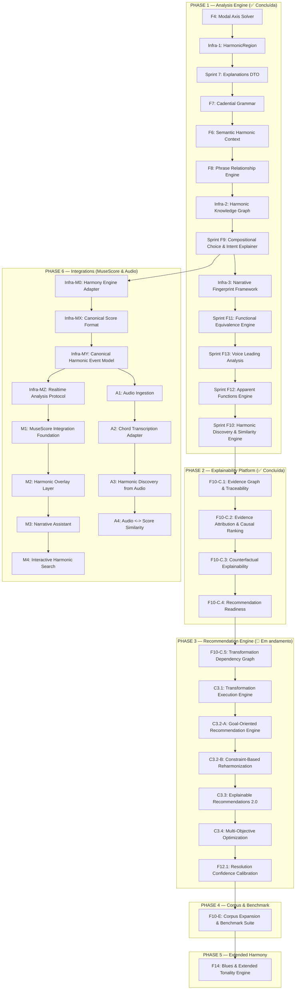

# 🚀 Catálogo de Sprints Futuras — Do Motor Analítico ao Engine de Significado

Após a conclusão da consolidação semântica e analítica, o Find Chord atingiu a maturidade em sua plataforma de explicabilidade. A trilogia de explicabilidade, causalidade e o espaço formal de transformações estão operando de forma integrada.

Este documento formaliza a reestruturação do roadmap sob a ótica de espaço de busca e planejamento pedagógico de rearmonizações.

---

## 📊 Estado de Cobertura Atual

| Área | Cobertura Atual | Detalhamento |
|---|---|---|
| **Harmonia funcional tonal maior** | ~95% | Cobertura completa de tétrades, graus e funções diatônicas. |
| **Tonalidade menor** | ~85% | Relações de menor natural, harmônica e melódica integradas na busca global. |
| **Dominantes secundários** | ~100% | Detecção e rotulação contextual de V7/X na timeline. |
| **SubV7** | ~100% | Identificação de dominantes substitutos tritone. |
| **Tonicizações e modulações** | ~100% | Delimitação de janelas temporárias vs modulações estruturais via cadência. |
| **Regiões harmônicas unificadas** | ~100% | Unificação de tonalidades e eixos modais em `HarmonicRegion`. |
| **Gramática cadencial** | ~100% | Quatro tipos objetivos (`AUTHENTIC`, `PLAGAL`, `HALF`, `PHRYGIAN`) com pesos e status de resolução. |
| **DTO Explicável** | ~100% | Evidências físicas, notas comuns e caminhos Viterbi expostos diretamente no DTO público. |
| **Contexto Semântico (F6)** | ~100% | AST semântica contendo intenção harmônica, papéis de frase, causas e suportes tipados. |
| **Empréstimo modal** | ~100% | Identificação de acordes emprestados e suporte para desvios harmônicos. |
| **Harmonia modal** | ~75% | resolvedor de eixos modais verdadeiro integrado ao Viterbi. |
| **Funções aparentes (Volume 3)** | ~100% | Resoluções retrospectivas, diminutos inteligentes e sextas aumentadas integrados à Layer 7. |
| **Equivalência funcional / substituições** | ~100% | Mapeamento de classes funcionais equivalentes e substituições na Layer 5. |
| **Voice-leading** | ~100% | Análise de notas comuns, condução suave e movimentos lineares concluída na Layer 6. |
| **Espaço de Transformação (F10-C.4/C.5)** | ~100% | Catálogo estático de templates de rearmonização, grafo de decisões e caminhos pedagógicos. |
| **Blues** | ~5% | Parcialmente detectado como acordes dominantes avulsos, sem suporte estrutural formal. |

---

## 🗺️ Visão Geral do Novo Roadmap

---

## 🔑 Cronograma de Priorização Recomendado

As sprints concluídas compõem o motor fundamental de análise, a plataforma de explicabilidade e a fundação do recomendador. As próximas focarão em restrições, otimização e calibração de probabilidade.

---

### Sprint C3.2-B: Constraint-Based Reharmonization
**Status: 🔄 PRÓXIMO PASSO (Prioridade 1)**
*   **Objetivo**: Permitir a imposição de restrições estéticas e físicas explícitas nas rearmonizações.
*   **Conceito**: Implementar filtros de restrições harmônicas e físicas (`ReharmonizationConstraints`):
    *   `preserveBassMotion`: Evita saltos desnecessários do baixo ou impõe direções.
    *   `preserveCadences`: Impede modificações nas janelas cadenciais da progressão.
    *   `maxPhysicalComplexity`: Filtra transformações com custo físico acima de um limiar.
    *   `maxSimilarityLoss`: Descarta variantes cuja perda de similaridade original ultrapasse um delta tolerado.
*   **Valor**: Permite refinar a busca baseada no perfil e nível técnico do compositor.

---

### Sprint C3.3: Explainable Recommendations 2.0
**Status: 🔄 PLANEJADA (Prioridade 2)**
*   **Objetivo**: Conectar as explicações estruturadas e contrafactuais diretamente às metas e restrições fornecidas.
*   **Conceito**: A narrativa pedagógica passa a detalhar por que certas opções foram descartadas (violação de restrições) e como a progressão se alinha à intenção declarada.

---

### Sprint C3.4: Multi-Objective Optimization
**Status: 🔄 PLANEJADA (Prioridade 3)**
*   **Objetivo**: Buscar o conjunto de caminhos ótimos na fronteira de Pareto de múltiplos objetivos.
*   **Conceito**: Resolver o conflito clássico: maior tensão harmônica vs menor complexidade física, gerando um espectro balanceado de opções de rearmonização.

---

### Sprint F12.1: Resolution Confidence Calibration
**Status: 🔄 PLANEJADA (Prioridade 4)**
*   **Objetivo**: Refinar os modelos de probabilidade contínua para calibrar e computar a confiança da resolução de dominantes e desvios tonais.
*   **Conceito**: Consolidar a `ResolutionAnalysis` usando múltiplos fatores: resolução física de voice-leading (Layer 6), força funcional de atração, densidade harmônica dos acordes e estabilidade regional circundante.

---

### Sprint F10-E: Corpus Expansion & Benchmark Suite
**Status: 🔄 ADIADA (Pós-Otimização)**
*   **Objetivo**: Expandir o corpus com mais de 100 progressões clássicas, de jazz e populares.
*   **Conceito**: Indexar fingerprints de alta densidade no banco estático para validação em larga escala.
*   **Valor**: Mudado para posterior ao gerador C3 para evitar retrabalho de calibração de modelos sobre uma base inflada de dados.

---

## 🔌 Trilha de Integração (MuseScore Integration Track)

### Sprint Infra-M0: Harmony Engine Adapter (API/SDK)
*   **Objetivo**: Criar uma API pública de fachada estável e desacoplada para expor as capacidades do motor a clientes externos.

### Sprint Infra-MX: Canonical Score Format
*   **Objetivo**: Definir uma estrutura de representação de partitura canônica, neutra e universal (`HarmonyEngineScore` JSON).

### Sprint Infra-MY: Canonical Harmonic Event Model
*   **Objetivo**: Definir um modelo canônico de eventos harmônicos baseado em tempo/offset (`HarmonicEvent[]`) para alimentar o motor a partir de dados de áudio ou cifras temporizadas.

### Sprint Infra-MZ: Realtime Analysis Protocol
*   **Objetivo**: Desenvolver um protocolo de reanálise incremental em tempo real para partituras longas durante a edição.

### Sprint M1: MuseScore Integration Foundation
*   **Objetivo**: Estabelecer a conectividade básica entre a partitura do MuseScore e o Harmony Engine do Find Chord de forma simplificada.

### Sprint M2: Harmonic Overlay Layer
*   **Objetivo**: Desenhar anotações analíticas diretamente sobre a partitura do MuseScore de forma dinâmica.

### Sprint M3: Narrative Assistant
*   **Objetivo**: Habilitar a auditoria semântica e pedagógica da F9 integrada ao fluxo de escrita no MuseScore.

### Sprint M4: Interactive Harmonic Search
*   **Objetivo**: Integrar os recursos de busca de similaridade e recomendação de repertório no MuseScore.

---

## 🎧 Trilha de Áudio (Audio Ingestion Track - Experimental)

### Sprint A1: Audio Ingestion
*   **Objetivo**: Estabelecer conectividade básica para processamento de sinais de áudio brutos e extração de características acústicas (chromagrams).

### Sprint A2: Chord Transcription Adapter
*   **Objetivo**: Mapear as características de áudio processadas em eventos harmônicos estruturados no formato canônico da `Infra-MY`.

### Sprint A3: Harmonic Discovery from Audio
*   **Objetivo**: Permitir a extração de fingerprints narrativos diretamente a partir de áudios brutos gravados ou importados.

### Sprint A4: Audio ↔ Score Similarity
*   **Objetivo**: Mapear e parear correspondências cruzadas de similaridade entre arquivos de áudio e partituras escritas.

---

## Sprints Secundárias & Refinamentos Gramaticais

*   **[F8.5] Curva de Tensão Harmônica (Tension Curve)**: Computar curva contínua de flutuação de dissonância e instabilidade tonal.
*   **[FX] Corpus & Statistical Learning**: Adicionar probabilidade empírica baseada em corpora para desempate do resolvedor Viterbi.

---

## Sprints Experimentais / Pesquisa

*   **[Experimental] Schenker-Lite Visualizer**: Grafo de redução hierárquica gráfica aninhada ilustrando as camadas de redução da narrativa tonal.
