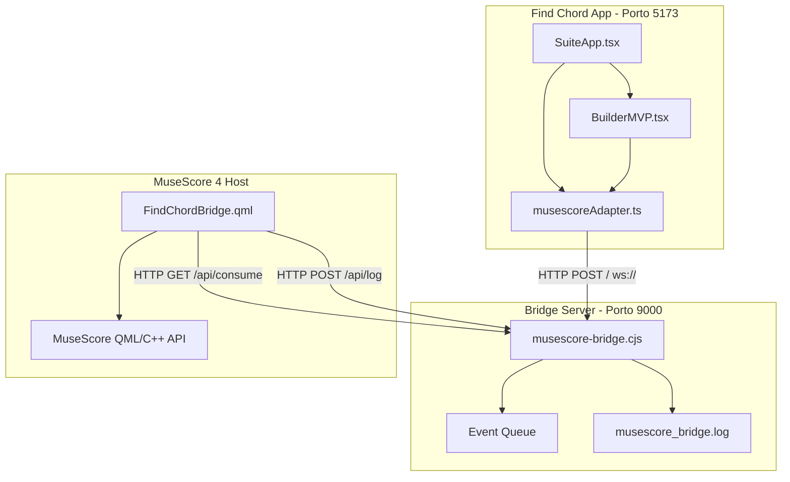

# 🔍 Relatório de Auditoria Arquitetural — Find Chord + MuseScore Bridge

Este documento apresenta a auditoria técnica em camadas do ecossistema de integração em tempo real entre o **Find Chord (Web App)** e o **MuseScore 4.x**, utilizando a ponte local em Node.js e o plugin QML.

---

## 📊 Scorecard de Maturidade Arquitetural

| Área | Nota | Observação |
| :--- | :--- | :--- |
| **Arquitetura Geral** | **9.0 / 10** | Excelente desacoplamento através de bridge local. |
| **Separação de Responsabilidades** | **9.0 / 10** | O plugin QML não contém regras musicais; apenas transcreve. |
| **Integração MuseScore** | **8.0 / 10** | Transações transacionais estáveis para cifras textuais. |
| **Manutenibilidade** | **8.5 / 10** | Código modularizado após refatoração da Sprint 12B. |
| **Robustez Operacional** | **7.0 / 10** | Fila volátil em memória e falta de confirmação de entrega (ACK). |
| **Segurança Local** | **6.0 / 10** | Porta localhost 9000 exposta sem autenticação/Origin check. |
| **Observabilidade** | **6.0 / 10** | Ausência de telemetria operacional em tempo real além de logs em texto. |
| **Média Geral** | **7.6 / 10** | **Maturidade de Produto Integrável**. |

---

## 🗺️ Documento 1: Arquitetura Atual

O sistema é dividido em três camadas operando de forma desacoplada por meio de uma ponte de comunicação rodando em `localhost:9000`:

```
┌─────────────────────────┐               ┌─────────────────────────┐
│   Find Chord Frontend   │               │    Plugin QML Host      │
│  (React/Vite App, 5173) │               │   (MuseScore 4.7.3)     │
└────────────┬────────────┘               └────────────▲────────────┘
             │                                         │
             │ HTTP POST / WebSocket                   │ HTTP GET (Polling)
             │ (sendChord/sendProgression)             │ (/api/consume)
             ▼                                         │
┌──────────────────────────────────────────────────────┴────────────┐
│              Local API Bridge Server (Node.js, 9000)              │
│  - Event Queue (Fila em Memória, Max 50)                          │
│  - WebSocket Server (RFC 6455 Frame Handler)                      │
│  - Log Writer (Sync file append de logs do QML)                   │
┌───────────────────────────────────────────────────────────────────┘
```

### Componentes do Sistema

| Componente | Responsabilidade | Tecnologias | Estado Atual |
| :--- | :--- | :--- | :--- |
| **Find Chord Frontend** | Permite ao usuário criar/visualizar voicings físicos (braço virtual) e enviar o acorde ou a progressão resultante. | React 19, TypeScript, TailwindCSS, Vite, Zustand | **Estável**. O arquivo `useChordStore.ts` gerencia o estado da cifra e o `musescoreAdapter.ts` gerencia a comunicação em segundo plano. |
| **Local Bridge Server** | Atua como a ponte IPC de baixo acoplamento. Recebe eventos do App via HTTP/WS, enfileira-os e os fornece ao plugin MuseScore. Recebe e grava logs do plugin. | Node.js (Pure HTTP & Crypto, sem dependências npm externas) | **Operacional**. Implementa um protocolo WebSocket nativo simples e servidores HTTP concorrentes. |
| **Plugin QML (MuseScore)** | Roda dentro do MuseScore 4. Polla a fila do servidor ponte a cada 500ms e escreve cifras (`Element.HARMONY`) na pauta de forma segura usando cursores transacionais. | QML, JavaScript (QML Engine do Qt 6 / MuseScore 4) | **Simplificado e Estável**. Removida a tentativa de escrita de Fretboard obsoleta para evitar crashes na ponte C++. |

### Status de Tecnologias

* **Bridge Local (IPC indireta)**: **Aprovada**. Reduz drasticamente o acoplamento comparado com tentativas de comunicação direta QML ↔ Browser.
* **Isolamento de Regras Musicais**: **Aprovado**. Toda a lógica de análise de inversões, voicings e teoria reside no Core App. O plugin apenas transcreve.
* **Manipulação de `Element.FRET_DIAGRAM` via QML**: **Descontinuada pelo Projeto**.
  * *Motivo*: A API pública foi privada/alterada no motor C++ do MuseScore 4.x. Tentativas de escrita resultam em grades vazias ou crashes imediatos. O plugin focará exclusivamente em `Element.HARMONY`.

---

## 🔗 Documento 2: Mapa de Dependências

O fluxo de controle e dados segue uma hierarquia estrita de dependências sem ciclos:



---

## ⚠️ Documento 3: Matriz de Riscos

Abaixo estão classificados os riscos técnicos identificados para o ecossistema de integração:

### 🔴 Riscos Críticos (Severidade Alta)
1. **Crash no Ponteiro C++ do MuseScore**: O QML roda sobre um wrapper C++ instável. Se modificarmos propriedades do elemento (`harmony`) antes de atrelá-lo ao score, ou se a partitura for fechada durante uma transação aberta (`startCmd`), o MuseScore sofre crash (Segmentation Fault).
   * *Status de Mitigação*: A ordem de chamada foi ajustada para: `cursor.add(harmony)` e logo após `harmony.text = symbol`.
2. **Loop de Travessia do Cursor do QML**: O algoritmo de avanço do cursor (`while (cursor.segment && (!cursor.element || (cursor.element.type !== Element.CHORD && cursor.element.type !== Element.REST))) cursor.next()`) pode entrar em loop infinito ou saltar partes essenciais da partitura em layouts complexos.
   * *Status de Mitigação*: Requer homologação formal através de uma matriz de teste específica.

### 🟠 Riscos Médios-Altos
1. **Fila Volátil em Memória (Risco de Overflow)**: A fila local é baseada puramente na memória RAM do Node.js com limite de 50 itens. Se o MuseScore estiver fechado (ou o plugin inativo) e o frontend continuar enviando eventos (por exemplo, em uma reprodução automática ou enfileiramento em lote), a fila transbordará. 
   * *Comportamento Atual*: FIFO (Drop Oldest - descarta os mais antigos). Não há notificação ao usuário ou ao frontend de que dados foram perdidos.
2. **Ausência de Entrega Confirmada (Falta de ACK)**: O fluxo atual é destrutivo (`fire-and-forget`). Quando o plugin consome `/api/consume`, os eventos são removidos da fila do servidor imediatamente. Se o plugin falhar em aplicar o acorde ou o MuseScore sofrer crash na escrita, os acordes são perdidos sem possibilidade de retransmissão.

### 🟡 Riscos Médios
1. **Falta de Segurança Local (CSRF / Injeção)**: A porta `9000` escuta requisições locais sem validação de origem (`Origin` header) ou token. Qualquer aba do navegador aberta em sites maliciosos de terceiros pode enviar acordes espúrios ou consumir logs confidenciais da partitura do usuário.
2. **Sobrecarga por HTTP Polling**: O plugin faz requisições a cada 500ms ininterruptamente. São 7.200 requisições/hora enviadas ao Node.js, impedindo wakeups otimizados da CPU e aumentando o consumo de energia.

---

## 🛠️ Documento 4: Levantamento de Débito Técnico

1. **Ausência de Telemetria Operacional**: Falta de um endpoint estruturado de metadados como `/api/status` impedindo ferramentas de diagnóstico ou dashboards de reportarem a saúde da integração sem abrir arquivos de log brutos.
2. **Try/Catch Silenciosos**: O arquivo `FindChordBridge.qml` engole exceções de rede silenciosamente in `postLog` e `checkPendingEvents`, ocultando interrupções no servidor.
3. **Contratos sem Versionamento**: APIs expostas diretamente em caminhos globais (ex: `/api/send`). Evoluções futuras no payload do `CanonicalChordEvent` quebrarão a compatibilidade do plugin se não forem atualizados juntos.

---

## 📅 Documento 5: Plano de Refatoração

Proposta de divisão de tarefas dividida em Sprints para consolidar a integração como produto:

### 🚀 Sprint A: Estabilização do Protocolo e Contrato v1
* **Meta**: Blindar a API local contra chamadas não autorizadas e formatar contratos.
* **Ações**:
  1. Validar `Origin` header no servidor Node.js (aceitar apenas requisições vindas de `localhost:5173`).
  2. Implementar versionamento de endpoints (prefixo `/api/v1/`).
  3. Adicionar limite de tamanho de payload no POST (max 50KB) para prevenir DoS local.
* **Esforço**: ~1.5h | **Risco**: Baixo

### 🚀 Sprint B: Otimização de Performance e Robustez do Polling
* **Meta**: Reduzir consumo de energia e aprimorar tratamento de erros.
* **Ações**:
  1. Implementar "Backoff Inteligente" no QML: Aumentar o polling de 500ms para 1500ms após 2 minutos sem novos eventos. Voltar a 500ms ao receber evento ou detectar movimentação de cursor.
  2. Atualizar estado visual do QML em caso de falha de conexão (exibir "Conexão Offline" em vez de falhar silenciosamente).
* **Esforço**: ~2h | **Risco**: Médio

### 📊 Sprint B.5: Observabilidade e Telemetria
* **Meta**: Obter visibilidade operacional sem ler logs em disco.
* **Ações**:
  1. Criar endpoint `GET /api/v1/status` e `GET /api/v1/health` na ponte Node.js retornando métricas operacionais estruturadas:
     ```json
     {
       "queueSize": 0,
       "eventsProcessed": 42,
       "eventsDropped": 0,
       "pluginLastSeen": "2026-06-13T17:30:00Z"
     }
     ```
  2. Desenhar um painel/dashboard de diagnóstico simples no frontend (dentro da aba Playground) exibindo conexões ativas, fila pendente e taxa de eventos perdidos.
* **Esforço**: ~1h | **Risco**: Baixo

### 🚀 Sprint C: Separação de Preocupações e Homologação
* **Meta**: Organização de código limpo e homologação de cenários complexos do MuseScore.
* **Ações**:
  1. Quebrar o arquivo `FindChordBridge.qml` em módulos JS relativos (`ScoreWriter.js`, `BridgeClient.js`, `Diagnostics.js`).
  2. Executar a matriz de testes de travessia de cursor em diferentes tipos de pautas para evitar saltos ou loops infinitos.

---

## 🧪 Anexo: Matriz de Testes de Cursor (Sprint C)

Para mitigar o risco de travessia incorreta do cursor QML in partituras complexas, a seguinte matriz de homologação deve ser executada:

| Cenário | Entrada Esperada | Comportamento Esperado | Status |
| :--- | :--- | :--- | :--- |
| **Piano (Pauta Dupla)** | Acorde enviado pelo Builder | Cifra inserida apenas na pauta selecionada (Clave de Sol ou Fá), avançando o cursor correspondente. | ⚠️ A Testar |
| **Violão/Guitarra (Pauta Clássica)** | Acorde enviado pelo Builder | Escrita de cifra acima da pauta de violão sem gerar conflito com armaduras. | ⚠️ A Testar |
| **Tablatura (TAB)** | Acorde enviado pelo Builder | Cifra inserida corretamente acima das linhas da tablatura vinculada. | ⚠️ A Testar |
| **Pauta Orquestral (Múltiplos Instrumentos)** | Acorde enviado pelo Builder | A cifra deve ser anexada estritamente na pauta do instrumento selecionado, sem transcrever nas pautas adjacentes. | ⚠️ A Testar |
| **Bateria / Percussão (Pauta não-tonal)** | Acorde enviado pelo Builder | Bloquear ou avisar no QML que cifras de acorde não são aplicáveis a pautas de percussão não-tonais. | ⚠️ A Testar |
| **Vozes Múltiplas (Polyphonic Staff)** | Acorde enviado pelo Builder | A cifra deve se associar ao tempo da Voz 1 (Voice 1) selecionada sem duplicar na Voz 2. | ⚠️ A Testar |
